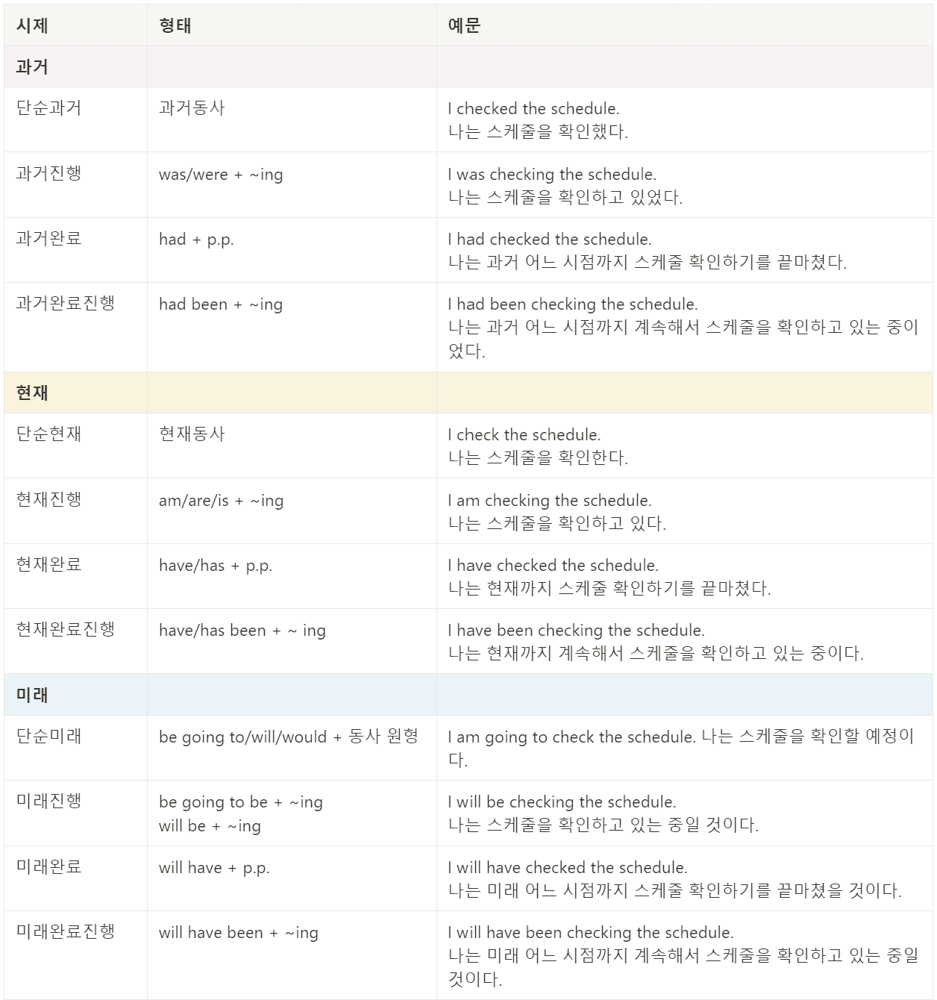

# 8품사

영어 문장을 만드는 8가지 요소

|**요소**|**설명**|
|:---------:|:--------:|
|**명사**|모든 것의 이름|
|**대명사**|명사를 대신하는 단어|
|**동사**|동작이나 상태|
|**형용사**|명사를 꾸며주는 말|
|**부사**|동사, 형용사, 부사를 꾸며주는 말|
|**전치사**|위치, 시간, 장소를 설명하는 말|
|**감탄사**|감탄하는 말|
|**접속사**|두 덩어리를 이어주는 말|

# 시제

영어에서 시제란 동사의 동작이나 상태가 일어난 시간에 해당하는 형태로 동사를 표현한 것입니다.

*과거완료진행*과 *미래완료진행* 시제는 원어민들도 잘 쓰지 않는 시제입니다.

  

[👉 시제 자세히보기](https://www.amazingtalker.co.kr/blog/ko/kr-en/83493/)