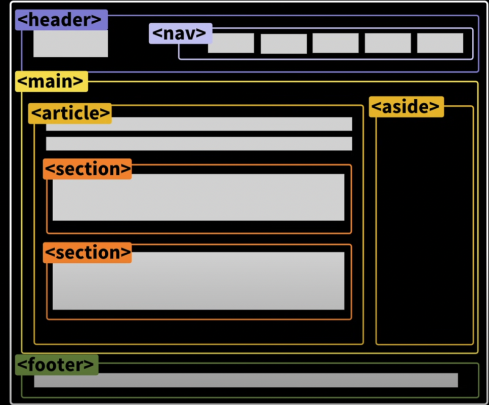

# HTML MDN

👉[HTML 학습하기](https://developer.mozilla.org/ko/docs/Learn/HTML)

👉[HTML 참고서](https://developer.mozilla.org/ko/docs/Web/HTML/Reference)

# HTML 요소의 구조

  

1. 여는 태그(Opening tag)
2. 닫는 태그(Closing tag)
3. 내용(Content)
4. 요소(Element)

👉[HTML 요소 참고서](https://developer.mozilla.org/ko/docs/Web/HTML/Element)

# HTML 속성(Attributes)

  

👉[HTML 속성 참고서](https://developer.mozilla.org/ko/docs/Web/HTML/Attributes)

# 시맨틱 태그

- 시맨틱 태그는 웹 페이지의 다양한 부분(헤더, 푸터, 본문 등)을 명확하게 구분짓는 데 사용되는 HTML 태그

- 이 태그들은 각 섹션의 의미를 명확히 하여, 웹 페이지의 구조를 더 잘 이해할 수 있게 도와줌

- 예를 들어, `<header>` 태그는 페이지의 머리말을, `<footer>` 태그는 바닥글을 나타내는 데 사용

  

