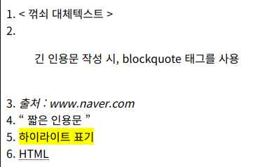

<hr>

## 속성(attribute)

- 태그의 동작을 설정 및 제어 

- 태그마다 설정 가능한 속성들이 있음

- 속성 예 : ``

    > src와 alt는 img 태그의 속성

## 대체 문자(Entity name)

- 문자 entity name 목록 보기 : [사이트 링크](https://html.spec.whatwg.org/multipage/named-characters.html)

| 문자 | Entity name |
|:----:|:-----------:|
|   <  |   `&lt;`    |
|   >  |   `&gt;`    |

## 인용문 관련 태그

|     태그       |                          설명                          |           비고          |
|:--------------:|:------------------------------------------------------:|:-----------------------:|
| `<blockquote>` |                 비교적 긴 인용문에 사용                | cite 속성으로 출처 표시 |
|    `<cite>`    |                   저작물의 출처 표기                   |    제목을 반드시 포함   |
|      `<q>`     |                비교적 짧은 인용문에 사용               | cite 속성으로 출처 표시 |
|    `<mark>`    | 인용문 중 하이라이트 또는 사용자 행동과 연관된 곳 표시 |                         |

### blockquote 태그

- 비교적 긴 인용문에 사용되며, cite 속성으로 출처를 표시해줌

- `<blockquote cite="www.naver.com"> 인용문 내용 작성 </blockquote>`

### cite 태그

- cite는 속성으로도 사용되지만 태그로도 사용됨

- 저작물의 출처를 표기할 때 사용

### q 태그

- 비교적 짧은 인용문에 사용되며, cite 속성으로 출처를 표시해줌

- `<q cite="www.naver.com"> 인용문 내용 작성 </q>`

### mark 태그

- <mark>하이라이트</mark> 표기 

## abbr 태그

|  태그    |        설명        |              비고             |
|:--------:|:------------------:|:-----------------------------:|
| `<abbr>` | 준말/머릿글자 표시 | title 속성으로 원래 형태 표시 |

- `<abbr title="HyperText Markup Language">HTML</abbr>`

- HTML 이라는 글자에 마우스를 가져다대면 "HyperText Markup Language" 라고 표시됨

## 실습

```html
<!DOCTYPE html>
<html lang="ko">
<head>
    <meta charset="UTF-8">
    <meta name="viewport" content="width=device-width, initial-scale=1.0">
    <title>Document</title>
</head>
<body>
    
    1.
    &lt; 꺾쇠 대체텍스트 &gt;  

    <br>2.
    <blockquote cite="www.naver.com">
        긴 인용문 작성 시, blockquote 태그를 사용
    </blockquote>

    <br>3.
    <cite>
        출처 : www.naver.com
    </cite>

    <br>4.
    <q cite="www.naver.com">
        짧은 인용문
    </q>

    <br>5.
    <mark>하이라이트 표기</mark>

    <br>6.
    <abbr title="HyperText Markup Language">
        HTML
    </abbr>

</body>
</html>
```

