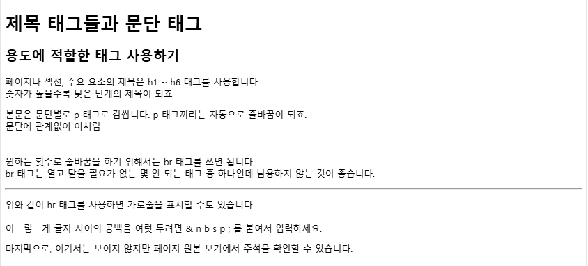

<hr>

## HTML 파일 생성

* HTML에서는 index.html 파일이 기본값으로 설정되어 있음

  * `www.(웹사이트 주소)/folder/`라고 입력하면 index.html 파일이 열림(기본값)

  * `www.(웹사이트 주소)/folder/index.html`라고 입력하면 index.html 파일이 열림

  * `www.(웹사이트 주소)/folder/test.html`라고 입력하면 test.html 파일이 열림

<br>

## HTML 기본 형식

* VS Code에서 \!를 입력하면 자동완성된다.

  ```html 
  <!DOCTYPE html>
  <html lang="en">
  <head>
    <meta charset="UTF-8">
    <meta name="viewport" content="width=device-width, initial-scale=1.0">
    <title>Document</title>
  </head>
  <body>
    
  </body>
  </html>
  ```  

* 내용은 body 태그 사이에 작성

* **HTML 언어를 en(영어)에서 <u>ko(한글)</u>로 변경해야 함**

<br>

## 실습

### 실습 주요 태그

| 태그 또는 구문 |       설명      |                        비고                        |
|:--------------:|:---------------:|:--------------------------------------------------:|
|  `<h1> ~ <h6>` |       제목      |             숫자가 높을 수록 낮은 단계             |
|    `<p>`       |       문단      |         각각 줄바꿈이 됨 (기본 스타일일 때)        |
|    `<br>`      |      줄바꿈     | 닫는 태그 필요 없음. `<br/>`, `<br />`와 혼용되기도 함 |
|    `<hr>`      |      가로줄     |                 닫는 태그 필요 없음                |
|    `&nbsp;`    | 공백 (스페이스) |              스페이스를 강제할 때 사용             |

* 주석 : `<!-- 주석입니다 -->`

<br>

### 태그 설명

* `<h1> </h1>`가 제일 큰 제목

* <mark>br을 입력하고 Tab 키를 누르면 자동으로 `<br>`이 입력됨</mark>

* **`p*6`을 입력하고 엔터를 누르면 `<p> </p>` 태그 6개가 자동으로 생성 됨**

* 구글에 `br 태그 mdn`이라고 검색하면 br 태그의 자세한 정보 등을 볼 수 있음

<br>

### 실습 예제

* 출력할 값

  

* 입력

  ```html 
  <!DOCTYPE html>
  <html lang="ko">
  <head>
    <meta charset="UTF-8">
    <meta name="viewport" content="width=device-width, initial-scale=1.0">
    <title>Document</title>
  </head>
  <body>

  <h1>제목 태그들과 문단 태그</h1>
  <h2>용도에 적합한 태그 사용하기</h2>

  <p>
    페이지나 섹션, 주요 요소의 제목은 h1 ~ h6 태그를 사용합니다.<br>
    숫자가 높을수록 낮은 단계의 제목이 되죠.
  </p>

  <p>
    본문은 문단별로 p 태그로 감쌉니다. p 태그끼리는 자동으로 줄바꿈이 되죠.<br>
    문단에 관계없이 이처럼
  </p>

  <br>

  <p>
    원하는 횟수로 줄바꿈을 하기 위해서는 br 태그를 쓰면 됩니다.<br>
    br 태그는 열고 닫을 필요가 없는 몇 안 되는 태그 중 하나인데 남용하지 않는 것이 좋습니다.
  </p>

  <hr>

  <p>
    위와 같이 hr 태그를 사용하면 가로줄을 표시할 수도 있습니다.<br><br>

    이&nbsp;&nbsp;&nbsp;렇&nbsp;&nbsp;&nbsp;게 글자 사이의 공백을 여럿 두려면 & n b s p ; 를 붙여서 입력하세요.<br><br>

    마지막으로, 여기서는 보이지 않지만 페이지 원본 보기에서 주석을 확인할 수 있습니다.
  </p>

  <!-- 한 줄 주석 -->

  <!-- 여러 줄 주석
  여러 줄 주석
  여러 줄 주석 -->

  </body>
  </html>
  ```  

<hr>