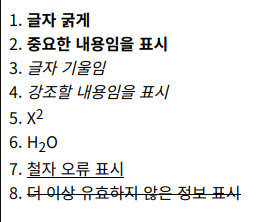

<hr>

<mark>HTML 태그는 정보의 **종류**를 구분하는데만 사용되며, 스타일은 CSS를 사용한다.</mark>

## b 태그와 strong 태그

- b 태그와 strong 태그 모두 글씨를 굵게 만들지만, 현재 스타일은 CSS가 담당하므로 중요한 내용을 명시하는 표기법인 strong 태그를 사용하자

|  태그  |             설명            |       비고       |
|:------:|:---------------------------:|:----------------:|
|    b   |  글자를 굵게 (구버전 HTML)  | 👉 [사용 일람 보기](https://developer.mozilla.org/ko/docs/Web/HTML/Element/b#%EC%82%AC%EC%9A%A9_%EC%9D%BC%EB%9E%8C)  |
| strong |     중요한 내용임을 명시    |                  |


## i 태그와 em 태그

- i 태그와 em 태그 모두 글씨를 기울이지만, 현재 스타일은 CSS가 담당하므로 강조할 내용을 명시하는 표기법인 em 태그를 사용하자

|  태그  |             설명            |       비고       |
|:------:|:---------------------------:|:----------------:|
|    i   | 글자를 기울임 (구버전 HTML) | 👉 [사용 일람 보기](https://developer.mozilla.org/ko/docs/Web/HTML/Element/i#%EC%82%AC%EC%9A%A9_%EC%9D%BC%EB%9E%8C) |
|   em   |     강조할 내용임을 명시    |                  |

## sup 태그와 sub 태그

|  태그 |    설명   |        비고        |
|:-----:|:---------:|:------------------:|
| <sup> |  위 첨자  |     지수, 서수     |
| <sub> | 아래 첨자 | 각주, 변수, 화학식 |

## u 태그와 s 태그

- u 태그는 과거 밑줄을 긋는 용도로 사용되었으나 현재는 CSS 효과와 함께 철자 오류 등을 강조하는 용도로 사용

- s 태그는 더 이상 유효하지 않은 정보를 취소선과 함께 표기

| 태그 |               설명              |            비고           |
|:----:|:-------------------------------:|:-------------------------:|
|  <u> |          철자 오류 표시         | 예전에는 밑줄 용도로 사용 |
|  <s> | 더 이상 유효하지 않은 정보 표시 |                           |

## 실습 예제

```html
<!DOCTYPE html>
<html lang="ko">
<head>
    <meta charset="UTF-8">
    <meta name="viewport" content="width=device-width, initial-scale=1.0">
    <title>Document</title>
</head>
<body>

    <b>글자 굵게</b>   <br>

    <strong>중요한 내용임을 표시</strong>   <br> 

    <i>글자 기울임</i>   <br>

    <em>강조할 내용임을 표시</em>   <br>

    X<sup>2</sup>   <br>

    H<sub>2</sub>O   <br>

    <u>철자 오류 표시</u>   <br>

    <s>더 이상 유효하지 않은 정보 표시</s>   <br>
    
</body>
</html>
```



