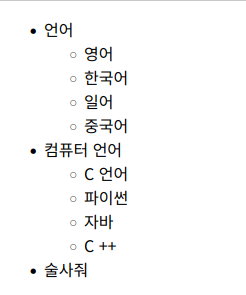
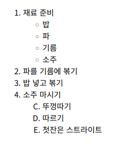
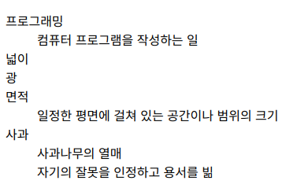
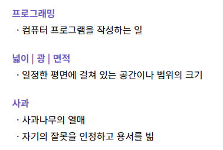

<hr>

## 목록을 표현하는 태그

| 태그 |       설명       |                    비고                   |
|:----:|:----------------:|:-----------------------------------------:|
| `<ul>` | 순서가 없는 목록 |                                           |
| `<ol>` | 순서가 있는 목록 |         type, start 속성 사용 가능        |
| `<li>` |    목록 아이템   | ul, ol 태그의 1촌 자식으로 이 태그만 가능 |

- <mark>VS Code에서 `ul>li*4`를 누르고 Tab 하면 ul 태그 안에 li 태그 4개가 자동 생성</mark>

### ul 태그

- *unordered list*의 약자

- 순서가 없는 목록을 표현

    ```html
    <ul>
        <li>언어</li>
            <ul>
                <li>영어</li>
                <li>한국어</li>
                <li>일어</li>
                <li>중국어</li>
            </ul>

        <li>컴퓨터 언어</li>
            <ul>
                <li>C 언어</li>
                <li>파이썬</li>
                <li>자바</li>
                <li>C ++</li>
            </ul>

        <li>술사줘</li>
    </ul>
    ```

    

### ol 태그

- *ordered list*의 약자

- 순서가 있는 목록을 표현

- type 속성에는 `[1, I, i, A, a]` 타입들이 있다

- start 속성은 순서의 시작값을 설정

    ```html
    <ol>
        <li>재료 준비</li>
            <ul>
                <li>밥</li>
                <li>파</li>
                <li>기름</li>
                <li>소주</li>
            </ul>

        <li>파를 기름에 볶기</li>
        <li>밥 넣고 볶기</li>

        <li>소주 마시기</li>
            <ol type="A" start="3">
                <li>뚜껑따기</li>
                <li>따르기</li>
                <li>첫잔은 스트라이트</li>
            </ol>
    </ol>
    ```

    

### li 태그

- 위의 예제처럼 `ul 태그`와 `ol 태그`의 내부에서 목록을 표현

## 용어와 정의 나열하기(dt, dd, dl)

- dt 태그 : **용어**를 나타내는 태그
- dd 태그 : **정의**를 나타내는 태그
- dl 태그 : dt 태그와 dd 태그의 부모 태그

    ```html
    <dl>
        <dt>프로그래밍</dt>
        <dd>컴퓨터 프로그램을 작성하는 일</dd>
        <dt>넓이</dt>
        <dt>광</dt>
        <dt>면적</dt>
        <dd>일정한 평면에 걸쳐 있는 공간이나 범위의 크기</dd>
        <dt>사과</dt>
        <dd>사과나무의 열매</dd>
        <dd>자기의 잘못을 인정하고 용서를 빎</dd>
    </dl>
    ```

    - 기본

    

    - CSS 적용 시
        - `<head>` 태그에 CCS 삽입
        - `<link rel="stylesheet" href="https://showcases.yalco.kr/html-css/01-04/05.css">`

    