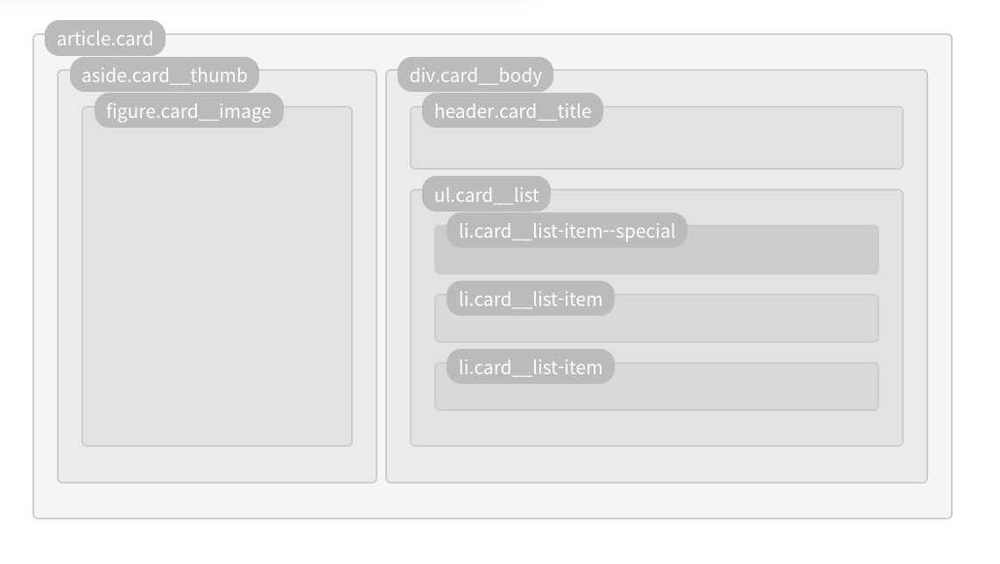

<hr>

## BEM(Block Element Modifier)

- 가독성 있는 이름을 짓기 위한 일종의 방법론

```css
.BLOCK__ELEMENT--MODIFIER { /* ... */ }
```

- 클래스의 이름을 `태그.부모이름__요소--수식어` 형태로 만들어 가독성을 높이는 방식

    

```css
.card { /* ... */ }
.card__thumb { /* ... */ }
.card__image { /* ... */ }
.card__title { /* ... */ }
.card__list { /* ... */ }
.card__list-item { /* ... */ }
.card__list-item--special { /* ... */ }
```

- BEM 관련 참고자료

    - [bem.info](https://en.bem.info/)

    - [BEM 치트시트](https://9elements.com/bem-cheat-sheet/)


