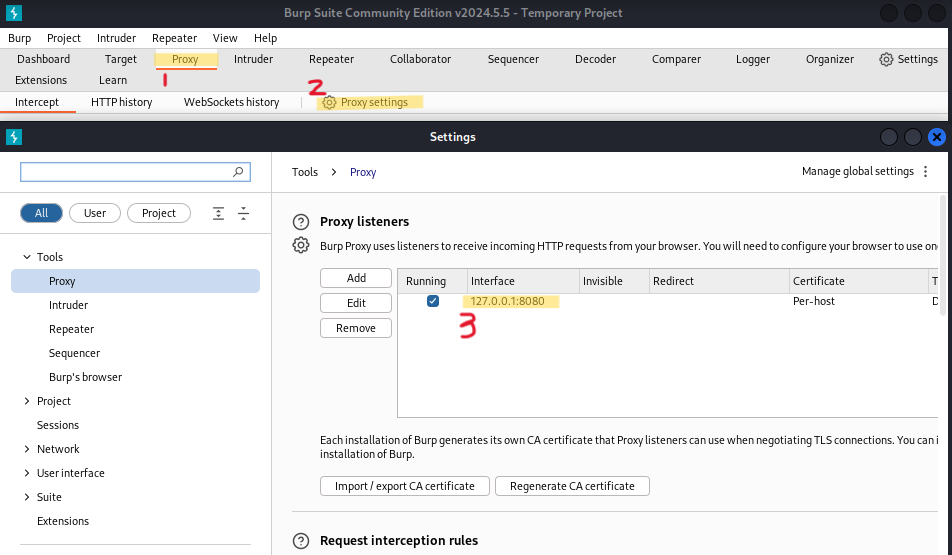
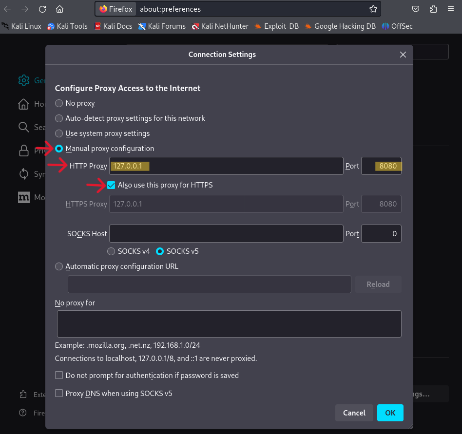

# burpsuite

burpsuite의 Proxy 메뉴

## burpsuite 기본 설정

- `burpsuite` 접속합니다.
- 아래의 이미지와 같이, `Proxy settings`에 `Proxy listeners`의 `Interface`가 `127.0.0.1:8080`으로 설정되어 있어야 합니다.

  

## 웹 브라우저(Firefox) 기본 설정

- **Firefox** 웹 브라우저의 오른쪽 상단의 三 버튼을 누릅니다.

- `Settings` 메뉴를 클릭하고, 스크롤을 내려 맨 마지막의 `Network Settings`에서 `Settings...` 버튼을 클릭합니다.

- 아래의 이미지와 같이, 프록시 액세스를 설정합니다.

  

## CA Certificate 

`http://burp`에 접속합니다.

`CA Certificate` 버튼을 클릭합니다. 

`cacert.der`라는 파일이 다운됩니다.

<video controls width="250">
  <source
    src="../../assets/images/Security/7-04.mp4"
    type="video/mp4"
  />
</video>
