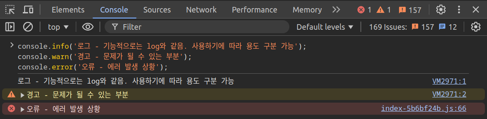

<hr>

# 콘솔에 데이터 출력하기

## 입력

```javascript
console.log("콘솔에 데이터 출력");
console.log(3+5);
console.log(false);
console.log("값1", "값2");
console.log({name: '홍길동', age: 20, married: false});
console.log('Hi!', 100, true, [1, 2, 3]);
```

## 출력

```
콘솔에 데이터 출력  
8  
false  
값1 값2  
{ name: '홍길동', age: 20, married: false }  
Hi! 100 true [ 1, 2, 3 ]  
```

# 흔히 활용되는 console 기능들

## 입력

```javascript
console.info('로그 - 기능적으로는 log와 같음. 사용하기에 따라 용도 구분 가능');
console.warn('경고 - 문제가 될 수 있는 부분');
console.error('오류 - 에러 발생 상황');
```

## 출력

<p id="img_center">
  
</p>

# 변수와 상수

## 입력

```javascript
let x = 3;                           // let : 값이 바뀔 수 있는 변수
const PI = 3.14;                     // const : 값이 바뀔 수 없는 상수 
console.log("x: ", x, "PI: ", PI);

x = 5;
//PI = 10;                           // const인 PI를 바꾸려고 하였으므로 에러가 발생함
console.log("x: ", x, "PI: ", PI);
```

## 출력

```
x:  3 PI:  3.14  
x:  5 PI:  3.14  
```

# 자료형 확인하기(typeof)

## 입력

```javascript
let a = 3
console.log(typeof a);      // a의 타입은 number
console.log(typeof "안녕"); // "안녕"의 타입은 string
console.log(typeof false);  // false의 타입은 boolean 
console.log(typeof b);      // b는 값이 부여되지 않은 상태인 undefined
console.log(typeof null);   // null은 (의도적으로)빈 값인 object
```

## 출력

```
number  
string  
boolean  
undefined  
object  
```

# 이스케이프 문자열

## 입력

```javascript
console.log("안녕하세요 저는 \"거지\"입니다.");                      
console.log('안녕하세요 저는 \'거지\'입니다.');  
console.log("");

// \n : 줄바꿈, \t : 탭
console.log("동해물과 백두산이 마르고 닮도록 \n하느님이 보우하사 \
우리나라 만세 \n무궁화 삼천리 \t화려강산\\");
console.log("");

// 백틱(`)으로 감싸면 자동 줄바꿈 및 탭이 가능
console.log(`동해물과 백두산이 마르고 닮도록
하느님이 보우하사 우리나라 만세
무궁화 삼천리   화려강산\\`);
console.log("");

// 백틱(`)의 강력한 기능
let 이름 = "거지";
let 나이 = 35;
const 결혼 = false;
console.log(`안녕하세요. 저의 이름은 ${이름}이고, 나이는 ${나이}살이며,
결혼도 ${결혼 ? `성공` : `실패`} 하였습니다.`);
```

## 출력

```
안녕하세요 저는 "거지"입니다.  
안녕하세요 저는 '거지'입니다.  
  
동해물과 백두산이 마르고 닳도록   
하느님이 보우하사 우리나라 만세   
무궁화 삼천리 	화려강산\  
  
동해물과 백두산이 마르고 닳도록  
하느님이 보우하사 우리나라 만세  
무궁화 삼천리   화려강산\  
  
안녕하세요. 저의 이름은 거지이고, 나이는 35살이며,  
결혼도 실패 하였습니다.  
```