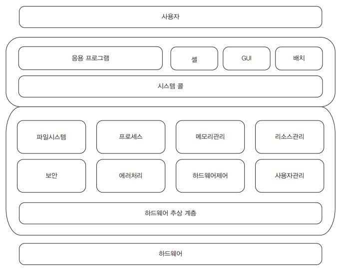

# 운영체제의 개요

## 운영체제의 정의

1. 사용자와 하드웨어 간의 상호작용을 위해 <b>사용자 인터페이스</b>를 제공(CLI, GUI 등)

2. 하드웨어의 효율적인 관리(CPU, 메모리, 입출력장치 등)

3. 응용 프로그램이 동작할 수 있는 <b>프로그래밍 인터페이스</b> 제공

## 운영체제의 목적

1. 처리능력(Throughput)의 향상

    > 처리능력 : 일정 시간 동안 처리하는 일의 양

2. 반환 시간(Turnaround Time)의 최소화

    > 반환 시간 : 작업 의뢰 후 시스템에서 결과가 얻어질 떄까지의 시간

3. 신뢰도(Reliability)의 향상

    > 신뢰도 : 주어진 문제를 정확하게 처리하는 정도

4. 사용 가능도(Availability)의 향상

    > 사용 가능도 : 이용할 수 있는 시스템의 자원이 어느 정도인가를 의미

## 운영체제의 역할

1. 하드웨어 제어 및 입출력 관리

2. 프로세스 및 파일 시스템 관리

3. CPU 스케줄링 및 동기화

4. 시스템 콜 기능 및 네트워크 기능

5. 사용자 인터페이스 제공

## 운영체제의 구조와 기능

 

### 운영체제의 구조

1. 사용자는 응용프로그램, 셸(shell), GUI, 배치 작업(batch jobs) 등을 통해 운영체제의 기능을 사용

    > 배치 작업 : 작업을 실시간으로 처리하지 않고 특정 시점에 일괄적으로 실행이 필요한 작업

2. 응용 프로그램은 시스템 호출을 통해 커널의 서비스를 이용

3. 운영체제는 다양한 하드웨어에 대한 이식성을 향상하기 위해 하드웨어 추상 계층(HAL : Haedware Abstraction Layer)을 제공

#### 하드웨어 추상 계층(HAL)

1. 소프트웨어가 하드웨어를 직접 다루지 않도록 만들어 주는 일종의 중간 계층

2. 하드웨어 추상 계층은 소프트웨어가 하드웨어와 상호작용하는 방식을 단순화해주고, 다양한 하드웨어에서 소프트웨어가 동작할 수 있도록 도와주는 중요한 역할

3. 하드웨어 추상 계층의 주요 기능

    1. **이식성(Portability)**: HAL 덕분에 소프트웨어는 특정 하드웨어에 종속되지 않아요. 하드웨어가 바뀌어도 HAL만 맞게 수정하면 소프트웨어는 그대로 사용할 수 있습니다.

    2. **유지보수 용이성**: 하드웨어나 드라이버가 변경되더라도 HAL만 수정하면 되기 때문에 소프트웨어 전체를 수정할 필요가 없습니다.

    3. **복잡성 감소**: 개발자는 복잡한 하드웨어 작동 원리를 몰라도 소프트웨어를 작성할 수 있어요. HAL이 하드웨어와 관련된 복잡한 부분을 대신 처리해 주기 때문이죠.

4. HAL은 주로 소프트웨어의 일종이지만, 특정 기능을 제공하는 방식에서는 프로토콜의 개념도 포함

    - **소프트웨어적 측면**: HAL은 주로 소프트웨어 라이브러리 또는 API의 형태로 제공되며, 하드웨어와 소프트웨어 간의 상호작용을 추상화하고 단순화합니다.

    - **프로토콜적 측면**: HAL은 하드웨어와 소프트웨어 간의 상호작용을 규정하는 명세와 규격을 정의하여, 일관된 통신 방법을 제공합니다.

5. HAL과 장치 드라이버의 차이점

    - HAL은 하드웨어와 소프트웨어 간의 추상화된 인터페이스를 제공하며, 장치 드라이버는 해당 인터페이스를 통해 하드웨어와 직접적으로 통신하여 장치를 제어

6. 장치(입출력장치 등) 제작자는 HAL이 정의한 표준 인터페이스나 API를 준수하여 장치를 설계합니다. 이를 통해 HAL이 장치와 통신할 수 있도록 합니다.

### 운영체제의 기능

1. 프로세스, 메모리, 장치 I/O, 파일 시스템 등 리소스 관리

2. 자원의 효율적인 