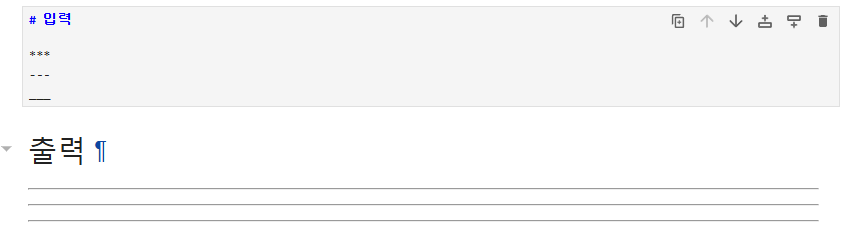

## 수평선(Horizontal Rule)

* HTML의 hr 태그
* 별 3개(\*\*\*) or 하이픈 3개(\-\-\-) or 언더바 3개(\_\_\_)
  

## 각주(Footnote)

* `[^각주]` 의 형태

* 입력
  `이것은 깃허브 블로그 작성을 위한 마크다운[^1] 문법을 공부하는 공간이다.` 
  `[^1]: 마크다운 (Markdown)은마크업 언어의 일종으로, 존 그루버(John Gruber) 와 아론 스워츠(Aaron Swartz)가 만들었다.`

* 출력
  이것은 깃허브 블로그 작성을 위한 마크다운[^1] 문법을 공부하는 공간이다.
  [^1]: 마크다운 (Markdown)은마크업 언어의 일종으로, 존 그루버(John Gruber) 와 아론 스워츠(Aaron Swartz)가 만들었다.
## Task list

- [x] 아침
- [ ] 점심
- [x] 저녁

## 이모지(Emoji)

* 이모지를 사용할 수 있는 사이트 : https://emojipedia.org/

## 하이라이트(Highlight)
* HTML mark태그

==Highlight==

## Subscript
* HTML sub태그

H~2~O

## Superscript
* HTML sup태그 

X^2^

## 주석

<!-- 안녕하세요. -->

[//]: # 1번

[//]: # (2번)

[//]: # "3번"

[//]: # '4번'
