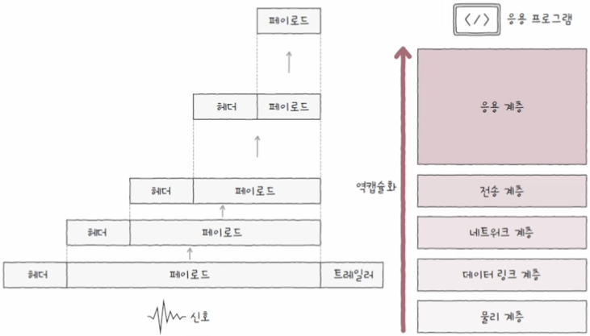

# 프로토콜

**프로토콜**protocol은 노드 간에 정보를 올바르게 주고받기 위해 합의된 규칙이나 방법을 의미

프로토콜의 종류로는 *IP*, *ARP*, *HTTP*, *HTTPS*, *TCP*, *UDP* 등 매우 다양한 종류가 있으며, 통신 과정에서 하나의 프로토콜만 사용되지 않으며, 일반적으로 여러 프로토콜을 함께 사용함

각각의 프로토콜에는 저마다의 **목적**과 **특징**을 가지고 있음

1. IP는 패킷을 수신지까지 전달하기 위해 사용되는 프로토콜이다.
2. ARP는 192.168.1.1과 같은 형태의 'IP 주소'를 A1:B2:C3:D4:E5:F6과 같은 형태의 'MAC 주소'로 대응하기 위해 사용되는 프로토콜이다
3. HTTPS는 HTTP에 비해 보안상 더 안전한 프로토콜이다.
4. TCP는 UDP에 비해 일반적으로 느리지만 신뢰성이 높은 프로토콜이다.

# 네트워크 참조 모델

**네트워크 참조 모델**network reference model은 통신이 일어나는 각 과정을 계층으로 나눈 구조로, 계층으로 표현한다는 점에서 **네트워크 계층 모델**이라고도 부름

이렇게 네트워크를 계층적으로 나눈 이유는 크게 두 가지입니다.

1. 네트워크 구성과 설계가 용이
2. 네트워크 문제 진단과 해결이 용이

## OSI 모델

**OSI 모델**은 국제 표준화 기구ISO; International Organization for Standardization에서 만든 네트워크 참조 모델로 통신 단계를 **7계층**으로 나눔

  

### 1. 물리 계층

**물리 계층**physical layer은 OSI 모델의 최하단에 있는 계층으로, 1과 0으로 표현되는 *비트 신호를 주고 받는 계층*

1과 0으로 표현된 비트 데이터는 다양한 통신 매체를 통해 전기, 빛, 전파 등의 신호로 정보를 운반

### 2. 데이터 링크 계층

**데이터 링크 계층**data link layer은 *동일 네트워크 내 주변 장치 간*의 정보를 올바르게 주고받기 위한 계층

물리 계층을 통해 주고받는 정보에 오류가 없는지 확인, MAC 주소를 통한 네트워크 내 송수신지 특정, 전송 과정에서 발생할 수 있는 충돌 문제 해결 등의 역할을 수행하는 계층

### 3. 네트워크 계층

**네트워크 계층**network layer은 메시지를 *다른 네트워크에 속한* 수신지까지 전달하는 계층

네트워크 간의 통신을 통해 인터넷을 가능하게 하는 계층으로, IP 주소를 통해 통신하고자 하는 수신지 호스트와 네트워크를 식별하고, 원하는 수신지에 도달하기 위한 최적의 경로를 결정

### 4. 전송 계층

**전송 계층**transport layer은 *신뢰성 있고 안정성 있는 전송*을 해야 할 때 필요한 계층

패킷이 정상적으로 보내졌는지, 중간에 유실된 정보는 없는지, 여러 개의 패킷을 보낼 때 순서가 뒤바뀐 것은 없는지 등 패킷의 흐름을 제어하며, 포트를 통해 실행 중인 응용 프로그램의 식별이 이루어 지도록 하는 계층

### 5. 세션 계층

**세션 계층**session layer은 이름 그래로 '세션'을 관리하기 위해 존재하는 계층

**세션**이라는 용어는 다양한 상황에서 폭넓게 사용되지만, 일반적으로 통신을 주고받는 호스트의 응용 프로그램 간 연결 상태를 의미

세션 계층에서는 이러한 연결 상태를 생성하거나 유지하고, 종료되었을 때는 끊어 주는 역할을 담당

### 6. 표현 계층

**표현 계층**presentation layer은 마치 번역가와 같은 역할을 하는 계층

사람이 이해할 수 있는 언어인 문자를 컴퓨터가 이해할 수 있는 코드로 변환하거나, 압축, 암호화와 같은 작업이 이루어짐

### 7. 응용 계층

**응용 계층**application layer은 OSI 참조 모델 최상단에 있는 계층으로 사용자 및 사용자가 이용하는 응용 프로그램과 가장 밀접히 맞닿아 있는 계층

웹 브라우저 프로그램에 웹 페이지 제공, 이메일 클라이언트 프로그램에 송수신된 이메일을 제공하는 등 *실질적인 네트워크 서비스가 제공*되는 계층

## TCP/IP 모델

**TCP/IP 모델**은 이론보다는 구현에 중점을 둔 네트워크 참조 모델

**4계층**으로 이루어져 있으며, <b>인터넷 프로토콜 스위트</b> 또는 <b>TCP/IP 프로토콜 스택</b>이라고도 부름

> 다양한 계층의 프로토콜 집합을 <b>프로토콜 스위트</b>(protocol suite), <b>프로토콜 스택</b>(protocol stack)이라고 부름

  

### 1. 네트워크 엑세스 계층

**네트워크 엑세스 계층**network access layer은 **링크 계층**link layer 또는 **네트워크 인터페이스 계층**network interface layer이라고도 부름

OSI 모델의 *데이터 링크 계층*과 유사함

### 2. 인터넷 계층

**인터넷 계층**internet layer은 OSI 모델의 *네트워크 계층*과 유사함

### 3. 전송 계층

**전송 계층**transport layer은 OSI 모델의 *전송 계층*과 유사함

### 4. 응용 계층

**응용 계층**application layer은 OSI 모델의 *세션 계층*, *표현 계층*, *응용 계층*을 합친 것과 유사함

# 캡슐화와 역캡슐화

패킷은 송신 과정에서 **캡슐화**가 이루어지고, 수신 과정에서 **역캡슐화**가 이루어짐.

## 캡슐화(=인캡슐레이션)

**캡슐화**encapsulation은 송신과정에서 데이터가 네트워크 참조 모델의 높은 계층에서 낮은 계층으로 이동하면서, 헤더 및 트레일러를 추가해 나가는 과정

  

## 역캡슐화(=디캡슐레이션)

**역캡슐화**decapsulation는 캡슐화 과정에서 붙인 헤더(및 트레일러)를 제거하는 과정

  

# PDU

**PDU**Protocol Data Unit: 각 계층에서 송수신되는 메시지의 단위

  

- 전송 계층에서 TCP 프로토콜의 PDU는 세그먼트, UDP 프로토콜의 PDU는 데이터그램

- 네트워크 계층에서의 PDU는 패킷(packet)으로, 패킷 교환 방식에서의 패킷과 용어가 같으나 다른 뜻.

  > 교재에서는 용어 혼동을 방지하기 위해서 '네트워크 계층의 PDU'는 <b>IP 패킷</b>이라고 지칭

  

