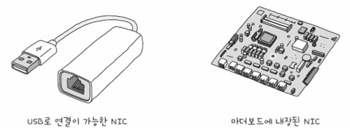
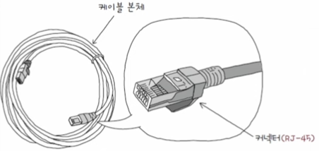
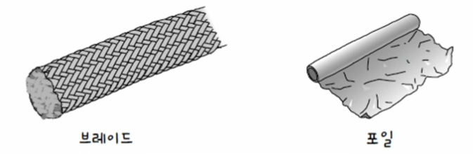
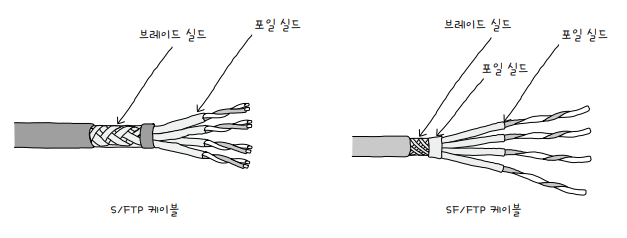
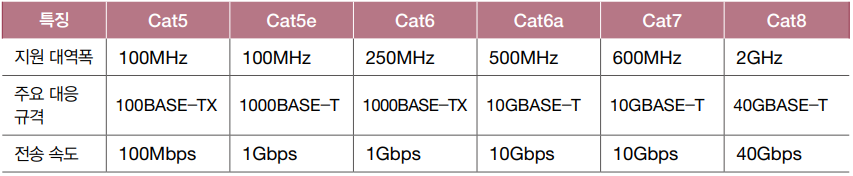
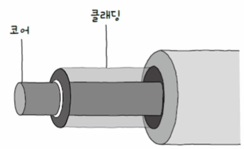

<hr>

# NIC와 케이블

**NIC**<sup>Network Interface Controller</sup>는 호스트와 통신 매체를 연결하고, MAC 주소가 부여되는 네트워크 장비입니다.

**케이블**<sup>cable</sup>은 NIC에 연결되는 물리 계층의 유선 통신 매체로, 유선 네트워크에 사용되는 대표적인 케이블에는 **트위스티드 케이블**과 **광섬유 케이블**이 있습니다.

# NIC

통신 매체를 통해 전달되는 **신호**(전기, 빛 등)와 컴퓨터가 이해할 수 있는 **정보** 간에 **변환**을 담당하는 네트워크 장비입니다.

<small>NIC는 네트워크 인터페이스 카드, 네트워크 어댑터, LAN 카드, 네트워크 카드, 이더넷 카드 등 다양한 명칭으로 불립니다.</small>

<p id="img_center">
  
</p>

## NIC의 역할

호스트와 통신 매체 사이의 **네트워크 인터페이스**<sup>network interface</sup> 역할을 수행합니다.

NIC는 MAC 주소를 통해 자신의 주소와 수신되는 프레임의 수신지 주소를 인식합니다.

이를 통해 자신과 관련 없는 수신지 MAC 주소의 프레임은 폐기하며, FCS 필드를 토대로 오류를 검출하여 잘못된 프레임을 폐기할 수도 있습니다.

# 트위스티드 페어 케이블

**LAN 케이블**의 가장 대중적인 케이블로, 구리 선으로 전기 신호를 주고받는 통신 매체입니다.

트위스티드 페어 케이블은 케이블 본체와 커넥터로 이루어져 있으며, 트위스티드 페어 케이블에서 주로 활용되는 커넥터를 **RJ-45**라고 부릅니다.

<p id="img_center">
  
</p>

구리선은 **노이즈**<sup>noise</sup>에 민감하기 때문에 노이즈 감소를 위해 **차폐**<sup>shielding</sup>를 합니다.

차폐의 종류로는 그물 모양의 철사인 **브레이드 실드**와 **포일 실드**로 구성되어 있습니다.

<p id="img_center">
  
</p>

## 실드에 따른 트위스티드 페어 케이블의 분류

트위스티드 페어 케이블은 다음과 같이 크게 세 종류로 나눌 수 있습니다.

1. **STP**<sup>Shielded Twisted Pair</sup>: **브레이드(S)** 실드로 감싼 트위스티드 페어 케이블
2. **FTP**<sup>Foil Twisted Pair</sup>: **포일(F)** 실드로 감싼 트위스티드 페어 케이블
3. **UTP**<sup>Unshielded Twisted Pair</sup>: **아무것도(U)** 차폐하지 않은 트위스티드 페어 케이블

세부적으로는, 다음과 같은 형태로 표기합니다.

```
[외부실드]/[내부실드]TP
```

예시1: **S/FTP** 케이블: 외부는 브레이드 실드, 내부는 포일 실드
예시2: **SF/FTP** 케이블: 외부는 브레이드와 포일 실드, 내부는 포일 실드

<p id="img_center">
  
</p>

## 카테고리에 따른 트위스티드 페어 케이블의 분류

트위스티드 페어 케이블은 **카테고리**<sup>Category</sup>에 따라 분류할 수도 있습니다.

<p id="img_center">
  
</p>

<small><b>Cat</b>은 <b>Category</b>의 약자입니다.</small>

# 광섬유 케이블

**광섬유 케이블**<sup>fiber optic cable</sup>은 빛(광신호)을 이용해 정보를 주고받는 케이블입니다.

빠른 속도, 장거리 전송, 노이즈 적음 등의 장점이 있으며, 해저 광섬유 케이블을 통해 대륙간 네트워크 연결에 사용됩니다.


## 광섬유 케이블의 구조

광섬유 케이블은 케이블 본체와 커넥터로 이루어져 있습니다. 커넥터의 종류로는 LC, SC, FC, ST 커넥터 등이 있습니다.

케이블 본체는 다음과 같은 구조로 이루어져 있습니다.

- 광섬유: 빛을 운반하는 매체
- 코어<sup>core</sup>: 광섬유의 중심에 있으며, 실질적으로 빛이 흐르는 부분
- 클래딩<sup>cladding</sup>: 코어를 둘러싸며, 빛이 코어 안에서만 흐르도록 빛을 가두는 역할

<p id="img_center">
  
</p>

## 광섬유 케이블의 모드

광섬유 케이블은 코어의 지름에 따라 **싱글 모드 광섬유 케이블(SMF; Single Mode Fiber)**과 **멀티 모드 광섬유 케이블(MMF; Multi Mode Fiber)**로 나뉩니다.

### 싱글 모드 광섬유 케이블

1. 싱글 모드 광섬유 케이블은 코어의 지름이 8~10um 정도로 매우 작습니다.

2. 신호 손실이 적어 장거리 전송에 적합합니다.

3. 멀티 모드에 비해 비용이 높습니다.

4. 파장이 긴 장파장의 빛을 사용합니다.

5. 대표적인 싱글 모드 광섬유 케이블 규격으로는 `1000BASE-LX`와 `10GBASE-LR`이 있습니다.(`L`은 장파장을 의미) 

6. 싱글 모드 케이블 본체의 색상은 대부분 노란색과 파란색을 띠고 있습니다. 

### 멀티 모드 광섬유 케이블

1. 멀티 모드 광섬유 케이블은 코어의 지름이 50~62.5um 정도로 싱글 모드보다 큽니다.

2. 신호 손실이 크기 때문에 장거리 전송에는 부적합합니다.

3. 싱글 모드에 비해 파장이 작은 단파장의 빛을 사용합니다.

4. 대표적인 멀티 모드 광섬유 케이블 규격으로는 `1000BASE-SX`와 `10GBASE-SR`이 있습니다.(`S`은 단파장을 의미) 

5. 멀티 모드 케이블 본체의 색상은 대부분 오렌지색과 아쿠아색을 띠고 있습니다. 