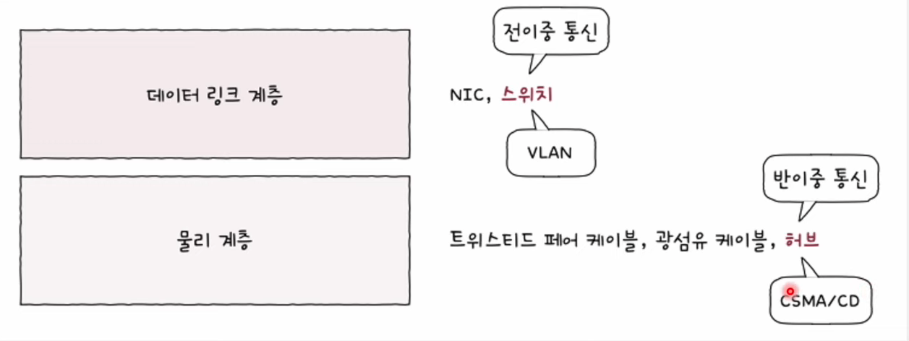
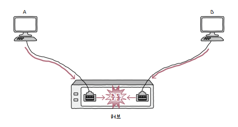
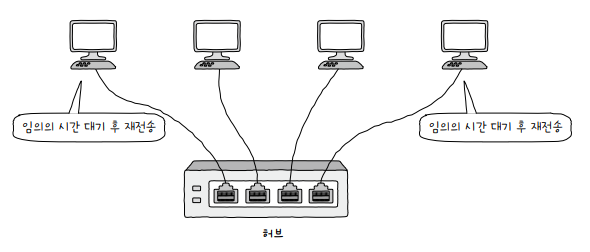

# 네트워크 장비

대표적인 네트워크 장비로는 허브와 스위치가 있으며, 주요 특징은 다음과 같습니다.

- **허브**: 물리 계층, 반이중 모드 통신, CSMA/CD 프로토콜 사용

- **스위치**: 데이터 링크 계층, 전이중 모드 통신, VLAN 사용

  

현재에는 허브가 사용되지 않지만, 스위치와 허브의 개념과 특성이 대비되기 때문에 이들을 쉽게 이해하기 위해서는 둘 다 알아두어야 합니다.

# 주소 개념이 없는 물리 계층

송수신지를 특정할 수 있는 주소는 데이터 링크 계층부터 존재하는 개념으로, 물리 계층에서는 단지 호스트와 통신 매체 간의 연결 및 송수신이 이루어집니다.

그렇기에, 물리 계층의 네트워크 장비는 송수신되는 정보에 대한 어떠한 조작이나 판단을 하지 않습니다.

# 허브(hub)

물리 계층의 **허브**는 여러 대의 호스트를 연결하는 장치입니다. 허브는 **포트**port를 통해 호스트와 연결된 통신 매체를 연결할 수 있습니다.

<small>포트(port)라는 용어는 전송 계층에서 다른 의미로도 사용됩니다.</small>

## 허브의 특징

### 1. 전달받은 신호를 다른 모든 포트로 그대로 다시 내보냅니다.

허브는 물리 계층의 장비로, 물리 계층에서는 주소 개념이 없기에 수신지를 특정할 수 없습니다.

그렇기에, 아래 그림과 같이 하나의 호스트가 신호를 송신하면, 허브는 포트에 연결된 모든 호스트에게 신호를 수신합니다.

  

신호를 수신받은 모든 호스트는 데이터 링크 계층에서 패킷의 **MAC 주소**를 확인하고, 자신과 관련 없는 주소는 폐기합니다.

### 2. 반이중 모드로 통신합니다.

**반이중**half duplex 모드는 한 번에 한 방향으로만 전송할 수 있는 통신 방식이고, **전이중**full duplex 모드는 동시에 양방향으로 데이터를 전송할 수 있는 통신 방식입니다.

허브는 반이중 모드로 통신하는 네트워크 장비로, 동시에 데이터를 주고받을 수 없습니다.

## 콜리전 도메인

허브는 반이중 모드로 동시에 데이터를 주고받을 수 없는데, 호스트들이 동시에 신호를 내보내면 **충돌**collision이 발생합니다.

  

충돌이 발생할 수 있는 영역을 **콜리전 도메인**collision domain이라고 하며, 허브에 연결된 모든 호스트는 같은 콜리전 도메인에 속합니다.

  

## CSMA/CD

**CSMA/CD**는 반이중 이더넷 네트워크에서 **충돌을 방지하는 대표적인 프로토콜**입니다.

CSMA/CD는 'Carrier Sense Multiple Access with Collision Detection'의 약자입니다.

1. CS는 Carrier Sense, 캐리어 감지를 의미합니다.
2. MA는 Multiple Access, 다중 접근을 의미합니다.
3. CD는 Collision Detection, 충돌 검출을 의미합니다.

**CSMA/CD 프로토콜**이 충돌을 방지하는 방식은 다음과 같습니다.

1. 호스트가 허브로 신호를 송신하기 전에, 다른 호스트가 신호를 송신하고 있는지 확인합니다.(Carrier Sense)
2. 다른 호스트가 신호를 송신하지 않을 때에만 신호를 송신합니다.
3. 만약 동시에 신호를 송신(Multiple Access)하여 충돌이 발생했다면, 충돌을 검출(Collision Detection)합니다.
4. 충돌이 검출되면 전송이 중단되고, 충돌을 검출한 호스트는 다른 호스트에게 **잼 신호**jam signal을 보내 충돌이 발생했음을 알립니다.
5. 충돌되었던 호스트들은 서로 다른 램덤한 임의 시간만큼 대기 후 재전송합니다.

  

