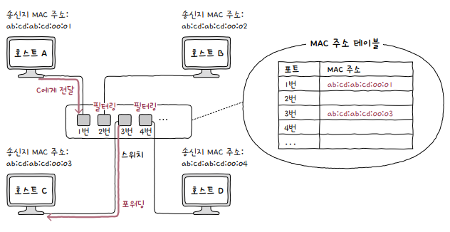

# 스위치(switch)

**스위치**는 **데이터 링크** 계층의 네트워크 장비로, 2계층에서 사용한다 하여 **L2 스위치**라고도 부릅니다.

스위치는 <b>특정 MAC 주소에게만 프레임을 전달</b>할 수 있고, **전이중 모드**의 통신을 지원하므로, CSMA/CD 프로토콜이 필요하지 않습니다.

  

## 스위치의 특징

**MAC 주소 학습**MAC address learning을 통해 MAC 주소를 기억하여, 원하는 호스트에게만 프레임을 전달할 수 있습니다.

스위치는 각 포트들에 연결된 호스트의 MAC 주소를 표 형태의 **MAC 주소 테이블**MAC address table을 메모리에 저장합니다.

## MAC 주소 학습

예시를 통해 스위치가 MAC 주소를 학습하고, MAC 주소 테이블에 정보를 기록하는 과정을 살펴 보겠습니다.

호스트 A, B, C, D는 각각 포트 1, 2, 3, 4번에 연결되어 있으며, 호스트 A가 호스트 C로 프레임을 전송하는 상황을 가정해 보겠습니다.

  

1. 호스트 A가 전송한 프레임의 <b>송신지 MAC 주소</b>를 보고, 1번 포트에 호스트 A의 MAC 주소를 기록합니다.
2. 스위치는 송신지 포트를 제외한 모든 포트로 프레임을 전송합니다. 이러한 동작을 **플러딩**flooding이라고 합니다.
3. 호스트 B와 D는 <b>수신지 MAC 주소</b>를 보고 자신과 관련이 없는 프레임이므로 폐기합니다.
4. 호스트 C는 프레임을 받고, 스위치로 **응답 프레임**을 전송합니다.
5. 응답 프레임의 송신지 MAC 주소를 보고, 3번 포트에 호스트 C의 MAC 주소를 기록합니다.

  

  

  

위와 같은 형태로, 스위치는 포트에 연결되어 있는 호스트의 MAC 주소를 기록함으로써, 다시 정보를 주고 받을 때에는 모든 포트로 프레임을 전송하는 **플러딩**을 하지 않아도 됩니다.

그러면, 호스트 A가 다시 호스트 C에게 프레임을 전송하는 상황을 가정해 보겠습니다.

1. 스위치는 프레임의 <b>수신지 MAC 주소</b>를 보고, 3번 포트를 제외한 2번과 4번 포트를 **필터링**filtering합니다.
2. 3번 포트로 프레임을 전송합니다. 이를 포워딩fowarding이라고 합니다.
3. 만약 일정 시간 동안 포워딩이 되지 않았다면, 스위치는 해당 프레임을 삭제합니다. 이를 **에이징**aging이라고 합니다.  

  

## VLAN

**VLAN**은 'Virtual Local Area Network'의 약자로써, 한 대의 스위치로 여러 개의 **가상 LAN**(근거리 통신망)을 구축하는 방법입니다.

VLAN을 구성하는 방법에는 '스위치의 포트로 VLAN을 결정'하는 **포트 기반 VLAN**과 '송수신하는 프레임 속 MAC 주소가 호스트가 속할 VLAN을 결정'하는 **MAC 기반 VLAN**이 있습니다.

### 포트 기반 VLAN

**포트 기반 VLAN**port based VLAN은 스위치의 포트로 VLAN을 결정하는 방식입니다.

특정 포트에 VLAN을 할당하고, 해당 포트에 호스트를 연결함으로써 VLAN에 포함시킬 수 있습니다.

  

만약에 포트가 부족하다면, 두 대 이상의 VLAN 스위치를 효율적으로 연결하여 확장하는 방법인 **VLAN 트렁킹**VLAN Trunking 방식을 통해 스위치를 연결하여 사용합니다.

스위치 간의 통신을 위한 특별한 포트인 **트렁크 포트**trunk port를 통해 스위치 간의 프레임을 주고 받을 수 있습니다.

  

**일반 이더넷 프레임**에서는 트렁크 포트를 통해 전달된 프레임이 어느 VLAN에 속하는지 알 수 없습니다. 그래서, VLAN 트렁킹 방식을 사용하기 위해서는 헤더에 **VLAN 태그**가 포함된 `802.1Q 프레임`이라는 **확장된 이더넷 프레임**을 사용해야 합니다.

  

  

### MAC 기반 VLAN

송수신하는 프레임 속 MAC 주소가 호스트가 속할 VLAN을 결정하는 방식을 **MAC 기반 VLAN**MAC based VLAN이라고 합니다.

아래 그림처럼 호스트 A의 MAC 주소가 3번 VLAN에 할당되었다면, 호스트 A가 <b>어떤 포트에 연결되던지</b>, 3번 VLAN에 속한 호스트로 동작합니다.

  

