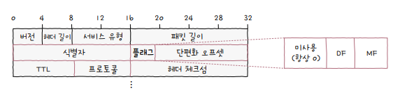
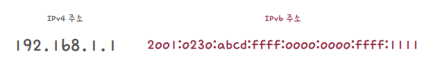
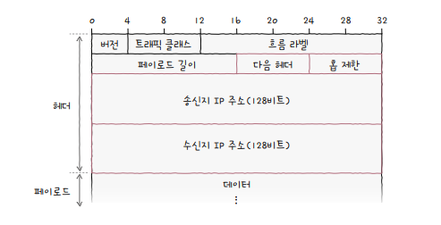
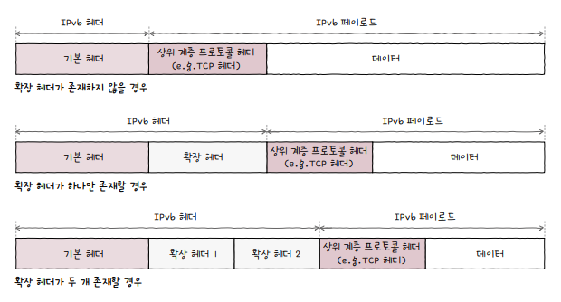
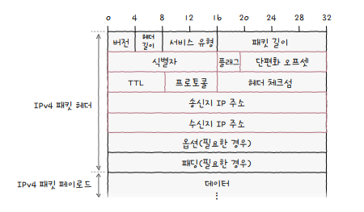

# 인터넷 프로토콜(IP)

인터넷 프로토콜(IP; Internet Protocol)은 IP 버전4(**IPv4**)와 IP 버전6(**IPv6**)가 있습니다.

IPv4 주소는 총 4바이트(32비트)로 구성되며, 8비트당 **옥텟**으로 구분됩니다.(예: `192.168.1.1`)

IP의 대표적인 기능에는 **IP 주소 지정**과 **IP 단편화**가 있으며, IPv4를 정의한 인터넷 표준 문서는 **RFC791** 입니다.

**IP 주소 지정**IP addressing은 IP 주소를 바탕으로 송수신 대상을 지정하는 것을 의미합니다.

**IP 단편화**IP fragmentation는 전송하고자 하는 패킷의 크기가 **MTU**보다 클 경우, 이를 MTU 크기 이하의 복수의 패킷으로 나누는 것을 의미합니다.

**MTU**Maximum Transmission Unit란 한 번에 전송 가능한 **IP 패킷의 최대 크기**를 의미합니다. IP 패킷의 헤더도 MTU 크기에 포함되며, 일반적인 MTU의 크기는 1500바이트 입니다.

# IPv4

IPv4는 데이터링크 계층의 프레임 페이로드로 데이터 필드에 명시됩니다.

  

IPv4 패킷의 가장 핵심이 되는 필드는 다음과 같습니다.

1. 식별자(identifier)
2. 플래그(flag)
3. 단편화 오프셋(fragment offset)
4. TTL(Time To Live)
5. 프로토콜(Protocol)
6. 송신지 IP 주소
7. 수신지 IP 주소

## 1. 식별자(identifier)

IPv4 패킷이 여러 조각으로 쪼개져서 전송되었을 경우, 수신지에서 패킷들을 재조합할 때 어떤 메시지로부터 쪼개졌는지 알 수 있도록 **패킷에 할당된 번호**입니다.

  

## 2. 플래그(flag)

플래그는 총 세 개의 비트로 구성된 필드입니다.

첫 번째 비트는 항상 **0**으로 예약된 비트로 현재는 사용되지 않습니다.

두 번째 비트는 **DF**(Don't Fragment)로 IP 단편화의 수행여부를 결정합니다.

|DF 비트|설명|
|:-:|:-:|
| 0 | IP 단편화 가능 |
| 1 | IP 단편화 불가능 |

세 번째 비트는 **MF**(More Fragment)로 단편화된 패킷이 남아 있는지를 나타내는 것으로, 마지막 패킷이 0이고, 나머지는 1로 설정됩니다.

|MF 비트|설명|
|:-:|:-:|
| 0 | 마지막 패킷 |
| 1 | 패킷이 남아있음 |

  

## 3. 단편화 오프셋(fragment offset)

단편화 오프셋은 패킷이 단편화되기 전에 패킷의 **초기 데이터에서 몇 번째로 떨어진 패킷**인지를 나타냅니다.

수신지에서 재조합할 때, 순서대로 재조합하기 위해 활용됩니다.

  

## 4. TTL(Time To Live)

**패킷의 수명**을 의미합니다. 패킷이 하나의 라우터를 거칠 때마다 TTL이 1씩 감소하며, TTL 값이 0으로 떨어진 패킷은 폐기됩니다.

<small>패킷이 호스트 또는 라우터에 한 번 전달되는 것을 **홉(hop)**이라고 합니다.</small>

  

## 5. 프로토콜(Protocol)

IP 패킷의 *프로토콜*은 상위 계층의 프로토콜이 무엇인지를 나타내는 필드입니다.

예를 들어서 전송 계층의 대표적인 프로토콜인 *TCP*는 6번, *UDP*는 17번 입니다.

## 6. 송신지 IP 주소와 수신지 IP 주소

*송신지 IP 주소*와 *수신지 IP 주소*에서는 이름 그대로 송수신지의 IPv4 주소를 알 수 있습니다.

# IPv6

IPv4 주소는 총 32비트로 이론적으로 할당 가능한 주소는 총 *232*(약 43억 개)입니다.

**IPv6** 주소는 총 16바이트(128비트)로 콜론(:)으로 구분된 8개 그룹의 16진수로 표기됩니다. 이론적으로 *2128*개의 무한에 가까운 개수를 할당할 수 있습니다.

  

**IPv6 패킷의 헤더**는 IPv4 패킷에 비해 간소화되었으며, 가장 핵심이 되는 필드는 다음과 같습니다.

  

1. 다음 헤더(next header)
2. 홉 제한(hop limit)
3. 송신지 IP 주소
4. 수신지 IP 주소

## 1. 다음 헤더(next header)

다음 헤더 필드는 **상위 계층의 프로토콜**을 가리키거나 **확장 헤더**를 가리킵니다.

IPv6의 **기본 헤더**에 추가적인 헤더 정보가 필요할 경우 **확장 헤더**를 덧붙이는 형태로, 확장 헤더는 기본 헤더와 페이로드 데이터 사이에 위치합니다.

  

대표적인 확장 헤더의 종류는 다음과 같습니다.

1. 홉 간 옵션: 송신지에서 수신지에 이르는 모든 경로의 네트워크 장비가 패킷을 검사하도록 함
2. 수신지 옵션: 수신지에서만 패킷을 검사하도록 함
3. 라우팅: 라우팅 관련 정보를 운반
4. 단편화를 위한 단편
5. 암호화를 위한 ESP, AH

## 2. 홉 제한(hop limit)

홉 제한 필드는 IPv4 패킷의 TTL 필드와 비슷하게 **패킷의 수명**을 나타내는 필드입니다.

## 3. 송신지 IP 주소와 수신지 IP 주소

송신지 주소와 수신지 주소를 통해 IPv6 주소 지정이 가능합니다.

# 마치며,

아래 그림은 IPv4의 패킷입니다. 그림을 보면 알 수 있듯이, **옵션**과 **패딩** 필드는 필요한 경우에만 선택적으로 존재합니다.

  

즉, IPv4의 헤더 길이는 가변적입니다. 반면 IPv6의 기본 헤더는 *40바이트*로 고정적입니다.

IPv6는 현재 유망한 프로토콜로 다수의 장비에서 지원하지만, 아직까지는 IPv4 프로토콜이 주로 사용되고 있습니다.