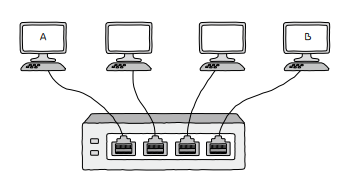

# ARP 프로토콜

**ARP**(*Address Resolution Protocol*)은 IP 주소를 통해 **MAC 주소**를 알아내는 프로토콜입니다.

ARP의 동작 과정은 다음과 같습니다.

1. ARP 요청
2. ARP 응답
3. ARP 테이블 갱신

예제를 통해 ARP의 주요 동작 과정을 살펴보도록 하겠습니다.

<small>스위치의 MAC 주소 학습과 비슷해 보이지만, 스위치의 MAC 주소 학습은 스위치가 호스트들의 MAC 주소를 알아내는 방법이고, ARP는 **호스트가 다른 호스트들의 MAC 주소를 알아내는 방법**입니다.</small>

## 0. 예제 상황

1. 호스트 A와 B는 동일한 네트워크에 속해 있습니다.

2. 호스트 A가 호스트 B에게 패킷을 보내려고 합니다.

3. 호스트 A는 호스트 B의 IP 주소를 알고 있지만, MAC 주소는 모르고 있습니다.

  

## 1. ARP 요청

호스트 A는 호스트 B의 MAC 주소를 알아내기 위해, **ARP 요청**ARP Request이라는 ARP 패킷을 동일 네트워크상 모든 호스트에게 **브로드캐스트** 메시지로 전송합니다.

