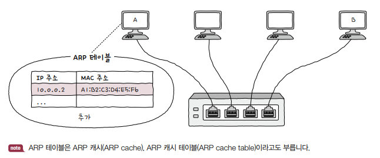

<hr>

# ARP 프로토콜

**ARP**(*Address Resolution Protocol*)은 IP 주소를 통해 *동일 네트워크*에 속한 호스트의 **MAC 주소**를 알아내는 프로토콜입니다.

<small>다른 네트워크에 속한 호스트에게 패킷을 보내야 할 경우 네트워크 외부로 나가기 위한 장비(라우터)의 MAC 주소를 알아내어 패킷을 전송합니다.</small>

ARP의 동작 과정은 다음과 같습니다.

1. ARP 요청
2. ARP 응답
3. ARP 테이블 갱신

예제를 통해 ARP의 주요 동작 과정을 살펴보도록 하겠습니다.

<small>스위치의 MAC 주소 학습과 비슷해 보이지만, 스위치의 MAC 주소 학습은 스위치가 호스트들의 MAC 주소를 알아내는 방법이고, ARP는 **호스트가 다른 호스트들의 MAC 주소를 알아내는 방법**입니다.</small>

## 0. 예제 상황

1. 호스트 A와 B는 동일한 네트워크에 속해 있습니다.

2. 호스트 A가 호스트 B에게 패킷을 보내려고 합니다.

3. 호스트 A는 호스트 B의 IP 주소를 알고 있지만, MAC 주소는 모르고 있습니다.

<p id="img_center">
  
</p>

## 1. ARP 요청

호스트 A는 호스트 B의 MAC 주소를 알아내기 위해, **ARP 요청**<sup>ARP Request</sup>이라는 ARP 패킷을 동일 네트워크상 모든 호스트에게 **브로드캐스트** 메시지로 전송합니다.

<p id="img_center">
  
</p>

## 2. ARP 응답

네트워크 내의 모든 호스트는 ARP 요청 메시지를 수신하지만, B를 제외한 나머지 호스트는 자신의 IP 주소가 아니므로 이를 무시합니다.

호스트 B는 호스트 A에게 **ARP 응답**<sup>ARP Reply</sup>이라는 ARP 패킷을 **유니케스트** 메시지로 전송합니다.

이렇게 호스트 A는 호스트 B의 MAC 주소를 알게 됩니다.

## 3. ARP 테이블 갱신

호스트 A는 **ARP 테이블**<sup>ARP Table</sup>에 IP 주소에 대응하는 MAC 주소를 저장합니다.

ARP 테이블은 일정 시간이 지나면 삭제되고, 임의로 삭제할 수도 있습니다. 여기까지 이루어지면 앞으로 A는 B와 통신할 때 굳이 브로드캐스트로 ARP 요청을 보낼 필요가 없어집니다.

<p id="img_center">
  
</p>

<small>ARP 테이블을 확인할 수 있는 명령어는 `arp -a`입니다. IP 주소와 그에 대응된 MAC 주소를 볼 수 있습니다.</small>

```bash
arp -a
```

# 다른 네트워크에서의 ARP

만약 호스트 A와 호스트 B가 다른 네트워크에 속해 있다면, 네트워크 외부로 나가기 위한 장비(라우터)의 MAC 주소를 알아내어 패킷을 전송합니다.

호스트 A와 호스트 B에게 패킷을 전송하는 주요 과정은 다음과 같습니다.

<small>이 상황은 매우 간략화된 예시로, 실제로는 라우터 간 통신을 주고받을 때 ARP만 사용하지는 않습니다.</small>

1. **호스트A**는 라우터A와의 ARP 요청-응답을 통해 라우터A의 MAC 주소를 알아내어 *라우터A에게 패킷을 전송*합니다.

2. **라우터A**는 라우터B와의 ARP 요청-응답을 통해 라우터B의 MAC 주소를 알아내어 *라우터B에게 패킷을 전송*합니다.

3. **라우터B**는 호스트B와의 ARP 요청-응답을 통해 호스트B의 MAC 주소를 알아내어 *호스트B에게 패킷을 전송*합니다.

<p id="img_center">
  
</p>

