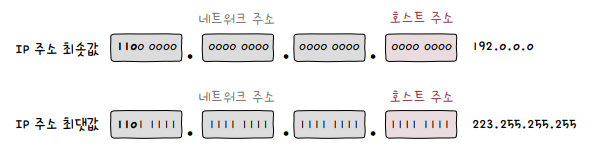

# 네트워크 주소와 호스트 주소

하나의 IP 주소는 크게 **네트워크 주소**와 **호스트 주소**로 이루어집니다.

**네트워크 주소**는 *네트워크 ID* 또는 *네트워크 식별자*network identifier라고도 부르며, 호스트가 속한 특정 **네트워크를 식별하는 역할**을 합니다.

**호스트 주소**는 *호스트 ID* 또는 *호스트 식별자*host identifier라고도 부르며, 네트워크 내에서 특정 **호스트를 식별하는 역할**을 합니다.

네트워크 주소와 호스트 주소는 다음 그림과 같이 *옥텟*으로 나뉘며, 클래스class에 따라 각각 얼마만큼의 주소를 할당할 것인지를 구분합니다.

  

# 클래스풀 주소 체계

**클래스**는 네트워크 크기에 따라 IP 주소를 분류하는 기준입니다.  

클래스를 이용하면 필요한 호스트 IP 개수에 따라, *네트워크 크기를 가변적으로 조정*해 네트워크 주소와 호스트 주소를 구획할 수 있습니다.

이렇게, 클래스를 기반으로 IP 주소를 관리하는 주소 체계를 **클래스풀 주소 체계**classful addressing라고 합니다.

클래스는 A부터 E까지 총 다섯개의 클래스가 있습니다. **D 클래스**는 *멀티캐스트를 위한 클래스*, **E 클래스**는 *특수한 목적을 위해 예약된 클래스*이므로, 실직적으로 사용되는 클래스는 A, B, C 입니다.

  

## 0. 네트워크 주소와 브로드캐스트 주소

클래스 학습에 앞서 알아두어야 할 것이 있습니다. 바로, **호스트 주소**에 할당되는 네트워크 주소와 브로드캐스트 주소입니다.

호스트 주소가 *전부 0인 IP 주소*는 네트워크 자체를 의미하는 **네트워크 주소**로 사용됩니다.

호스트 주소가 *전부 1인 IP 주소*는 **브로드캐스트**를 위한 주소로 사용됩니다.

  

예를 들어, A 클래스의 경우 네트워크 주소는 1옥텟(**8비트**), 호스트 주소는 3옥텟(**24비트**)으로 구성되는데, 호스트 주소가 전부 0인 경우(`x.0.0.0`)와 전부 1인 경우(`x.1.1.1`)은 사용이 불가능 합니다. 

즉, 이론적으로 할당 가능한 호스트 주소는 *224개*이나 사용 불가능한 두 가지 주소를 제외한, 할당 가능한 호스트 수는 **(224-2)개**입니다.

## 1. A 클래스

1. A 클래스는 네트워크 주소 1옥텟(**8비트**), 호스트 주소 3옥텟(**24비트**)로 구성됩니다.

2. 네트워크 주소 첫 비트는 *'0'*으로 고정되어 있어, 네트워크 주소에 할당 가능한 주소는 *27(128)개* 입니다.

3. 호스트 주소는 *224개*의 주소를 가질 수 있으나, 네트워크 주소와 브로드캐스트를 제외한 **(224-2)개**의 주소에 할당 가능합니다.

4. A 클래스가 가질 수 있는 IP 주소의 최댓값은 `127.255.255.255` 입니다.

5. IP 주소의 첫 옥텟 값이 `0~127`일 경우 A 클래스임을 짐작할 수 있습니다.

  

## 2. B 클래스

1. B 클래스는 네트워크 주소 2옥텟(**16비트**), 호스트 주소 2옥텟(**16비트**)로 구성됩니다.

2. 네트워크 주소의 처음 두 비트는 *'10'*으로 고정되어 있어, 네트워크 주소에 할당 가능한 주소는 *214개* 입니다.

3. 호스트 주소는 *216개*의 주소를 가질 수 있으나, 네트워크 주소와 브로드캐스트를 제외한 **(216-2)개**의 주소에 할당 가능합니다.

4. B 클래스가 가질 수 있는 IP 주소의 최솟값은 `128.0.0.0` 입니다.

5. B 클래스가 가질 수 있는 IP 주소의 최댓값은 `191.255.255.255` 입니다.

6. IP 주소의 첫 옥텟 값이 `128~191`일 경우 B 클래스임을 짐작할 수 있습니다.

  

## C 클래스

1. C 클래스는 네트워크 주소 3옥텟(**24비트**), 호스트 주소 1옥텟(**8비트**)로 구성됩니다.

2. 네트워크 주소의 처음 세 비트는 *'110'*으로 고정되어 있어, 네트워크 주소에 할당 가능한 주소는 *221개* 입니다.

3. 호스트 주소는 *28개*의 주소를 가질 수 있으나, 네트워크 주소와 브로드캐스트를 제외한 **(28-2)개**의 주소에 할당 가능합니다.

4. C 클래스가 가질 수 있는 IP 주소의 최솟값은 `192.0.0.0` 입니다.

5. C 클래스가 가질 수 있는 IP 주소의 최댓값은 `223.255.255.255` 입니다.

6. IP 주소의 첫 옥텟 값이 `192~223`일 경우 C 클래스임을 짐작할 수 있습니다.

  

