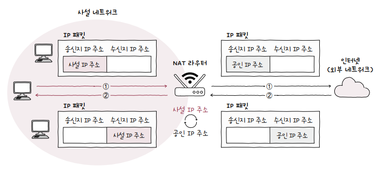

# 공인 IP 주소

**공인 IP 주소**public IP address는 *전 세계에서 고유한 IP 주소*입니다. 공인 IP 주소는 ISP나 공인 IP 주소 할당 기관을 통해 할당받을 수 있습니다.

# 사설 IP 주소

**사설 IP 주소**private IP address는 *사설 네트워크에서 사용하기 위한 IP 주소*입니다. 사설 네트워크란 인터넷, 외부 네트워크에 공개되지 않은 네트워크를 의미합니다.

# 사설 IP 주소의 탄생

사설 IP 주소와 공인 IP 주소가 나뉘어진 계기는 인터넷의 폭발적인 성장과 **IPv4 주소 자원의 한계** 때문입니다.

인터넷 초기에는 IPv4 주소(32비트)만을 사용하여 43억 개 정도의 IP 주소를 할당할 수 있었습니다. 이 정도면 충분할 것으로 예상했으나, 인터넷이 빠르게 확산되면서 기업, 가정, 모바일 기기 등이 네트워크에 연결되기 시작했습니다. 결국, IPv4 주소만으로는 모든 기기를 인터넷에 연결하기에 부족한 상황에 이르게 되었습니다.

이를 해결하기 위해 다음과 같은 방법들이 고안되었습니다.

## 1. 사설 IP 주소와 NAT(Network Address Translation)

1996년, **RFC 1918**에 의해 사설 IP 주소의 개념이 도입되었습니다. 사설 IP 주소는 내부 네트워크에서만 사용되며, 외부 네트워크(공인 인터넷)에서는 사용되지 않는 특별한 주소 대역입니다. 

사설 IP 주소로 예약된 대역은 다음과 같습니다.

- *10.0.0.0/8* (10.0.0.0 ~ 10.255.255.255)
- *172.16.0.0/12* (172.16.0.0 ~ 172.31.255.255)
- *192.168.0.0/16* (192.168.0.0 ~ 192.168.255.255)

**NAT**(Network Address Translation)는 이러한 *사설 IP 주소를 공인 IP 주소 하나로 변환해주는 역할*을 합니다. 즉, 하나의 공인 IP 주소만으로 여러 내부 기기가 인터넷에 연결될 수 있게 하여 IPv4 주소를 절약하는 방식입니다. 가정이나 회사의 **라우터**가 주로 NAT 역할을 수행하며, 내부 기기들에 사설 IP 주소를 할당하고 인터넷에 연결할 때는 라우터의 공인 IP 주소를 통해 통신합니다.

  

## 2. IPv6 도입

IPv4의 한계를 보완하기 위해 128비트의 **IPv6**가 도입되었습니다. IPv6는 사실상 무한에 가까운 주소를 제공하므로, 이론적으로 모든 기기가 공인 IP 주소를 사용할 수 있게 합니다. 그러나 *IPv6로 완전한 전환이 아직 진행 중*이기 때문에 현재도 많은 네트워크에서 IPv4와 사설 IP 주소가 널리 사용되고 있습니다.

# 사설 IP 주소와 포트(Port)

사설 IP 주소와 포트(Port)는 네트워크에서 *다수의 기기가 하나의 공인 IP 주소로 인터넷에 연결될 수 있도록 돕는 중요한 요소*입니다. 특히, **NAT**(Network Address Translation)와 포트는 서로 밀접하게 연관되어 있습니다.

## 1. NAT와 포트 매핑

NAT는 하나의 공인 IP 주소를 통해 여러 사설 IP 주소를 가진 기기들이 동시에 인터넷에 접속할 수 있도록 도와줍니다. 여기서 포트가 중요한 역할을 합니다. NAT 라우터는 각 *사설 IP 주소와 관련된 포트를 통해 트래픽을 구분하고 관리*합니다. 이 과정을 **포트 매핑** 또는 **포트 포워딩**이라고도 합니다.

예를 들어 가정 네트워크에서 여러 기기(예: 스마트폰, 노트북, 태블릿)가 인터넷에 동시에 연결된 상황을 생각해 봅시다.

1. 각 기기에는 사설 IP 주소가 할당됩니다(예: `192.168.1.10`, `192.168.1.11`)
2. 이 기기들이 인터넷에 연결될 때, NAT 라우터는 외부로 나가는 트래픽을 *포트 번호와 함께 기록*해둡니다.
3. 예를 들어, 기기 `192.168.1.10`에서 특정 웹사이트에 접속하면 NAT 라우터는 이를 공인 IP 주소와 특정 포트(예: `203.0.113.1:45001`)로 매핑해 *외부에 전달*합니다.
4. 응답이 돌아오면, NAT 라우터는 *해당 포트를 보고* 원래 요청한 사설 IP 주소(`192.168.1.10`)로 트래픽을 전달합니다.

## 2. 포트의 역할

포트는 각 기기의 **네트워크 세션을 구분**하는 데 사용됩니다. 포트 번호를 통해 라우터는 여러 기기에서 발생한 트래픽을 정확하게 구분하고, 각각의 기기로 트래픽을 돌려보낼 수 있습니다. 이 덕분에 *하나의 공인 IP 주소를 사용하더라도 여러 기기가 동시에 인터넷에 연결*될 수 있습니다.

## 3. 예시: 포트 넘버로 구분되는 트래픽

예를 들어, 집에서 스마트폰과 노트북이 같은 웹사이트에 접속하더라도, 각각의 트래픽은 *다른 포트 번호를 할당받아 구분*됩니다.

- 스마트폰에서 발생한 요청은 공인 IP 주소에 포트 `45001`을 사용하여 웹사이트에 전달
- 노트북에서 발생한 요청은 공인 IP 주소에 포트 `45002`를 사용하여 웹사이트에 전달

이렇게 각 트래픽이 특정 포트 번호와 매핑되면서, NAT는 어떤 트래픽이 어떤 기기로 가야 하는지 명확히 알 수 있게 됩니다.

## 4. 요약

사설 IP 주소와 포트의 관계는 NAT를 통해 여러 사설 IP 주소를 하나의 공인 IP 주소로 연결할 때, 트래픽을 구분하고 라우팅하는 핵심 요소입니다. 포트는 각 기기의 연결 세션을 구분해 줌으로써, 공인 IP 주소 하나만으로 다수의 기기가 동시에 인터넷을 사용할 수 있게 해 줍니다.