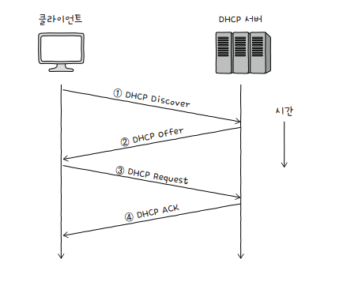
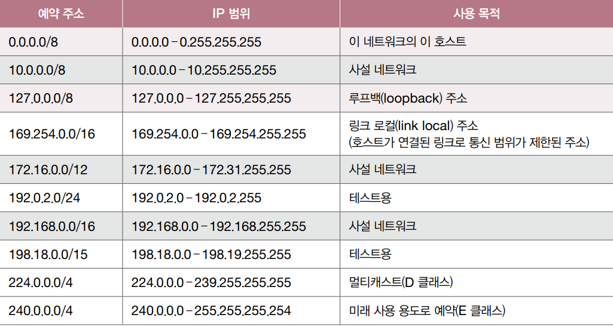

# 정적 할당

**정적 할당**은 호스트에 직접 수작업으로 IP 주소를 부여하는 방식입니다. 이렇게 할당된 IP 주소를 **정적 IP 주소**static IP address라고 부릅니다.

운영체제의 네트워크 설정에서 IP 주소를 수동으로 설정할 수 있습니다. 일반적으로 부여하고자 하는 IP 주소, 서브넷 마스크, 게이트웨이(라우터) 주소, DNS 주소를 입력합니다.

<small>**기본 게이트웨이(default gateway)**는 호스트가 속한 네트워크 외부로 나가기 위한 기본적인 첫 경로(첫 번째 **홉**)을 의미합니다. 일반적으로 라우터(공유기)의 주소를 의미하는 경우가 많습니다.</small>

# 동적 할당과 DHCP

**동적 할당**은 IP 주소를 동적(자동)으로 할당받는 방식입니다. 이렇게 할당된 IP 주소를 **동적 IP 주소**dynamic IP address라고 부릅니다. 

IP 동적 할당에 사용되는 대표적인 프로토콜은 **DHCP**Dynamic Host Configuration Protocol입니다. DHCP는 **응용 계층**에 속하는 프로토콜 입니다.

# DHCP 동작 과정

DHCP를 통한 IP 주소 할당은 IP 주소를 제공하는 **DHCP 서버**와 IP 주소를 할당받고자하는 클라이언트간에 메시지를 주고받음으로써 이루어집니다.

<small>**DHCP 서버**의 역할은 일반적으로 라우터(공유기)가 수행하지만, 특정 호스트에 DHCP 서버 기능을 추가할 수도 있습니다.</small>

DHCP 서버를 통해 할당받은 IP 주소는 **임대 기간**이 정해져 있으며, DHCP에서 설정된 임대기간이 지나면 IP 주소는 DHCP 서버로 다시 반납됩니다. 

<small>임대 기간은 **임대 갱신**(lease renewal)을 통해 연장 가능하며, 기본적으로 두 차레는 자동으로 연장됩니다.</small>

IP 주소를 할당받는 과정에서 클라이언트와 DHCP 서버 간에 주고받는 **메시지의 종류**는 크게 네 가지가 있습니다.

1. DHCP Discover
2. DHCP Offer
3. DHCP Request
4. DHCP Acknowledgment(DHCP ACK)

  

## 1. DHCP Discover(클라이언트 → DHCP 서버)

*Discover*는 '발견하다'라는 의미로, *클라이언트*는 DHCP Discover를 *브로드캐스트*로 전송하여 **DHCP 서버를 찾습니다**. 

## 2. DHCP Offer(DHCP 서버 → 클라이언트)

*Offer*는 '제안하다'라는 의미로, DHCP Discover 메시지를 받은 *DHCP 서버*는 IP 주소, 서브넷 마스크, 임대 기간 등의 정보를 클라이언트에게 **제안(전송)합니다**.

## 3. DHCP Request(클라이언트 → DHCP 서버)

*Request*는 '요청하다'라는 의미로, *클라이언트*는 DHCP 서버에게 DHCP Offer를 통해 전달받은 IP 주소를 사용해도 되는지 **요청합니다**.

## 4. DHCP ACK(DHCP 서버 → 클라이언트)

*Acknowledgment(ACK)*는 '승인하다'라는 의미로, *DHCP 서버*는 클라이언트에게 IP 주소를 사용해도 된다라는 **최종 승인 메시지를 전송**합니다.

# 예약 주소

특수한 목적을 위해 예약된 IP 주소도 있습니다. 대표적인 예약 주소와 사용 목적은 다음과 같습니다.

  

## 1. 루프백 주소

**루프백 주소**loopback address는 자기 자신을 가리키는 특별한 주소입니다. 가장 일반적으로 사용되는 주소는 `127.0.0.1`이고, **로컬호스트**localhost라고도 부릅니다.

루프백 주소로 전송된 패킷은 자기 자신에게 되돌아오므로 자기 자신을 마치 다른 호스트인 양 간주하여 패킷을 전송할 수 있습니다. 주로 테스트나 디버깅 용도로 사용됩니다.

## 2. 0.0.0.0/8

`0.0.0.0/8`은 인터넷 표준 공식 문서(**RFC 6890**)에 따르면 '이 네트워크의 이 호스트(This host on this network)를 지칭하도록 예약되었다'라고 명시되어 있습니다.

호스트가 IP 주소를 할당받기 전에 임시로 사용하는 경우가 많습니다. 호스트 입장에서 자신을 지칭할 IP 주소가 없을 때, `0.0.0.0/8`을 자신의 IP 주소로 지칭합니다.

## 3. 0.0.0.0/0

`0.0.0.0/0`은 '모든 임의의 IP 주소'를 의미합니다. 이 주소는 주로 패킷이 이동할 경로를 결정하는 라우팅에서 활용되는데, 디폴트 라우트를 나타내기 위해 사용됩니다.

**디폴트 라우트**default route란 패킷을 어떤 IP 주소로 전달할지 결정하기 어려울 경우 기본적으로 패킷을 전달할 경로를 의미합니다.

즉, 어디로 패킷을 전달해야 할지 명확하지 않을 경우 이곳으로 패킷을 이동시키라고 표기하는 셈입니다.

