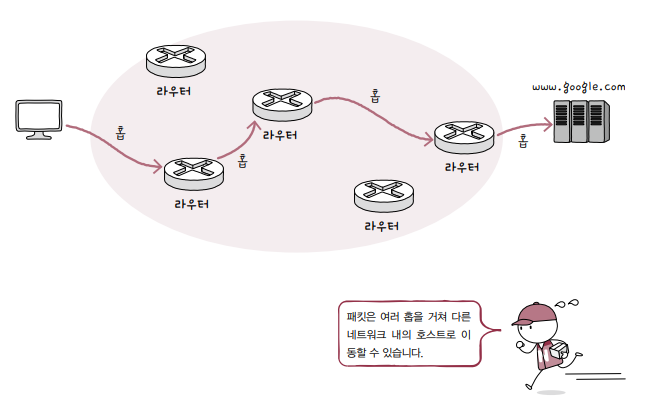
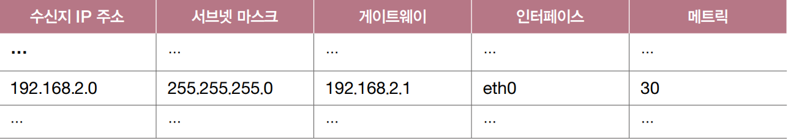
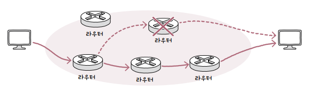
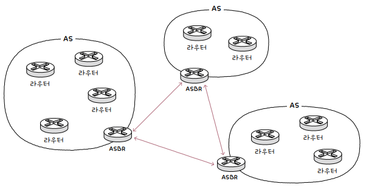
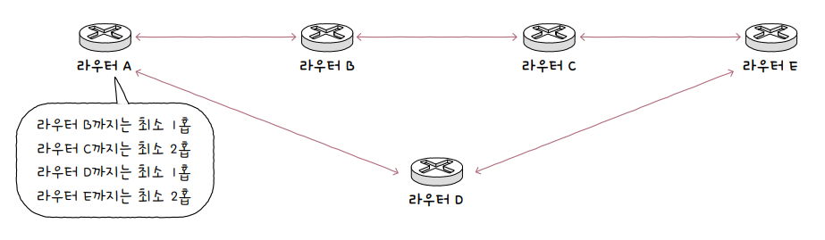
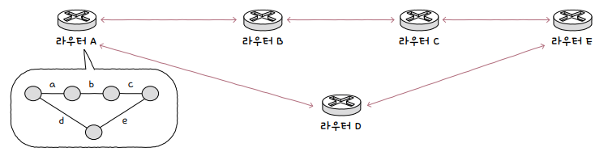
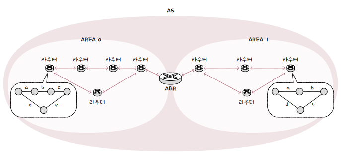

<hr>

# 라우터

라우터는 둘 이상의 패킷 전환 네트워크 또는 서브네트워크를 연결하는 장치입니다. 라우터는 데이터 패킷을 의도한 IP 주소로 전달하여 이러한 네트워크 간의 트래픽을 관리하고, 여러 장치가 동일한 인터넷 연결을 사용할 수 있도록 하는 등, 두 가지 주요 기능을 제공합니다.

라우터에는 여러 유형이 있지만, 대부분의 라우터는 *근거리 통신망(LAN)과 광역 네트워크(WAN) 간에 데이터를 전달*합니다.

<small>네트워크 스위치는 동일한 네트워크의 장치 그룹 간에 데이터 패킷을 전달하는 반면, 라우터는 서로 다른 네트워크 간에 데이터를 전달합니다.</small>

라우터의 핵심 기능은 **패킷이 이동할 최적의 경로를 설정**한 뒤 해당 경로로 패킷을 이동시키는 것입니다. 이를 **라우팅**이라 합니다. 

멀리 떨어져 있는 호스트 간의 통신 과정에서 패킷은 서로에게 도달하기까지 여러 라우터를 거쳐서 다양한 경로로 이동할 수 있습니다.

라우팅 도중 패킷이 호스트와 라우터 간에, 혹은 라우터와 라우터 간에 이동하는 과정을 **홉**<sup>hop</sup>이라고 부릅니다.

<p id="img_center">
  
</p>

# 라우팅 테이블

라우팅의 핵심은 라우터가 저장하고 관리하는 라우팅 테이블입니다. **라우팅 테이블**<sup>routing table</sup>은 특정 수신지까지 도달하기 위한 정보를 명시한 일종의 표와 같은 정보입니다. 라우터는 라우팅 테이블을 참고하여 수신지까지의 도달 경로를 판단합니다.

라우팅 테이블에 포함된 정보는 라우팅 방식 또는 호스트의 환경에 따라 달라질 수 있으나, 핵심적인 정보는 다음과 같습니다.

1. **수신지 IP 주소**와 **서브넷 마스크**: 최종적으로 패킷을 전달할 대상

2. **다음 홉**<sup>next hop</sup>: 최종 수신지까지 가기 위해 다음으로 거쳐야 할 호스트의 IP 주소나 인터페이스. **게이트웨이**라고 명시되기도 합니다.

3. **네트워크 인터페이스**: 패킷을 내보낼 통로. 인터페이스(NIC) 이름이 직접적으로 명시되거나 인터페이스에 대응하는 IP 주소가 명시되기도 합니다.

4. **메트릭**<sup>metric</sup>: 해당 경로로 이동하는 데에 드는 비용을 의미. 라우터가 라우팅 테이블에 있는 경로 중 패킷을 내보낼 경로를 선택할 때, *메트릭이 낮은 경로를 선호*합니다.

예를 들어, 다음 표와 같은 라우팅 테이블이 있다고 가정해 보겠습니다. 이는 수신지가 `192.168.2.0/24`(호스트 IP 주소 범위 `192.168.2.1`~`192.168.2.254`)인 패킷은 `eth0`(인터페이스)를 통해 `192.168.2.1`(게이트웨이)로 전송하라는 것을 의미합니다.

<p id="img_center">
  
</p>

만약, 전송할 패킷의 경로가 라우팅 테이블에 없다면, 기본 경로인 **디폴트 라우트**<sup>default route</sup>로 패킷을 내보냅니다.

디폴트 라우트는 모든 IP 주소를 의미하는 `0.0.0.0/0`으로 명시합니다. 예를 들어 수신지 IP 주소가 `1.2.3.4`인 패킷의 경우, 다음 라우팅 테이블에서 다른 어떤 항목과도 합치되지 않으므로, 패킷은 `eth2`를 통해 `192.168.0.1`로 전송됩니다.

# 정적 라우팅과 동적 라우팅

**라우팅 테이블을 만드는 방식**에는 *수동*으로 채우는 **정적 라우팅**과 *자동*으로 채우는 **동적 라우팅**이 있습니다.

## 정적 라우팅

**정적 라우팅**<sup>static routing</sup>은 사용자가 **수동**으로 직접 채워 넣은 라우팅 테이블의 항목을 토대로 라우팅되는 방식입니다.

리눅스 운영체제의 `route`와 같은 명령어를 통해 라우팅 테이블을 채워 넣습니다.

```bash
sudo route add -net 10.0.0.0 netmask 255.255.255.0 gw 192.168.1.1
```

예시: `10.0.0.0/24`로 향하는 패킷을 `192.168.1.1` 게이트웨이로 라우팅합니다.

## 동적 라우팅

**동적 라우팅**<sup>dynamic routing</sup>은 **자동**으로 라우팅 테이블 항목을 만들고, 이를 이용하여 라우팅하는 방식을 의미합니다.

라우팅 테이블이 자동으로 채워지기 때문에, 대규모 네트워크를 관리하는데 유용합니다. 또한, 네트워크 경로상에 문제가 발생했을 때 이를 우회할 수 있게 경로가 자동으로 갱신되기도 합니다.

<p id="img_center">
  
</p>

동적 라우팅은 **라우팅 프로토콜**을 통해 라우터끼리 서로 자신의 정보를 교환함으로써, 라우팅 테이블 항목을 채워 넣습니다.

# 라우터들의 집단 네트워크(AS)

**AS**(Autonomous System)는 동일한 라우팅 정책으로 운용되는 라우터들의 집단 네트워크를 의미합니다.

AS마다 인터넷상에서 고유한 AS 번호(*ASN*; Autonomous System Number)가 할당되며, 한 AS 내에는 다수의 라우터가 있습니다.

라우터들은 AS 내부에서만 통신할 수도 있고, AS 외부와 통신할 수도 있습니다.

AS 외부와 통신할 경우 AS 경계에서 AS 내외로 통신을 주고받을 수 있는 **AS 경계 라우터**(*ASBR*; Autonomous System Boundary Router)라는 특별한 라우터를 이용합니다.

<p id="img_center">
  
</p>

# 라우팅 프로토콜

**라우팅 프로토콜**<sup>routing protocol</sup>은 라우터끼리 자신들의 정보를 교환하며 패킷이 이동할 최적의 경로를 찾기 위한 프로토콜입니다.

라우팅 프로토콜의 대표적인 *종류*는 다음과 같습니다.

- **IGP**<sup>Interior Gateway Protocol</sup>: *AS 내부*에서 수행되는 프로토콜

  - **RIP**: *거리 벡터*를 사용하여 최적의 경로를 선정

  - **OSPF**: *링크 상태*를 사용하여 최적의 경로를 선정

- **EGP**<sup>Exterior Gateway Protocol</sup>: *AS 외부*에서 수행되는 프로토콜

  - **BGP**: AS 간의 통신을 위한 프로토콜

## 1. IGP의 RIP 프로토콜

**RIP**<sup>Routing Information Protocol</sup> 프로토콜은 AS 내부에서 수행되는 *IGP* 프로토콜의 일종입니다.

RIP는 **거리 벡터**<sup>distance vector</sup> 기반의 라우팅 프로토콜로, *거리를 기반으로 최적의 경로를 찾는* 라우팅 프로토콜을 의미합니다.

<small>거리는 패킷이 경유한 **라우터**의 수, 즉 **홉** 수를 의미합니다.</small>

RIP는 인접한 라우터끼리 경로 정보를 주기적으로 교환하며, 특정 수신지에 도달하기까지의 홉 수를 알아냅니다.

*홉 수가 가장 적은 경로*를 *최적의 경로*로 판단하며, 홉 수가 적을수록 라우팅 테이블상의 메트릭 값도 작아집니다.

<p id="img_center">
  
</p>

## 2. IGP의 OSPF 프로토콜

**OSPF**<sup>Open Shortest Path First</sup> 프로토콜도 AS 내부에서 수행되는 *IGP* 프로토콜의 일종으로, **링크 상태**<sup>link state</sup> 라우팅 프로토콜입니다.

<small>네트워크는 그래프의 형태를 띠며, 노드와 간선(**링크**)으로 이루어져 있습니다.</small>

OSPF는 **링크 상태 데이터베이스**<sup>LSDB; Link State DataBase</sup>에 링크 정보를 비롯한 현재 네트워크의 상태를 그래프의 형태로 저장합니다.

<small>링크 상태 데이터베이스에는 라우터들의 연결 관계, 연결 비용 등 현재 네트워크의 상태를 그래프로 표현하기 위한 데이터가 저장되어 있습니다.</small>

*라우터*는 링크 상태 데이터베이스를 기반으로 현재 네트워크 구성을 지도처럼 그린 뒤에 최적의 경로를 선택합니다.

<p id="img_center">
  
</p>

OSPF는 **대역폭**을 기반으로 *메트릭*을 계산하여 *최적의 경로*를 결정하며, 대역폭이 높은 링크일수록 매트릭이 낮은 경로로 인식합니다.

라우터끼리 경로 정보를 주기적으로 교환하는 *RIP*와 달리, OSPF는 네트워크의 구성이 변경되었을 때에 라우팅 테이블이 갱신됩니다.

그런데 네트워크 구성이 변경될 때마다 라우팅 테이블이 갱신된다면, 네트워크의 규모가 매우 커졌을 때는 *링크 상태 데이터베이스*에 모든 정보를 저장하기 어렵고, 최적의 경로를 갱신하는 연산 부담이 커지는 문제가 있습니다.

이를 해결하기 위해 OSPF에서는 AS를 **에어리어**<sup>area</sup>라는 더욱 작은 단위로 나누고, 에어리어 내에서만 링크 상태를 공유합니다.

에어리어들에는 각각에 번호가 부여되어 있으며, 에어리어 경계에 있는 **ABR**<sup>Area Border Router</sup>이라는 라우터가 에어리어 간의 연결을 담당합니다.

<p id="img_center">
  
</p>

## 3. EGP의 BGP 프로토콜

**BGP**<sup>Border Gateway Protocol</sup> 프로토콜은 AS 간의 통신에서 사용되는 EGP의 대표적인 프로토콜입니다.

<small>**BGP**는 AS 내의 통신도 가능하여, AS 간의 통신을 위한 **eBGP(external BGP)**와 AS 내의 통신을 위한 **iBGP(internal BGP)**으로 구분되나, 일반적으로 BGP는 AS 간의 통신을 위한 eBGP를 지칭합니다.</small>

AS 간에 정보를 주고받기 위해서는 AS