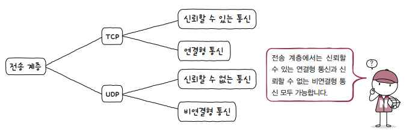

# IP의 한계

네트워크 계층의 핵심 프로토콜인 IP의 한계는 **신뢰할 수 없는 프로토콜**unreliable protocol이자 **비연결형 프로토콜**connectionless protocol이라는 점입니다. 이는 전송 계층이 존재하는 이유와도 직결됩니다.

**신뢰할 수 없는 통신**은 IP 프로토콜이 패킷이 수신지까지 제대로 전송되었다는 보장을 하지 않는 특징을 일컫습니다.

이는 통신 과정에서 패킷의 데이터가 손상되거나 중복된 패킷이 전송되었더라도 이를 확인하지 않고, 재전송도 하지 않으며, 순서대로 패킷이 도착할 것이라는 보장도 하지 않는다는 의미입니다.

**비연결형 통신**은 패킷을 보내기만 할 뿐, 송수신 호스트 간에 사전 연결 수립 작업을 거치지 않는 특징을 의미합니다.

IP가 *신뢰할 수 없는 통신*과 *비연결형 통신*을 하는 주요한 이유는 성능 때문입니다. 패킷의 전송 확인 및 호스트 간에 연결 수립 과정에는 *시간*, *대역폭*, *부하*가 요구되므로 성능이 저하됩니다.

# IP의 한계를 보완하는 전송 계층

*전송 계층*은 **연결형 통신**을 지원하며, **신뢰할 수 있는 통신**을 가능하게 하는 **TCP 프로토콜**을 통해 *네트워크 계층*의 핵심 프로토콜인 *IP*의 한계를 보완합니다.

하지만, *연결형 통신*과 *신뢰할 수 있는 통신*은 *비연결형 통신*과 *신뢰할 수 없는 통신*에 비해 성능이 저하되기 때문에, 빠른 전송이 요구되는 환경이라면 **신뢰할 수 없는 통신**과 **비연결형 통신**인 **UDP 프로토콜**을 사용하는 것이 적절합니다.

<small>스트리밍 서비스와 같이 일부 데이터를 잃어 버리더라도, 빠른 전송을 해야되는 상황에서는 TCP보다 UDP를 많이 사용합니다.</small>

  

