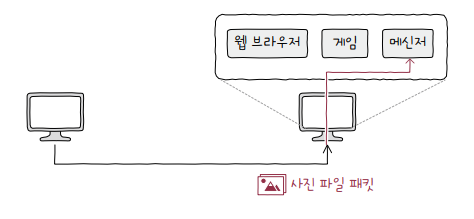

# 포트의 정의

컴퓨터가 데이터를 정상적으로 수신 받았다면, 데이터는 최종적으로 웹 브라우저, 게임, 메신저 등과 같은 특정 프로세스에 전달되어야 합니다. 

즉, 네트워크를 통해 송수신되는 패킷의 최종 수신 대상은 컴퓨터 내부의 특정 애플리케이션 프로세스입니다.

**포트**는 이와 같이 네트워크에서 *특정 서비스나 애플리케이션을 구별*하는 역할을 합니다.

또한, 하나의 컴퓨터에서 여러 개의 애플리케이션이 네트워크 통신을 할 수 있도록 해줍니다. *각 애플리케이션은 고유한 포트를 할당*받고, 이를 통해 동시에 여러 통신을 처리할 수 있습니다.

  

# 포트의 분류

