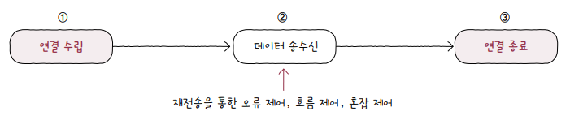
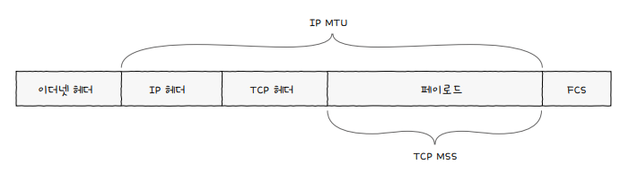
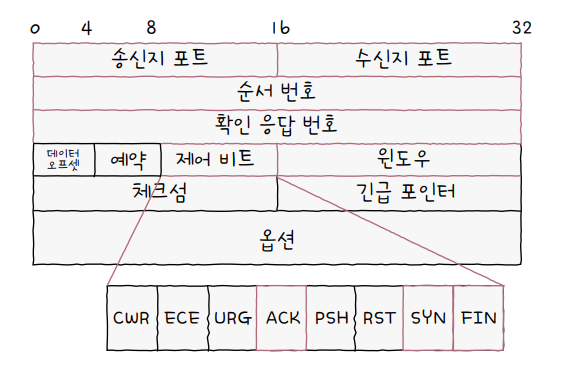
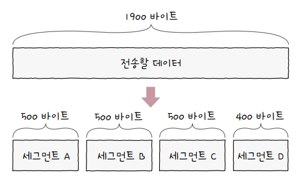
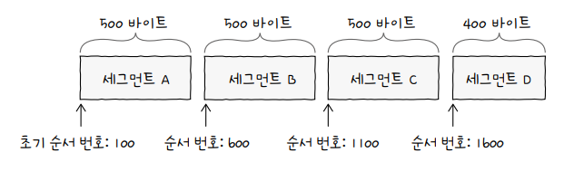
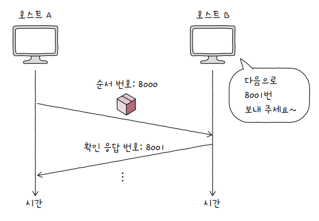

# TCP와 UDP

전송 계층에서 가장 중요한 프로토콜에는 TCP와 UDP가 있습니다. 

**TCP**Transmission Control Protocol는 *신뢰할 수 있는 통신*을 위한 *연결형 프로토콜*이고, **UDP**User Datagram Protocol는 TCP보다 *신뢰성은 떨어지지만* 비교적 빠른 통신이 가능한 *비연결형 프로토콜*입니다.

# TCP(Transmission Control Protocol)

TCP 통신 단계는 다음과 같습니다.

1. 연결수립
2. 데이터 송수신
3. 연결 종료

TCP는 통신(데이터 송수신)하기 전에 *연결을 수립*하고 통신이 끝나면 *연결을 종료*합니다.

그리고 *데이터 송수신* 과정에서 **재전송을 통한 오류 제어**, **흐름 제어**, **혼잡 제어** 등의 기능을 제공합니다.

  

TCP 통신 단계를 이해하기 위해서는 먼저 *MSS*라는 단위와 *TCP의 세그먼트 구조*를 이해해야 합니다. 

## 1. MSS(Maximum Segment Size)

**MSS**는 Maximum Segment Size의 약자로, TCP로 전송할 수 있는 **최대 페이로드 크기**를 의미합니다.

헤더의 크기를 포함하는 MTU와는 다르게, MSS는 TCP 헤더 크기를 제외합니다.

  

## 2. TCP의 세그먼트 구조

TCP의 세그먼트 구조는 다음과 같습니다.

  

- *송신지 포트*와 *수신지 포트*: 송신지 또는 수신지 애플리케이션을 식별하는 포트 번호가 명시되는 필드

- **순서 번호(시퀀스 넘버)**: 송수신되는 세그먼트의 올바른 순서를 보장하기 위해 *세그먼트 데이터의 첫 바이트에 부여되는 번호*인 순서 번호sequence number가 명시되는 필드. 

- **확인 응답 번호(ACK 넘버)**: 상대 호스트가 보낸 세그먼트에 대한 응답으로, 다음으로 수신하기를 기대하는 순서 번호가 명시됨.

- **제어 비트**: 플래그 비트라고도 불리며, 현재 세그먼트에 대한 부가 정보를 나타냄(ACK, SYN, FIN 등)

- *윈도우*: 한 번에 수신하고자 하는 데이터의 양을 나타내는 수신 윈도우window의 크기가 명시되는 필드

TCP에서 꼭 알아두어야할 중요한 필드는 순서 번호sequence number, 확인 응답 번호acknowledgment number, 제어 비트control bits입니다.

### 제어 비트

제어 비트 필드는 기본적으로 *8비트*로 구성되어 있습니다. 비트들은 각각의 역할이 정해져 있습니다.

1. **ACK**(Acknowledge): 이전에 받은 세그먼트를 승인했음을 나타내는 비트. 이 비트가 설정되어 있다면, `Acknowledgment Number` 필드의 값이 유효합니다.

2. **FIN**(Final): 연결을 종료하기 위한 비트. 송신 측에서 더 이상 데이터 전송이 없음을 알리기 위해 사용됩니다.

3. **SYN**(Synchronize): 연결을 수립하기 위한 비트. TCP 3-way handshake의 초기 단계에서 사용됩니다.

4. **RST**(Reset): 연결을 비정상적으로 종료하거나 초기화하기 위한 비트. 문제 발생 시 연결을 즉시 닫습니다.

5. **PSH**(Push): 데이터를 즉시 처리하도록 수신 측에 알리는 비트. 버퍼링하지 않고 데이터를 상위 계층으로 전달할 것을 요청합니다.

6. **URG**(Urgent): 긴급 데이터를 나타내는 비트. `Urgent Pointer` 필드의 값이 유효하며, 긴급 데이터를 처리하도록 요청합니다.

7. **ECE**(ECN-Echo): 네트워크 혼잡을 나타내기 위한 비트 (Explicit Congestion Notification). 혼잡 알림을 수신했음을 상대방에게 알립니다.

8. **CWR**(Congestion Window Reduced): 네트워크 혼잡으로 인해 혼잡 창 크기를 줄였음을 나타내는 비트. 혼잡 제어 알고리즘과 연동됩니다.

### 순서 번호와 확인 응답 번호

순서 번호 필드와 확인 응답 번호 필드는 TCP의 신뢰성을 보장하기 위해 사용되는 중요한 필드로, 한 쌍으로 묶어서 기억하는 것이 좋습니다.

**순서 번호**는 세그먼트의 올바른 송수신 순서를 보장하기 위한 번호로, 세그먼트 데이터의 첫 바이트에 부여되는 번호입니다.

예를 들어, 전송해야할 데이터의 크기가 1900 바이트일 때, MSS가 500 바이트라면 세그먼트는 아래와 같이 4개의 세그먼트로 쪼갤 수 있습니다.

  

연결을 수립하기 위해, SYN 플래그가 1로 설정된 세그먼트의 순서 번호는 무작위로 할당되며, 이를 **초기 순서 번호**ISN; Initial Sequence Number라고 합니다.

연결 수립 이후의 세그먼트에 할당되는 순서 번호는 **초기 순서 번호 + 송신한 바이트 수**입니다.

만약 초기 순서 번호가 100 이라면, 세그먼트 B의 순서 번호는 초기 순서 번호인 100에서 500 바이트 떨어진 셈이므로 600이 됩니다. 

마찬가지로 세그먼트 C의 순서 번호는 초기 순서 번호인 100에서 1000 바이트 떨어진 1100이 됩니다.

  

확인 응답 번호 필드에 명시되는 **확인 응답 번호**는 순서 번호에 대한 응답으로, 수신 호스트가 다음으로 받기를 희망하는 순서 번호입니다.

일반적으로 **수신한 순서 번호 + 1**로 설정됩니다.

아래 그림을 예를들어, 호스트 B가 호스트 A로부터 순서 번호가 8000인 세그먼트를 잘 받았다면, 수신한 순서 번호(8000)에 1을 더한 8001을 확인 응답 번호에 명시한 뒤 호스트 A에게 전송(응답)합니다.

<small>확인 응답 번호 값을 보내기 위해서는 ACK 플래그가 1로 설정되어 있어야 합니다.</small>

  

## 3. TCP의 통신 단계

### 연결 수립: 쓰리 웨이 핸드셰이크

### 연결 종료