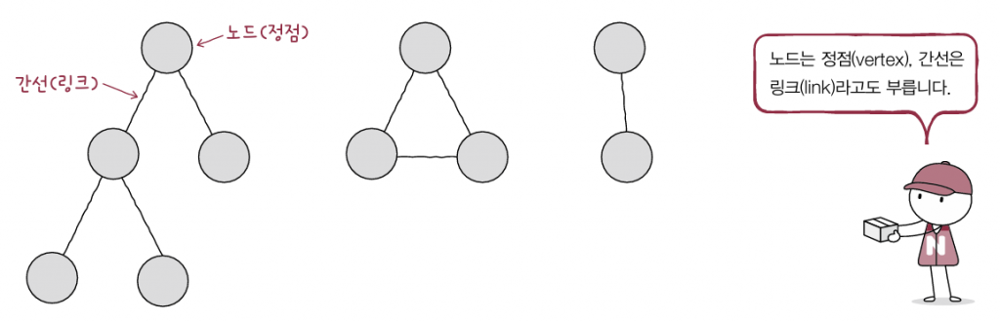
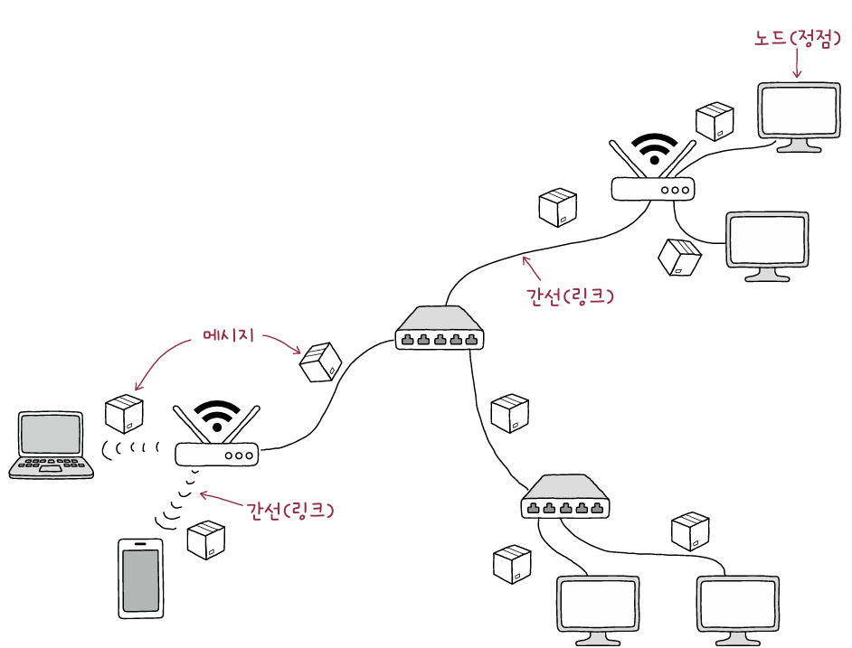
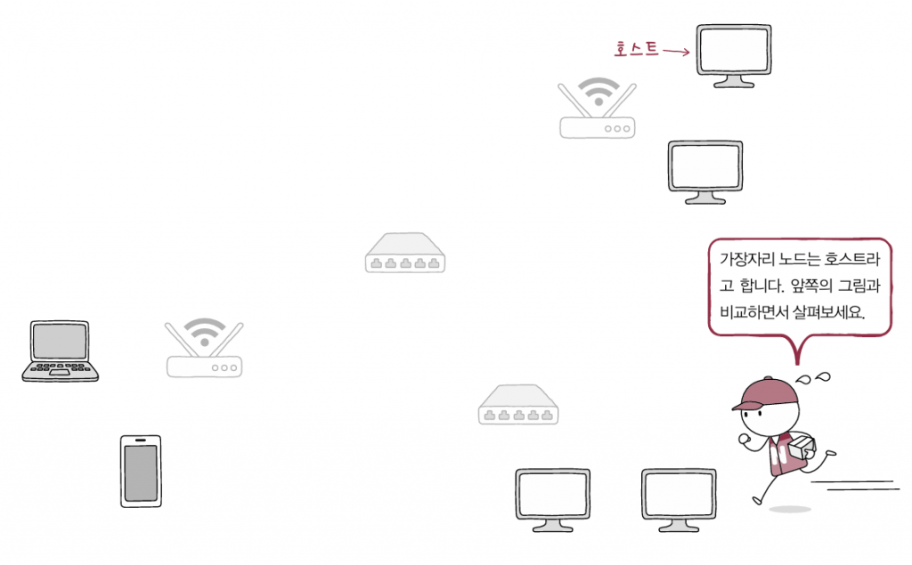
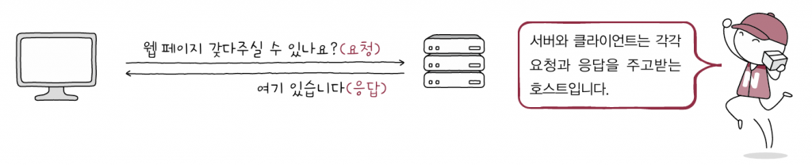
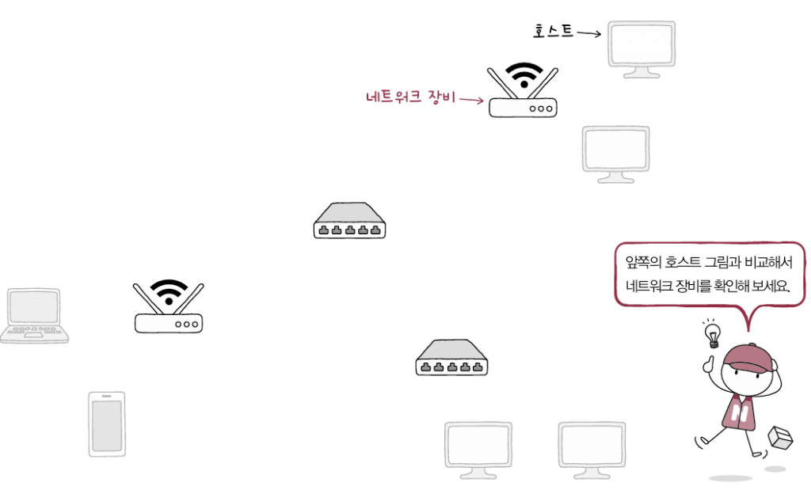
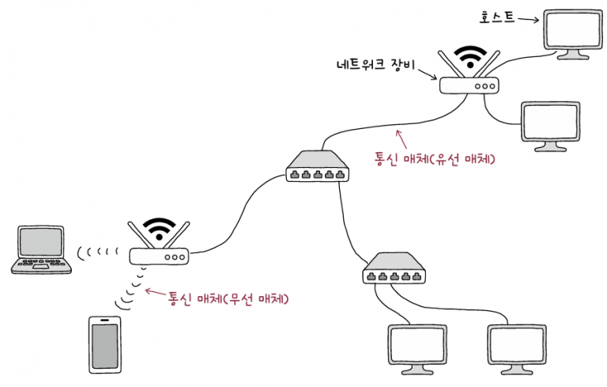
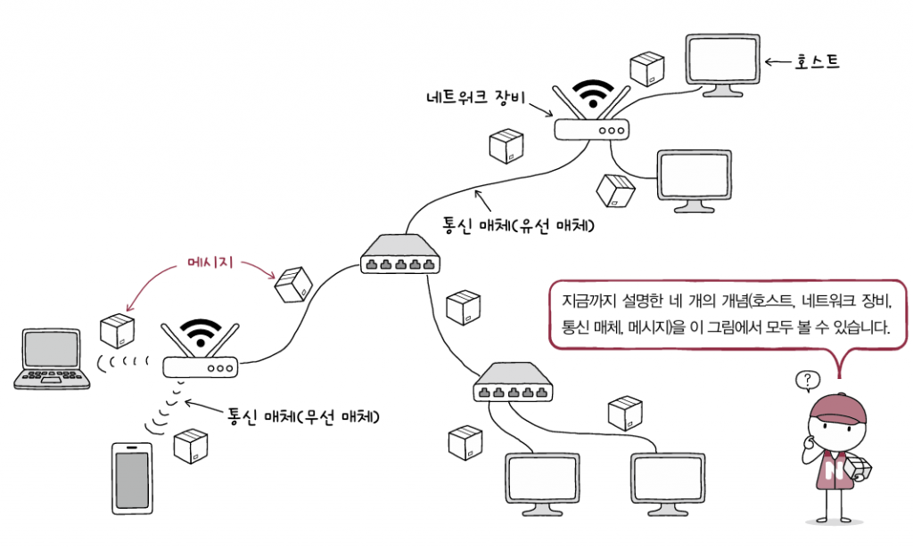
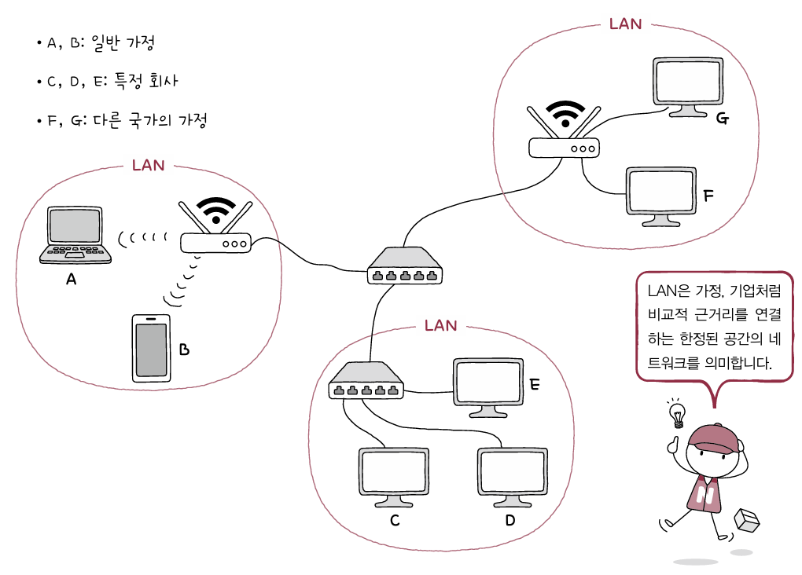
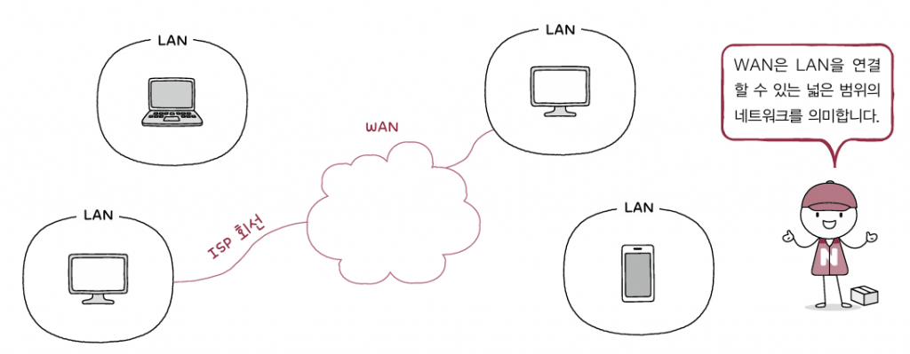

# 네트워크란? 

- **컴퓨터 네트워크**: 여러 장치가 연결되어 서로 정보를 주고받을 수 있는 통신망

- **인터넷**: 네트워크를 연결하는 네트워크

# 네트워크의 구조

네트워크 통신망은 그래프의 형태를 띠고 있음

**그래프**graph: **노드**(node)와 **간선**(edge)으로 이루어진 자료 구조

> 노드는 정점(vertex), 간선은 링크(link)라고도 부름

  

- **노드**: 정보를 주고받을 수 있는 장치
- **간선**: 정보를 주고받을 수 있는 유무선의 통신매체
- **메시지**: 노드 간에 주고받는 정보

  

## 호스트

- **호스트**host란 네트워크에서의 가장자리 노드로서, *종단 시스템*(end system)이라고도 부름

  

- **서버**server는 '어떠한 서비스'를 제공하는 호스트

    > 어떠한 서비스: 파일, 웹 페이지, 메일 등

- **클라이언트**client란 서버에게 어떠한 서비스를 **요청(request)**하고 서버의 **응답(response)**을 제공받는 호스트

  

## 네트워크 장비

- **네트워크 장비**란 네트워크에서 가장자리에 위치하지 않는 중간 노드로서 

- 호스트 간 주고받는 정보가 원하는 수신지까지 안정적이고 안전하게 전송될 수 있도록 함

- 네트워크 장비의 종류로는 *이더넷 허브*, *스위치*, *라우터*, *공유기* 등이 있음

  

## 통신 매체

노드들 간의 통신을 위한 **통신 매체**(간선)로, 노드들을 유선으로 연결하는 **유선 매체**와 무선으로 연결하는 **무선 매체**가 있음

  

## 메시지

**메시지**(message)란 통신 매체로 연결된 노드가 주고받는 정보로서 파일, 웹 페이지, 메일 등의 다양한 종류가 있음

  

# 범위에 따른 네트워크 분류

## LAN(Local Area Network)

**LAN**은 Local Area Network의 약자로 이름 그대로 가까운 지역을 연결한 **근거리 통신망**을 의미

  

## WAN(Wide Area Network)

- **WAN**은 Wide Area Network의 약자로 이름 그대로 먼 지역을 연결하는 **광역 통신망**을 의미

- 멀리 떨어진 LAN들을 연결할 수 있는 네트워크로 *인터넷*이 WAN으로 분류됨

- 인터넷을 사용하기 위해 접속하는 WAN은 **ISP**Internet Service Provider라는 인터넷 서비스 업체가 구축하고 관리함

- 국내 ISP로는 KT, LG유플러스, SK브로드밴드가 있으며, WAN에 연결 가능한 회선을 임대하는 등 WAN과 관련한 다양한 서비스를 제공

  

## CAN과 MAN

- CAN(Campus Area Network): 학교 또는 회사의 여러 건물 단위로 연결되는 규모의 네트워크

- MAN(Metropolitan Area Network): 도시나 대도시 단위로 연결되는 규모의 네트워크

- 네트워크를 범위 기준으로 분류하면 **[ WAN > MAN > CAN > LAN ]**으로 볼 수 있음

# 메시지 교환 방식에 따른 네트워크 분류

호스트들이 네트워크를 통해 메시지를 주고 받는 대표적인 방식으로는 **회선 교환 방식**과 **패킷 교환 방식**이 있음

## 회선 교환 방식

**회선 교환**circuit switching 방식은 메시지 전송로인 **회선**circuit을 설정하고 이를 통해 메시지를 주고받는 방식

**회선 스위치** 

## 패킷 교환 방식