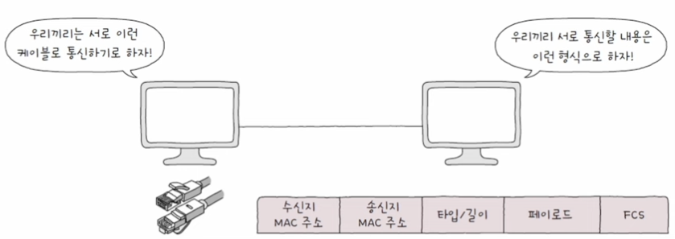
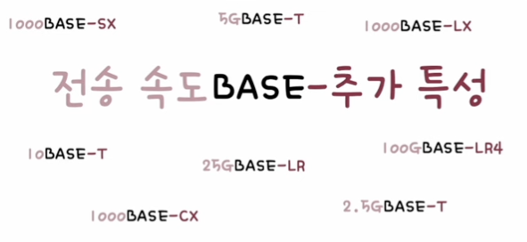
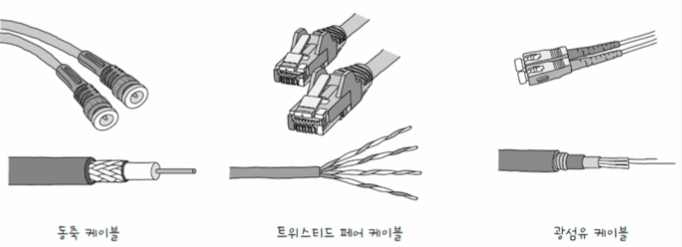
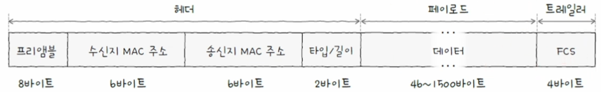
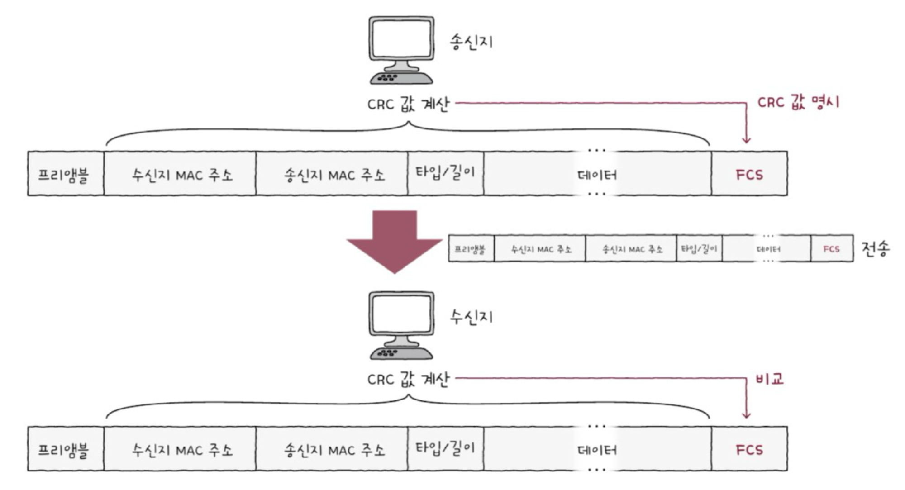
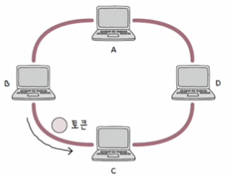

# 이더넷(Ethernet)

이더넷Ethernet은 유선 LAN 환경에서 가장 대중적으로 사용되는 기술로, **물리 계층**과 **데이터 링크 계층**에서 이 이더넷이라는 공통된 기술이 사용되고 있습니다.

물리 계층에서 사용되는 연결매체, 데이터 링크 계층에서 주고받는 메시지의 형태는 이더넷의 규격과 프레임 형태를 따릅니다.

이더넷은 다양한 통신 매체의 규격들과 송수신되는 프레임의 형태, 프레임을 주고받는 방법 등이 정의된 네트워크 기술입니다.

  

## 이더넷 표준

현재 이더넷은 **IEEE 802.3**이라는 이름으로 국제적으로 표준화가 이루어졌습니다. 

서로 다른 컴퓨터가 각기 다른 제조사의 네트워크 장비를 사용하더라도, 동일한 형식의 프레임을 주고받고 통일된 형태로 작동하는 것은, <b>통신 매체를 비롯한 네트워크 장비들이 이더넷 표준을 준수하기 때문</b>입니다.

**IEEE 802.3**은 이더넷 관련 표준 규격들의 집합으로, 현재에도 새로운 표준 규격들이 만들어지고 있으며, 규격들은 `802.3u`, `802.3ab`처럼 숫자 `802.3` 뒤에 버전을 나타내는 알파벳으로 표현합니다.

이더넷 표준 규격(버전)에 따라, 지원되는 네트워크 장비, 통신 매체의 종류와 전송 속도 등이 달라질 수 있습니다.

## 통신 매체 표기 형태

통신 매체인 케이블의 표기 형태는 통신 매체의 속도와 특성을 파악하기 쉽도록 다음과 같은 형태로 표기합니다.(`전송 속도BASE-추가 특성`)

  

### 전송 속도(data rate)

기본 단위는 **Mbps**로, 숫자만 표기되어 있으면 <b>Mbps</b>, 숫자 뒤에 <b>G</b>가 붙는 경우 <b>Gbps</b>를 의미 합니다.

예1. `100Base-T` 케이블은 <b>100Mbps</b> 속도를 지원합니다.

예2. `10GBASE-T` 케이블은 <b>10Gbps</b> 속도를 지원합니다.

### BASE

**BASE**는 **베이스밴드**BASEband의 약자로, **변조 타입**modulation type을 의미합니다.

변조 타입이란, <u>비트 신호로 변환된 데이터를 통신 매체로 전송하는 방법</u>을 의미하며, 

일반적인 LAN 환경에서는 대부분 <u>디지털 신호를 송수신하는 베이스밴드 방식을 사용</u>하므로, 대부분의 이더넷 통신 매체는 BASE를 사용합니다.

<small>BASE 외에 BROAD로 표기하는 브로드밴드, PASS로 표기하는 패스밴드도 있습니다.</small>

### 추가 특성

**추가 특성**additional distinction에는 통신 매체의 특성을 명시합니다.

이곳에 명시할 수 있는 특성의 종류는 다양하며, 다음과 같은 종류가 있습니다.

1. **전송 가능한 최대 거리**: 10BASE-*2*, 10BASE-*5* 등
2. **물리 계층 인코딩 방식**: 데이터가 비트 신호로 변환되는 방식(1000BASE-C*X*)
3. **레인 수**: 비트 신호를 옮길 수 있는 전송로 수(100GBASE-L*R4*)
4. **통신 매체 종류**: 동축 케이블(C), 트위스티드 페어 케이블(T) 등(1000BASE-*C*X)

#### 통신 매체 종류

| 추가 특성 표기(통신 매체의 종류) | 케이블 종류 |
|:------------------------------:|:----------:|
|C                               |동축 케이블  |
|T                               |트위스티드 페어 케이블  |
|S                               |단파장 광섬유 케이블  |
|L                               |장파장 광섬유 케이블  |

  

## 이더넷 프레임(Ethernet frame)

**이더넷 프레임**은 이더넷 네트워크에서 주고받는 프레임으로, 현대 유선 LAN 환경은 대부분 이더넷을 기반으로 구성되기 때문에, 호스트가 데이터 링크 계층에서 주고받는 프레임 형식은 이더넷 프레임의 형식으로 <b>정해져 있습니다</b>.

이더넷 프레임은 상위 계층으로부터 받아들인 정보에 헤더와 트레일러를 추가하는 **캡슐화** 과정을 통해 만들어집니다.

헤더에는 *프리앰블*, *수신지 MAC 주소*, *송신지 MAC 주소*, *타입/길이*로 구성되며, 페이로드는 *데이터*, 트레일러는 *FCS*로 구성됩니다.

  

### 프리앰블

프리앰블preamble은 이더넷 프레임의 시작을 알리는 8byte(64bit) 크기의 정보입니다.

첫 7바이트는 `10101010`값을 가지고, 마지막 바이트는 `10101011` 값을 가집니다.

프리앰블은 송수신지 간의 동기화를 위해 사용되는 정보입니다.

  

### 수신지 MAC 주소와 송신지 MAC 주소

**MAC 주소**는 네트워크 인터페이스마다 부여되는 <b>6byte</b>(48bit) 길이의 주소로, *LAN 내의 수신지와 송신지를 특정*할 수 있습니다.

같은 네트워크 내에 동일한 MAC 주소를 가진 기기들이 있다면 송신지와 수신지를 특정할 수 없으므로, MAC 주소는 일반적으로 고유하고, 변경되지 않는 주소입니다.

<small>MAC 주소의 변경이 가능한 경우도 있고, 고유하지 않을 수도 있음</small>

보통 **NIC**Network Interface Controller라는 장치가 네트워크 인터페이스 역할을 담당하며, 한 컴퓨터에 NIC가 여러 개 있다면 MAC 주소도 여러 개 있을 수 있습니다.

### 타입/길이

타입/길이 필드에는 **타입**(type) 혹은 **길이**(lengh)가 올 수 있습니다.

필드에 명시된 크기가 1500(05DC16) 이하면 프레임의 크기(길이)를, 1536(060016) 이상이면 타입을 나타냅니다.

타입이란, 이더넷 프레임이 '어떤 정보를 캡슐화했는지'를 나타내는 정보로 **이더타입**ethertype이라고도 부르며, 대표적으로 상위 계층에서 사용된 프로토콜의 이름이 명시됩니다.

예1. `IPv4 프로토콜`이 캡슐화된 정보를 운반한다면, 타입에는 <b>080016</b>이 명시
예2. `IPv6 프로토콜`이 캡슐화된 정보를 운반한다면, 타입에는 <b>86DD16</b>이 명시
예3. `ARP 프로토콜`이 캡슐화된 정보를 운반한다면, 타입에는 <b>080616</b>이 명시

### 데이터

데이터는 상위 계층에서 전달받거나 전달해야 할 내용으로, 네트워크 계층의 데이터와 헤더를 합친 [PDU](https://ehdgur5123.github.io/posts/Network-02/#pdu)가 이곳에 포함됩니다.

데이터는 반드시 *46byte 이상*이여야 하며, 최대 크기는 *1500byte* 입니다.

데이터의 크기가 46byte 미만이라면, 46byte 이상이 될 때까지 **패딩**padding이라는 정보가 내부에 채워집니다.

패딩은 보통 46byte 이상이 될 때까지 `0`으로 채워집니다.

### FCS

**FCS**Frame Check Sequence는 수신한 이더넷 프레임에 *오류가 있는지 확인*하기 위한 필드입니다.

이 필드에는 **CRC**Cyclic Redundancy Check, 즉 순환 중복 검사라고 불리는 오류 검출용 값이 들어갑니다.

CRC 값을 통해, 오류를 검출하는 단계는 다음과 같습니다.

  

1. <b>송신지</b>는 프리앰블을 제외한 나머지 필드 값들을 바탕으로 CRC 값을 계산
2. <b>송신지</b>는 계산한 CRC 값을 FCS 필드에 명시
3. 전송
4. <b>수신지</b>는 프리앰블과 FCS 필드를 제외한 나머지 필드 값들을 바탕으로 CRC 값을 계산
5. <b>수신지</b>는 자신이 계산한 CRC 값과 FCS 필드에 명시된 CRC 값을 비교
6. <b>수신지</b>는 비교한 CRC 값이 일치하지 않으면, 프레임에 오류가 있다고 판단하여 해당 프레임을 폐기 

# 토크링(Token Ring)

**토큰링**은 이더넷 이외의 또 따른 LAN 기술입니다.

호스트들이 링(고리) 형태로 연결되어, 호스트들끼리 토큰이라는 정보를 주고 받습니다.

토큰을 보유한 호스트만 메시지를 전송할 수 있으며, 메시지 전송이 끝난 호스트는 토큰을 다음 컴퓨터에게 넘겨주는 방식으로 통신합니다.

  

