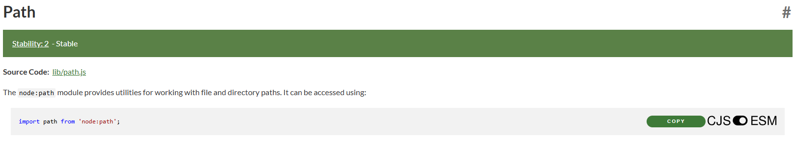
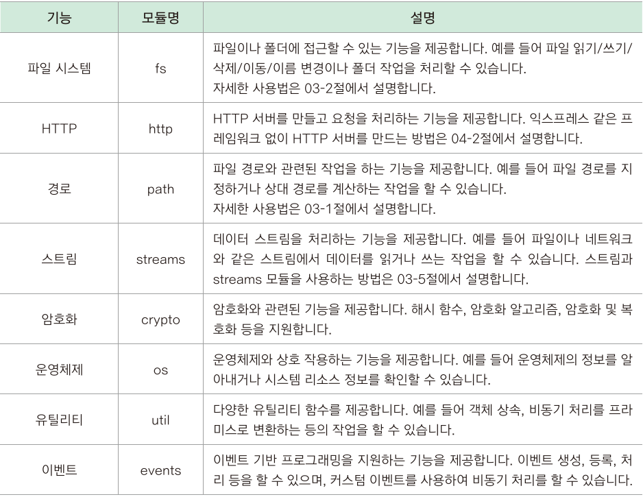

<hr>

# 노드의 모듈이란?

- 프로그램을 작은 기능 단위로 쪼개고 파일 형태로 저장해 놓은 것
- 코드를 중복해서 작성하지 않아도 된다.
- 수정이 필요한 경우 필요한 모듈만 수정하면 된다

# CommonJS 모듈 시스템 vs ES 모듈 시스템

- *CommonJS 모듈 시스템*: Node.js의 기본 모듈 시스템(require, module.exports 사용)
- *ES 모듈 시스템*: ECMAScript의 표준 모듈 시스템(import, export 사용)
- Node.js에서는 기본적으로 CommonJS 모듈 시스템을 사용하고 있었지만, 에크마스크립트가 발전하면서 ES 모듈 시스템도 지원하게 되었음
- NodeJS의 공식 문서에서 제공하는 [예제 코드](https://nodejs.org/docs/latest/api/path.html#pathdirnamepath)를 보면 CJS와 ESM이 표시되어 있는데, CommonJS 모듈 시스템을 사용하고 싶다면 *CJS*, ES 모듈 시스템을 사용하고 싶다면 *ESM*을 선택하면 된다.

<p id="img_center">
  
</p>

<p id="img_center">
  
</p>

- VS Code 자동완성 등에 문제가 있다면 명시적으로 다음과 같이 확장자를 지정해줘도 된다.

| 확장자 | 모듈 시스템 |                                          동작                                          |
|:------:|:-----------:|:--------------------------------------------------------------------------------------:|
| .js    | CommonJS    | 기본값으로 CommonJS로 동작 (package.json에 "type": "module" 설정 시 ES 모듈로 해석됨). |
| .mjs   | ES 모듈     | 항상 ES 모듈로 해석됩니다.                                                             |
| .cjs   | CommonJS    | 항상 CommonJS 모듈로 해석됩니다.                                                       |

# CommonJS 모듈 시스템

## 1. 모듈 내보내기

모듈을 내보내는 파일에는 다음과 같은 코드로 내보낼 모듈을 익스포트<sup>export</sup> 해주어야 합니다.

```javascript
module.exports = 외부로 내보낼 함수 또는 변수

// ex) module.exports = user;
```

## 2. 모듈 가져오기

모듈을 가져오는 파일에는 다음과 같은 코드로 가져올 모듈을 임포트<sup>import</sup> 해주어야 합니다.

```javascript
require(모듈 파일 경로)

// ex) const user = require("./user");
```

## 3. 직접 모듈 만들기

*CommonJS 모듈 시스템*을 사용하여 직접 모듈을 만들어 보겠습니다.

```javascript
const user = "홍길동";

const hello = (name) => {
  console.log(`${name} 님, 안녕하세요?`);
};

hello(user);
```

다음 코드는 `user`를 입력 받고, `hello` 함수를 통해 `user 님, 안녕하세요?`라는 문구를 출력하는 코드입니다.

이 코드를 다음과 같이 모듈로 나누어 보겠습니다.

- user 변수를 모듈로 내보내는 *user.js* 파일
- hello 함수를 모듈로 내보내는 *hello.js* 파일
- user 변수와 hello 함수를 가져오는 *app.js* 파일

### A. user.js 파일

```javascript
const user = "홍길동";

module.exports = user; // user 변수 내보내기
```

### B. hello.js 파일

```javascript
const hello = (name) => {
  console.log(`${name} 님, 안녕하세요?`);
};

module.exports = hello; // hello 함수 내보내기
```

### C. app.js 파일

```javascript
const user = require("./user"); // user.js에서 user 가져오기
const hello = require("./hello"); // hello.js에서 hello 가져오기

hello(user); // 모듈에서 가져온 user 변수와 hello 함수 사용하기
```

`require()` 내부에는 가져올 모듈의 파일 경로를 입력하면 됩니다. 같은 경로에 있으므로 `"./user.js"`로 입력해주며, 확장자(`.js`)는 생략 가능합니다.

## 4. 2개 이상의 모듈 사용하기

### A. 2개 이상의 모듈 내보내기

2개 이상의 모듈을 내보내기 위해서는 중괄호(`{}`)로 감싸주면 됩니다.

```javascript
const user1 = "Kim";
const user2 = "Lee";
const user3 = "Pack";

module.exports = {user1, user2};
```

### B. 2개 이상의 모듈 가져오기

2개 이상의 모듈을 가져올때도 중괄호(`{}`)로 감싸주면 됩니다.

```javascript
const {user1, user2} = require("./users-1");
```

# 코어 모듈

노드에는 백엔드 개발에 필요한 모듈이 이미 내장되어 있는데, 이를 **코어 모듈**이라고 합니다.

노드에서 지원하는 코어 모듈은 노드 공식 웹 사이트의 [[Docs]](https://nodejs.org/docs/latest/api/)에서 확인할 수 있습니다.

다음은 노드의 코어 모듈 중 "fs"를 가져오는 방법입니다.

```javascript
// 기본형
const fs = require("fs"); 
// 사용자가 만든 모듈과 이름이 중복될 경우
const fs = require("node:fs");
```

자주 사용하는 코어 모듈의 종류는 다음과 같습니다.

<p id="img_center">
  
</p>

# 글로벌 모듈

노드에서 모듈을 가져올 때는 require 함수를 사용해야 하지만, require 함수를 사용하지 않아도 사용할 수 있는 모듈을 **글로벌 모듈**이라고 합니다.

글로벌 모듈에 있는 *글로벌 객체*를 사용하기 위해서는 앞에 global을 명시해줘야 하지만, 글로벌 모듈은 어디에서나 사용할 수 있으므로 global을 생략해도 됩니다.

```javascript
global.console.log(`${name}님 안녕하세요?`);
// 또는
console.log(`${name}님 안녕하세요?`);
```

다음은 글로벌 모듈의 종류 및 사용 예시입니다.

- `__dirname`: 현재 모듈이 있는 폴더 이름을 가져옴(절대경로)
- `__filename`: 현재 모듈이 있는 파일 이름을 가져옴(절대경로)

```javascript
console.log(`현재 모듈이 있는 폴더 이름: ${__dirname}`);
console.log(`현재 모듈이 있는 파일 이름: ${__filename}`);
```

- `setTimeout`: 지정한 시간이 지난 후 함수 안의 내용을 실행(타이머 함수)
- `setInterval`: 지정한 시간마다 함수 안의 내용을 실행(타이머 함수)
- `clearInterval`: setInterval 함수로 반복 실행하던 것을 정지(타이머 함수)

```javascript
let remainingTime = 3000; // 남은 시간을 3초로 설정(3초 = 3000ms)
const waitingInterval = 500; // 대기 간격을 0.5초로 설정

// 0.5초마다 호출되는 함수
const timer = setInterval(() => {
  // 남은 시간을 표시
  console.log(`${remainingTime / 1000}초 남음`);
  remainingTime -= waitingInterval; // 남은 시간 감소

  if (remainingTime <= 0) {
    // 남은 시간이 0 이하일 경우 'Hi' 메시지를 표시하고 타이머를 종료
    console.log("Hi");
    clearInterval(timer);
  }
}, waitingInterval);
```

# ES 모듈 시스템

## 1. 모듈 내보내기

모듈을 내보낼 대상이 하나라면 `export` 또는 `export default`을 사용합니다.

```javascript
export goodbye;
//또는
export default goodbye;
```

모듈을 내보낼 대상이 두 개 이상이면 `export {대상1, 대상2, ...}`로 내보냅니다.

```javascript
export {hi, goodbye};
```

## 2. 모듈 가져오기

모듈을 가져오려면 `import 변수명/함수명 from 모듈_파일` 형태로 입력합니다.

```javascript
// 대상이 하나라면
import {goodbye} from "./goodbye-1.mjs";
// 대상이 두 개 이상이라면
import {hi, goodbye} from "./goodbye-1.mjs";

hi("홍길동");
goodbye("홍길동");
```

## 3. import ~ as

import 문에서 as 예약어를 사용하면 가져오는 함수와 변수의 이름을 바꿔서 사용할 수 있습니다.

```javascript
import {goodbye as 굿바이} from "./goodbye-1.mjs";

굿바이("홍길동");
```

## 4. import * as

모듈_파일에서 가져오는 함수와 변수가 너무 많다면 `*`기호를 사용해 모든 함수와 변수를 가져올 수 있습니다.

```javascript
import * as say from "./goodbye-1.mjs";

say.hi("홍길동");
say.goodbye("홍길동");
```