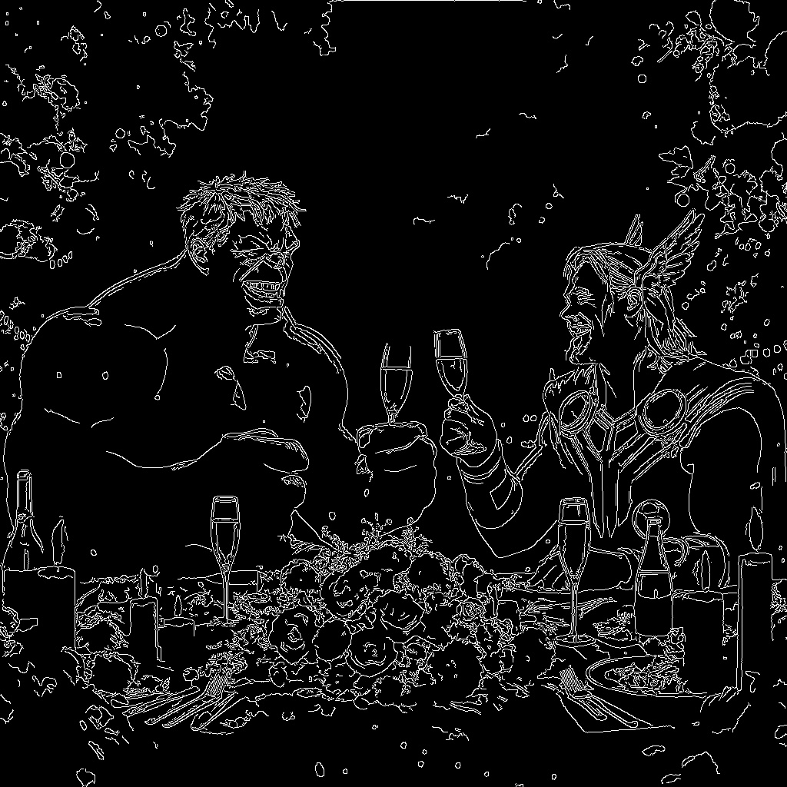

<hr>

# 1. 기본적인 이미지 읽기, 표시, 저장

```python
import cv2

img_src = "/home/lee/Vscode_ws/ehdgur5123.github.io/_posts/OpenCV/image/logo.jpg"

# 이미지 읽기
img = cv2.imread(img_src)

# 이미지 창에 표시
cv2.imshow('Title', img)

# 키 입력 대기 (0이면 무한 대기)
cv2.waitKey(0)

# 창 닫기
cv2.destroyAllWindows()

# 이미지 저장 
cv2.imwrite('/home/lee/Vscode_ws/ehdgur5123.github.io/assets/images/OpenCV/ImageBasic-01.jpg', img)
```

- `cv2.imread()` : 파일에서 이미지를 읽습니다.
- `cv2.imshow()` : 이미지를 화면에 출력합니다.
- `cv2.waitKey()` : 사용자의 키 입력을 기다리며, 이 값이 0이면 무한정 대기합니다.
- `cv2.destroyAllWindows()` : 열려 있는 모든 창을 닫습니다.
- `cv2.imwrite()` : 이미지를 파일로 저장합니다.

<p id="img_center">
  
</p>

# 2. 이미지 크기 변경(Resizing)

```python
import cv2
img_src = "/home/lee/Vscode_ws/ehdgur5123.github.io/_posts/OpenCV/image/logo.jpg"
img = cv2.imread(img_src)

# 이미지 크기 변경
img_resized = cv2.resize(img, (300, 300))

cv2.imshow('resized image', img_resized)
cv2.waitKey(0)
cv2.destroyAllWindows()
cv2.imwrite('/home/lee/Vscode_ws/ehdgur5123.github.io/assets/images/OpenCV/ImageBasic-02.jpg', img_resized)
```

<p id="img_center">
  
</p>

# 3. 그레이스케일 변환

```python
import cv2
img_src = "/home/lee/Vscode_ws/ehdgur5123.github.io/_posts/OpenCV/image/logo.jpg"
img = cv2.imread(img_src)

# 그레이스케일 변환
gray_img = cv2.cvtColor(img, cv2.COLOR_BGR2GRAY)

cv2.imshow('gray image', gray_img)
cv2.waitKey(0)
cv2.destroyAllWindows()
cv2.imwrite('/home/lee/Vscode_ws/ehdgur5123.github.io/assets/images/OpenCV/ImageBasic-03.jpg', gray_img)
```

<p id="img_center">
  
</p>

# 4. 경계선 검출(Canny Edge Detection)

```python
import cv2
img_src = "/home/lee/Vscode_ws/ehdgur5123.github.io/_posts/OpenCV/image/logo.jpg"
img = cv2.imread(img_src)

# 경계선 검출
edges = cv2.Canny(img, 100, 200)

cv2.imshow('edges', edges)
cv2.waitKey(0)
cv2.destroyAllWindows()
cv2.imwrite('/home/lee/Vscode_ws/ehdgur5123.github.io/assets/images/OpenCV/ImageBasic-04.jpg', edges)
```

<p id="img_center">
  
</p>