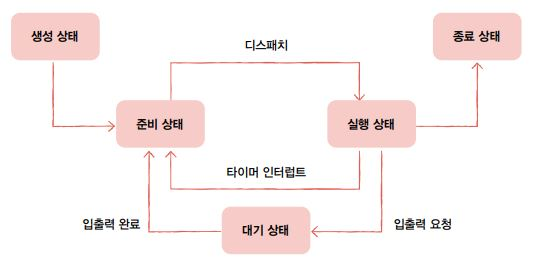
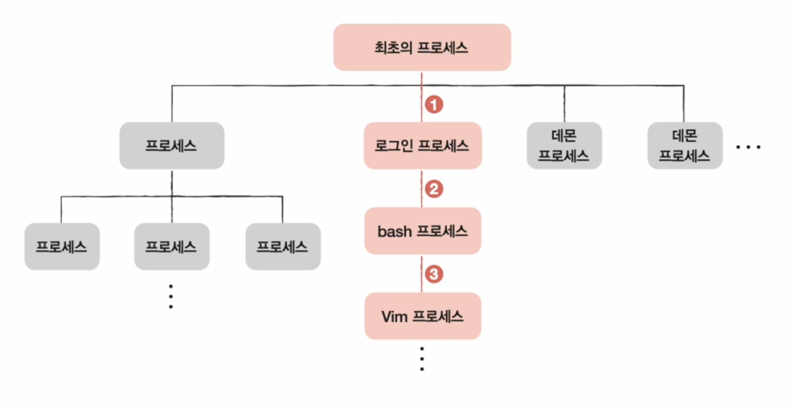
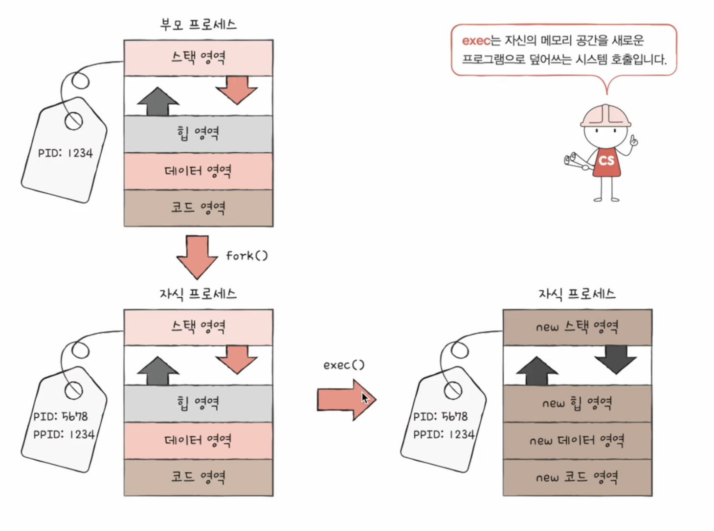

# 프로세스 상태

- 프로세스들이 번갈아 가면서 실행될 때, PCB에 현재 프로세스 상태를 기록

  

1. **생성 상태(new)**

    - 프로세스를 생성 중인 상태

    - 이제 막 메모리에 적재되어 PCB를 할당 받은 상태

2. **준비 상태(ready)**

    - 생성 상태 완료 후, CPU 사용을 위해 자신의 차례를 기다리는 상태

    - **디스패치**(dispatch) : 준비 상태인 프로세스가 실행 상태로 전환되는 것

3. **실행 상태(running)**

    - CPU를 할당받아 실행 중인 상태

    - 자신의 차례가 끝나 타이머 인터럽트가 발생하면 준비 상태로 전환

    - 입출력 장치를 사용하면 입출력 장치의 작업이 끝날 때까지 대기 상태로 전환

4. **대기 상태(blocked)**

    - 입출력 작업은 CPU에 비해 처리 속도가 느리므로 입출력을 요청한 프로세스는 대기 상태로 전환

    - 입출력 작업이 완료되면 준비 상태로 전환되어 다시 CPU의 할당을 기다림

    - 입출력 작업 외에도 특정 이벤트가 발생하는 것을 기다릴 때 대기 상태가 됨(대부분은 입출력 작업)

5. **종료 상태(terminated)**

    - PCB가 종료된 상태

    - 프로세스가 종료되면 운영체제는 PCB와 프로세스가 사용한 메모리를 정리

# 프로세스 계층 구조

- 프로세스(**부모 프로세스**)는 실행 도중 시스템 호출을 통해 다른 프로세스(**자식 프로세스**)를 생성

- 부모 프로세스와 자식 프로세스의 PID는 다름

- 일부 운영체제에서는 자식 프로세스의 PCB에 <u>부모 프로세스의 PID</u>(**PPID**Parent PID)를 기록

- 최초 프로세스(최상단 부모 프로세스)의 PID는 항상 1번이다

    - 유닉스 최초 프로세스: **init**

    - 리눅스 최초 프로세스: **systemd**

- `pstree 명령어`: 리눅스의 프로세스 계층 구조를 보여주는 명령어

  

# 프로세스 생성 기법

- 부모 프로세스는 **fork**를 통해 자신의 복사본을 자식 프로세스로 생성해냄

- 만들어진 자식 프로세스는 **exec**를 통해 메모리 공간을 다른 공간으로 교체

- **fork**: 자기 자신 프로세스의 복사본을 만드는 시스템 호출

- **exec**: 자신의 메모리 공간을 새로운 프로그램으로 덮어쓰는 시스템 호출

- 프로세스 계층 구조를 이루는 과정은 fork와 exec가 반복되는 과정

  

# 프로세스 관련 python 코드

- [예제 코드(링크)](https://github.com/kangtegong/self-learning-cs/blob/main/process/process_python.md)

