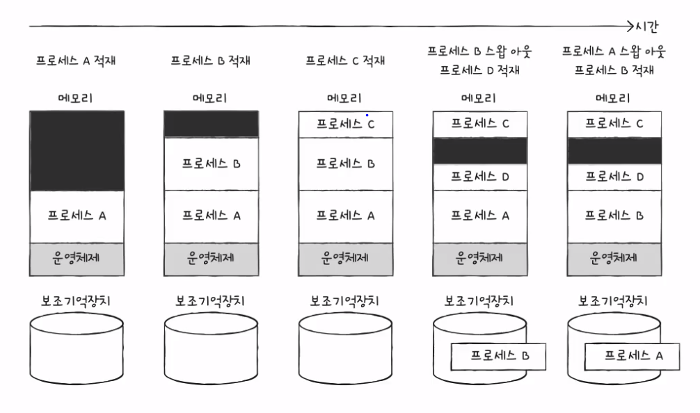
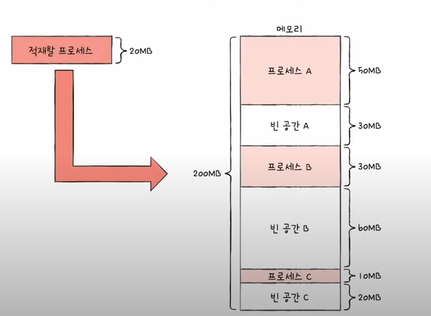
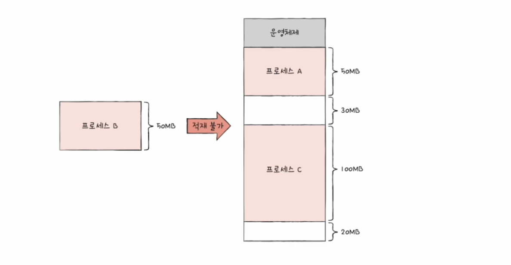

# 연속 메모리 할당

프로세스들이 메모리에 연속적으로 할당되는 방식

## 스와핑(swapping)

메모리에 적재된 프로세스 중 현재 사용되지 않는 프로세스를 보조기억장치의 일부 영역(스왑 영역)으로 쫒아내고, 그 공간에 다른 프로세스를 적재하는 방식

- 스왑 영역swap space: 메모리에서 쫒겨난 프로세스들의 정보가 저장되는 보조기억장치의 영역

- 스왑 아웃swap-out: 현재 실행되지 않는 프로세스가 메모리에서 스왑 영역으로 옮겨지는 것

- 스왑 인swap-in: 스왑 영역에 있던 프로세스다 다시 메모리로 옮겨지는 것

스와핑을 이용하면 프로세스들이 요구하는 메모리 주소 공간의 크기가 실제 메모리 크기보다 큰 경우에도 프로세스들이 동시 실행할 수 있음

  

## 메모리 할당

프로세스는 메모리 내의 빈 공간에 적재되어야 한다. 비어 있는 메모리 공간에 프로세스를 연속적으로 할당하는 방식은 다음과 같다.

  

### 최초 적합

- 최초 적합first fit은 메모리 내의 빈 공간을 순서대로 검색하다가 발견 즉시 메모리를 할당하는 방식

- 빠른 할당이 가능하며, 위 그림에서 A 공간에 할당됨

### 최적 적합

- 최적 적합best fit은 메모리 내의 빈 공간을 모두 검색한 후, 프로세스가 적재되는 공간 중 *가장 작은 공간*에 할당하는 방식

- 위 그림에서 C 공간에 할당됨

### 최악 적합

- 최악 적합worst fit은 메모리 내의 빈 공간을 모두 검색한 후, 프로세스가 적재되는 공간 중 *가장 큰 공간*에 할당하는 방식

- 위 그림에서 B 공간에 할당됨

## 외부 단편화

외부 단편화external fragmentation는 프로세스를 할당하기 어려울 만큼 작은 메모리 공간들로 인해 메모리가 낭비되는 현상

  

### 압축compaction

- 외부 단편화를 해결할 수 있는 대표적인 방안

- 메모리 조각 모음이라고도 부름

- 메모리 내의 프로세스를 재배치하여 작은 빈 공간을 큰 빈 공간으로 만드는 방법

- 압축 작업 중에는 시스템은 하던 일을 중지해야 하며, 많은 오버헤드를 야기하는 등 많은 단점이 존재

- 많은 단점으로 인해, 현재는 외부 단편화를 해결할 수 있는 또 다른 방안인 *가상 메모리 기법*, 그중 *페이징 기법*을 사용함