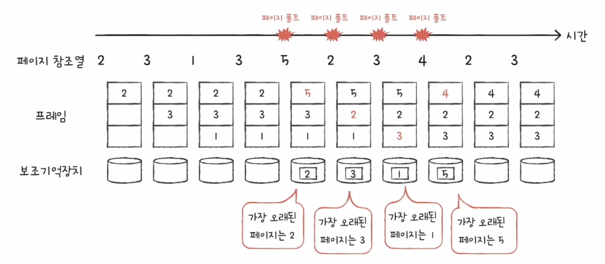
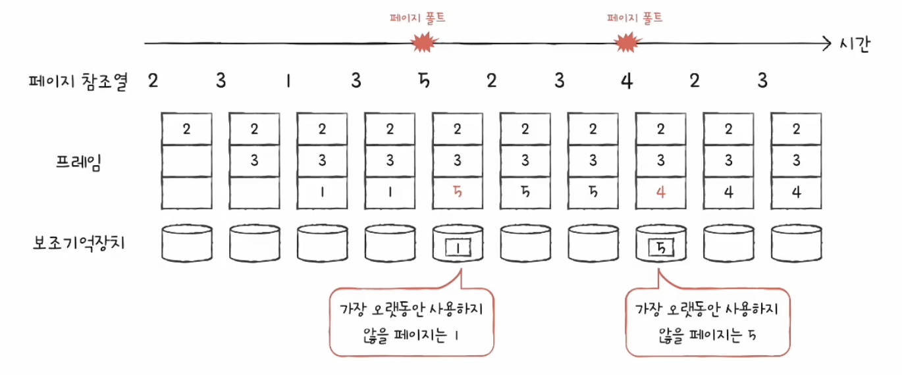
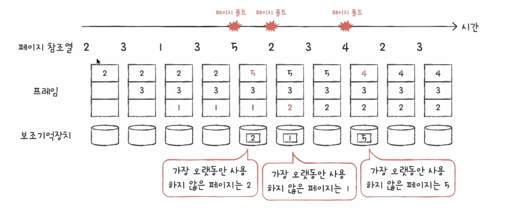
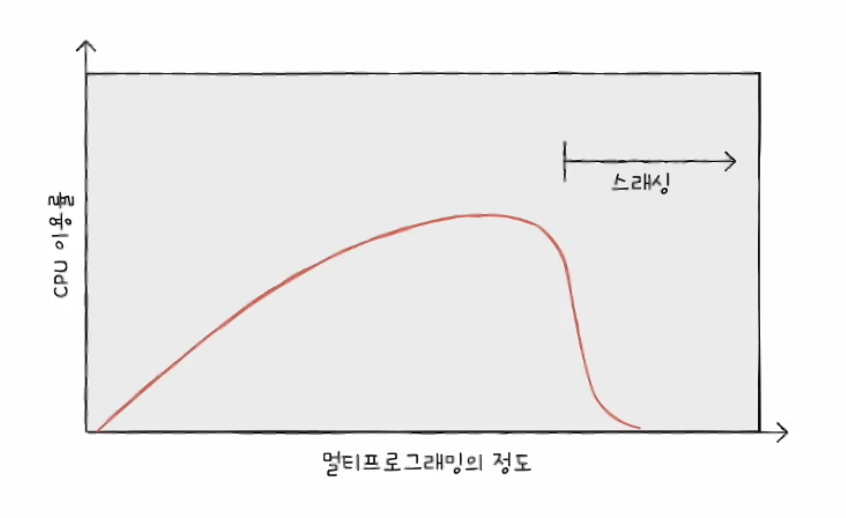
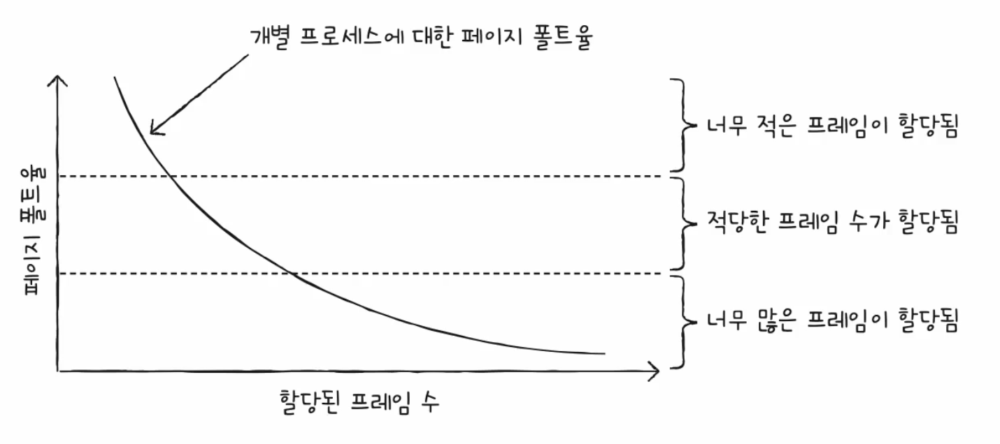

<hr>

# 요구 페이징

요구 페이징<sup>demand paging</sup>: 프로세스를 메모리에 적재할 때 처음부터 모든 페이지를 적재하지 않고 필요한 페이지만을 메모리에 적재하는 기법(**실행에 요구되는 페이지만 적재하는 기법**)

1. CPU가 특정 페이지에 접근하는 명령어를 실행
2. 유효 비트가 1일 경우 CPU는 페이지가 적재된 프레임에 접근
3. 유효 비트가 0일 경우 페이지 폴트가 발생
4. **페이지 폴트 처리 루틴**은 해당 페이지를 메모리에 적재하고 유효 비트를 1로 설정
5. 다시 1번을 수행

## 순수 요구 페이징

순수 요구 페이징<sup>pure demand paging</sup>: 아무런 페이지도 메모리에 적재하지 않고 *무작정 실행*시키는 방식으로 *첫 명령어를 실행하는 순간부터 페이지 폴트가 발생*하게 되고, 실행에 필요한 페이지가 어느 정도 적재된 이후부터는 페이지 폴트 발생 빈도가 떨어짐

# 페이지 교체와 프레임 할당

요구 페이징 시스템이 안정적으로 작동하려면 필연적으로 다음 두 가지를 해결해야 합니다.

운영체제는 어떻게 기존 메모리에 적재된 불필요한 페이지를 선별하여 보조기억장치로 내보낼 수 있는지(**페이지 교체**)

그리고 프로세스들에 얼마만큼의 프레임을 할당할 것인가(**프레임 할당**)

## 페이지 교체 알고리즘

요구 페이징에 의해 페이지가 메모리에 가득 찰 경우 어떤 페이지를 보조기억장치에 내보낼 것인가를 결정하는 알고리즘

- 일반적으로 페이지 폴트가 가장 적게 일으키는 알고리즘을 좋은 알고리즘으로 평가

> 메모리에 적재된 페이지를 가져오는 것보다 보조기억장치에 적재된 페이지를 가져오는 것이 훨씬 느림 

- 가령 자주 사용되는 페이지를 스왑 아웃 시킨다면 계속해서 페이지 폴트가 발생할 것이다(나쁜 알고리즘)

어떠한 페이지 교체 알고리즘이 좋은 알고리즘인지 판단하려면 **페이지 폴트 횟수**를 알아야 하며, 페이지 폴트 횟수는 **페이지 참조열**<sup>page reference string</sup>을 통해 알 수 있습니다.

- 페이지 참조열: CPU가 참조하는 페이지들 중 연속된 페이지를 생략한 페이지열

- 중복된 페이지를 참조하는 행위는 페이지 폴트를 발생시키지 않기 때문에 연속되는 페이지를 생략

### FIFO 페이지 교체 알고리즘

- FIFO 페이지 교체 알고리즘(**First-In First-Out** Page Replacement Algorithm)

- 메모리에 가장 먼저 올라온 페이지부터 내쫓는 방식

- 예를들어 프로세스가 사용할 수 있는 프레임이 세 개 있으며, 페이지 참조열이 아래와 같다고 가정하자

```
2 3 1 3 5 2 3 4 2 3
```

- 아래의 그림과 같이 총 네 번의 페이지 폴트가 발생하는 것을 볼 수 있음

<p id="img_center">
  
</p>

- 프로그램 실행 내내 사용되어야 할 페이지도 계속 내쫓는 결과를 일으킬 수 있으므로 좋은 알고리즘이 아니다

### 최적 페이지 교체 알고리즘

- 최적 페이지 교체 알고리즘(optimal Page Replacement Algorithm)

- CPU에 의해 참조되는 횟수를 고려하는 페이지 교체 알고리즘

- *앞으로의 사용 빈도*가 가장 낮은 페이지를 교체하는 알고리즘 

- 예를들어 프로세스가 사용할 수 있는 프레임이 세 개 있으며, 페이지 참조열이 아래와 같다고 가정하자

```
2 3 1 3 5 2 3 4 2 3
```

- 아래의 그림과 같이 총 두 번의 페이지 폴트가 발생하는 것을 볼 수 있음

<p id="img_center">
  
</p>

- 앞으로 어떤 페이지가 사용될지 안될지를 알 수가 없으므로 **현실적으로는 불가능에 가까운 방식**

- 최적 페이지 교체 알고리즘의 페이지 폴트 횟수가 가장 최소한(최적)의 페이지 폴트 횟수로 이는 *다른 페이지 교체 알고리즘을 평가하기 위해 사용*됨(최적 페이지 교체 알고리즘 대비 얼마나 페이지 폴트가 발생되었느냐) 

### LRU 페이지 교체 알고리즘

- LRU 페이지 교체 알고리즘(**Least Recently Used** Page Replacement Algorithm)

- 가장 오랫동안 사용되지 않은 페이지를 교체하는 알고리즘

- 페이지마다 마지막으로 사용한 시간을 토대로 최근에 가장 사용이 적었던 페이지를 교체

- 예를들어 프로세스가 사용할 수 있는 프레임이 세 개 있으며, 페이지 참조열이 아래와 같다고 가정하자

```
2 3 1 3 5 2 3 4 2 3
```

- 아래의 그림과 같이 총 세 번의 페이지 폴트가 발생하는 것을 볼 수 있음

> TIP: 시간을 기준으로 순서대로 체크해볼 것

<p id="img_center">
  
</p>

## 스래싱과 프레임 할당

### 스래싱

- 프로세스가 사용할 수 있는 프레임의 숫자가 적다면 페이지 폴트가 자주 발생할 것이다

- **스래싱**<sup>thrashing</sup>은 프로세스가 실제 실행되는 시간보다 페이징에 더 많은 시간을 소요하여 성능이 저하되는 문제로

- 메모리에 동시에 실행되는 프로세스의 수(**멀티 프로그래밍의 정도**<sup>degree of multiprogramming</sup>)가 많을수록 CPU의 이용률이 상승하지만

- <u>프로세스의 수가 너무 많아지면 프로세스들이 할당 받는 프레임의 수가 줄어들어</u> 스래싱이 발생하게 되며, CPU 이용률이 현저히 감소하게 된다. 

<p id="img_center">
  
</p>

- 스래싱의 발생을 방지하기 위해서는 프로세스들에 적절한 프레임을 할당할 수 있어야 함

### 프레임 할당 방식

#### 정적 할당 방식

프로세스의 실행 과정을 고려하지 않고 단순히 프로세스의 크기와 물리 메모리의 크기만을 고려한 방식으로 **균등 할당**과 **비례 할당** 방식이 있음

##### 균등 할당(aqual allocation)

- 모든 프로세스들에게 균등하게 프래임을 할당하는 방식

- 프로세스마다 크기가 천차만별이므로(ex. 포토샵과 메모장) 모든 프로세스에 균등하게 프레임을 할당하는 것은 비합리적

##### 비례 할당(proportional allocation)

- 프로세스의 크기에 따라 프레임을 배분하는 방식

- 프로세스의 크기가 크다고 반드시 프레임이 많이 필요한 것은 아니므로 이 또한, 합리적인 방식은 아님

- 결국 프로세스를 실행해 봐야 실제로 얼마나 많은 프레임이 필요한지 알 수 있음

#### 동적 할당 방식

프로세스의 실행을 보고 할당할 프레임의 수를 결정하는 방식으로 **작업 집합 모델**<sup>working set model</sup>과 **페이지 폴트 빈도**<sup>PFF;Page-Fault Frequency</sup> 방식이 있음

##### 작업 집합 모델

- **작업 집합**은 <u>실행 중인 프로세스가 일정 시간 동안 참조한 페이지의 집합</u>으로 작업 집합의 크기만큼 프레임을 할당하는 방식

- 아래의 예제에서 일정 시간을 4초라고 가정한다면 A 지점에서의 작업 집합은 (2,3,5,8)로 프레임 4개가 할당되고, B 지점에서의 작업 집합은 (2,3,4)로 프레임 3개가 할당될 것이다.  

```
               A        B
|--|--|--|--|--|--|--|--|--|--|
2  3  5  8  2  3  4  3  2  8  3
```

- 즉, 시간을 기준으로 참조되었던 페이지에 따라 할당 받는 프레임의 개수가 달라진다 

##### 페이지 폴트 빈도

- 페이지 폴트의 빈도를 기준으로 프로세스에 적절한 수의 프레임을 할당하는 방식

- 페이지 폴트율이 너무 높으면 프레임이 적은 것이고, 너무 낮으면 프레임이 많은 것으로

- *페이지 폴트율에 상한선과 하한선을 정하고, 그 내부 범위 안에서만 프레임을 할당하는 방식*

<p id="img_center">
  
</p>
