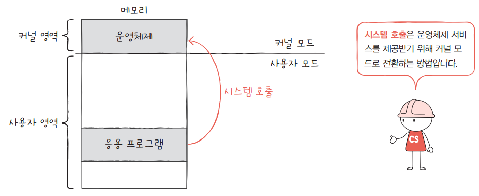

## 혼자공부하는 컴퓨터구조+운영체제

* 혼자공부하는 컴퓨터구조+운영체제 강의 : [한빛미디어(youtube)](https://www.youtube.com/watch?v=bls_GjX-4U8&list=PLVsNizTWUw7FCS83JhC1vflK8OcLRG0Hl)

- [참조 블로그(링크)](https://velog.io/@mmodestaa/%ED%98%BC%EC%9E%90-%EA%B3%B5%EB%B6%80%ED%95%98%EB%8A%94-%EC%BB%B4%ED%93%A8%ED%84%B0-%EA%B5%AC%EC%A1%B0-%EC%9A%B4%EC%98%81%EC%B2%B4%EC%A0%9C-Section-10.-%ED%94%84%EB%A1%9C%EC%84%B8%EC%8A%A4-%EA%B0%9C%EC%9A%94)

## 운영체제(Operating System)

* **운영체제(Operating System)**
  * 컴퓨터 하드웨어를 제어하기 위한 소프트웨어

* **커널(kernel)**  
  * 운영체제의 핵심서비스를 담당하는 프로그램
 
* **메모리 영역**
  * **사용자 영역** : 일반적인 응용 프로그램들이 실행되는 영역 
  * **커널 영역** : 운영체제가 실행되는 영역 
 
* **CPU 명령 모드**
  * 이중 모드   
    * **사용자 모드** : 하드웨어를 제어할 수 없는 모드
    * **커널 모드** : 하드웨어를 제어할 수 있는 모드 
  * 하이퍼바이저 모드
    * 가상머신(VM ware 등) 환경에서 하드웨어에 접근하기 위한 모드

* **시스템 호출(=시스템 콜)**
  * 사용자 모드에서 하드웨어를 제어하기 위해 커널 모드로 전환하는 방법
  * **소프트웨어 인터럽트**의 일종  
  
  

* **운영체제의 핵심서비스**
  * 프로세스 관리
  * 자원 접근 및 할당
  * 파일 시스템 관리  

