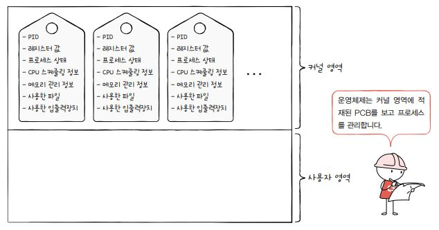
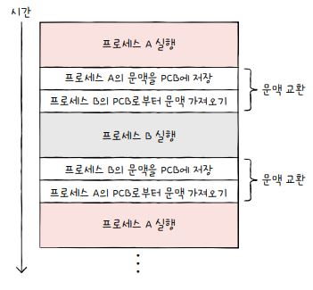
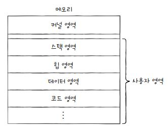
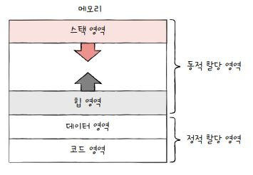

<hr>

## 프로세스 개요

- 프로세스 : 실행 중인 프로그램
    > 보조기억장치에 저장된 프로그램이 <u>메모리에 적재</u>되면 프로세스가 된다.

- 포그라운드 프로세스 : 사용자가 보는 앞에서 실행되는 프로세스

- **백그라운드 프로세스** : 사용자가 보지 못하는 뒤편에서 실행되는 프로세스

    - 사용자와 직접 상호작용하는 백그라운드 프로세스

    - 사용자와 상호작용하지 않는 백그라운드 프로세스

        - 유닉스 운영체제에서는 **데몬(demon)**이라고 부른다

        - 윈도운 운영체제에서는 **서비스(service)**라고 부른다

- 모든 프로세스는 실행을 위해 CPU를 필요로 하므로, **타이머 인터럽트**에 의해 정해진 시간만큼 CPU를 차례대로 실행한다.

    > 타이머 인터럽트 : 클럭 신호를 발생시키는 장치에 의해 주기적으로 발생하는 하드웨어 인터럽트


## 프로세스 제어 블록

- 프로세스 제어 블록(**PCB**: Process Control Block)

- 프로세스와 관련된 정보를 저장하는 자료 구조

- 메모리의 커널 영역에 생성

- PCB는 프로세스 생성 시 만들어지며, 실행이 끝나면 폐기됨

### PCB에 담기는 정보

1. 프로세스 ID

    - 프로세스 ID(**PID**: Process ID)

    - 특정 프로세스를 식별하기 위한 고유번호

2. 레지스터 값

    - 해당 프로세스가 실행하며 사용했던 프로그램 카운터를 비롯한 레지스터 값을 PCB에 저장

    - 타이머 인터럽트 이후 다시 자신의 실행 차례일 때, 이전 정보값들을 불러오기 위함(복원)

3. 프로세스 상태

    - 프로세스의 현재 상태를 PCB에 저장

    - 프로세스 상태의 종류 : 생상 상태, 준비 상태, 실행 상태, 대기 상태, 종료 상태

4. CPU 스케줄링 정보

    - 프로세스가 언제, 어떤 순서로 CPU에 할당받을지에 대한 정보를 저장

5. 메모리 관리 정보

    - 프로세스가 메모리의 어느 주소에 저장되어 있는지에 대한 정보를 저장

    - 베이스 레지스터, 한계 레지스터, 페이지 테이블 정보 등

6. 사용한 파일 및 입출력장치 목록

    - 어떤 파일들을 열었는지에 대한 정보들을 저장

    - 어떤 입출력장치가 프로세스에 할당되었는지 저장

    

## 문맥 교환

- 기존 프로세스(A)의 문맥을 PCB에 백업하고, 새로운 프로세스(B)의 문맥을 PCB로부터 복구하여 새로운 프로세스를 실행하는 것

    > 문맥 : 하나의 프로세스 수행을 재개하기 위해 기억해야 할 정보
    > PCB에 기록되는 정보들을 문맥이라고 봐도 무방

    

- 여러 프로세스의 문맥 교환이 빠르게 이루어지므로, 우리 눈에는 프로세스들이 동시에 실행되는 것처럼 보임

- 문맥 교환을 너무 자주하면 오버헤드가 발생할 수 있음

    > 오버헤드 : 어떤 명령어를 처리하는데 소비되는 간접적, 추가적인 컴퓨터 자원(지연 시간, 메모리 용량, CPU 사용량 등)

## 프로세스의 메모리 영역

- 프로세스는 메모리의 사용자 영역에 코드 영역, 데이터 영역, 힙 영역, 스택 영역으로 나뉘어 저장됨

    

### 코드 영역(code segment)

- 텍스트 영역(text segment)라고도 부르며, CPU가 실행할 명령어가 저장되는 공간

- 쓰기가 금지되어 있는 읽기 전용(read-only) 공간

- 메모리의 크기가 고정된 **정적 할당 영역**이다.

### 데이터 영역(data segment)

- 프로그램이 실행되는 동안 유지할 데이터가 저장되는 공간

- 대표적으로 **전역 변수(Global Variable)**가 이 데이터 영역에 저장된다.

    > 전역 변수 : 프로그램이 실행되는 동안 유지되며, 프로그램 전체에서 접근할 수 있는 변수

    ```python
    global_var = 2 # 전역변수 선언

    def multiple(a):
        global global_var # global 키워드를 사용하여 전역변수임을 명시
        return a * global_var

    result = multiple(5)
    print(result) # 출력 : 10
    ```

- 메모리의 크기가 고정된 **정적 할당 영역**이다.

### 힙 영역(heap segment)

- 프로그래머가 직접 할당할 수 있는 저장 공간

- 메모리의 크기가 변할 수 있는 **동적 할당 영역**이다.

- 사용이 끝나면 메모리 공간을 반환하여야 한다

- 반환하지 않으면 메모리 내에 계속 남아 메모리 낭비(**메모리 누수**)가 발생

### 스택 영역(stack segment)

- 데이터를 일시적으로 저장하는 공간

- 함수의 실행이 끝나면 사라지는 매개 변수와 지역 변수가 이 스택 영역에 저장된다.

    - **매개 변수(Parameter)** : 함수나 메서드가 호출될 때 외부로부터 입력을 받을 수 있도록 정의된 변수

    ```python
    def add(a, b):  # a와 b가 매개변수
    return a + b
    ```

    - **지역 변수(Local Variable)** : 함수나 메서드 내부에서 선언된 변수로, 함수나 메서드의 범위(scope) 내에서만 유효

    ```python
    def multiply(x, y):
    result = x * y  # result가 지역변수
    return result
    ```

- 메모리의 크기가 변할 수 있는 **동적 할당 영역**이다.

- 저장할 데이터는 스택 영역에 PUSH, 필요하지 않은 데이터는 POP

- 스택 영역과 힙 영역은 동적 할당 영역으로 주소가 겹치지 않도록 **스택 영역**은 <u>높은 주소에서 낮은 주소</u>로, **힙 영역**은 <u>낮은 주소에서 높은 주소</u>로 할당 된다.

    

