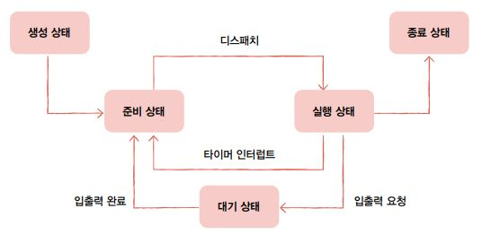

## 프로세스 상태

- 프로세스들이 번갈아 가면서 실행될 때, PCB에 현재 프로세스 상태를 기록

    

1. **생성 상태(new)**

    - 프로세스를 생성 중인 상태

    - 이제 막 메모리에 적재되어 PCB를 할당 받은 상태

2. **준비 상태(ready)**

    - 생성 상태 완료 후, CPU 사용을 위해 자신의 차례를 기다리는 상태

    - **디스패치**(dispatch) : 준비 상태인 프로세스가 실행 상태로 전환되는 것

3. **실행 상태(running)**

    - CPU를 할당받아 실행 중인 상태

    - 자신의 차례가 끝나 타이머 인터럽트가 발생하면 준비 상태로 전환

    - 입출력 장치를 사용하면 입출력 장치의 작업이 끝날 때까지 대기 상태로 전환

4. **대기 상태(blocked)**

    - 입출력 작업은 CPU에 비해 처리 속도가 느리므로 입출력을 요청한 프로세스는 대기 상태로 전환

    - 입출력 작업이 완료되면 준비 상태로 전환되어 다시 CPU의 할당을 기다림

    - 입출력 작업 외에도 특정 이벤트가 발생하는 것을 기다릴 때 대기 상태가 됨(대부분은 입출력 작업)

5. **종료 상태(terminated)**

    - PCB가 종료된 상태

    - 프로세스가 종료되면 운영체제는 PCB와 프로세스가 사용한 메모리를 정리

## 프로세스 계층 구조

- 프로세스는 실행 도중 시스템 호출을 통해 다른 