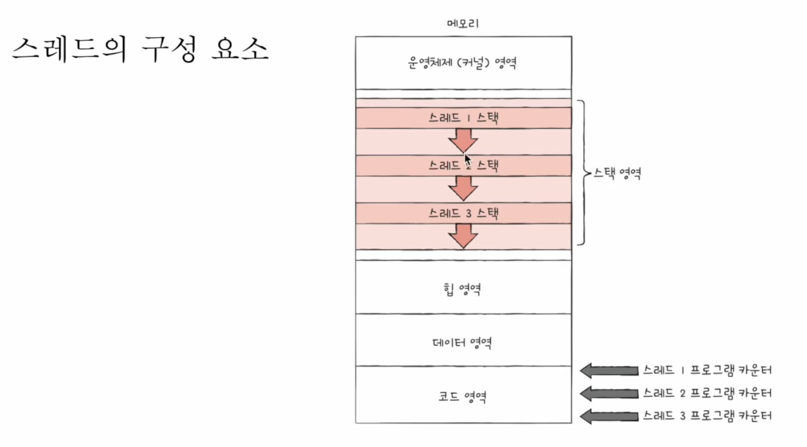
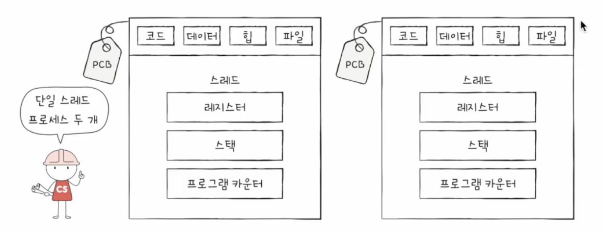
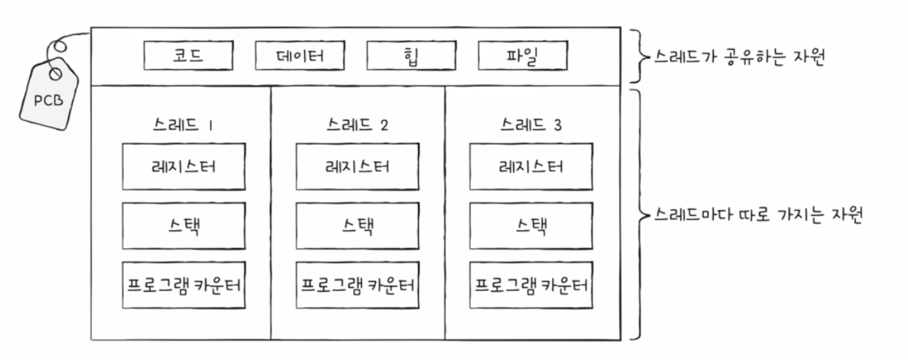

## 스레드(Thread)

- 프로세스를 구성하는 실행의 흐름 단위

- 프로세스는 여러 개의 스레드를 가질 수 있으며, 하나의 프로세스에서 동시 실행이 가능

- 단일 스레드 프로세스 : 실행의 흐름 단위가 하나

- 멀티 스레드 포로세스 : 실행 흐름이 여러 개인 프로세스

  > 프로세스를 구성하는 여러 명령어를 동시에 실행 가능

- 프로세스를 이루는 스레드들은 프로세스의 자원을 공유하면서 실행됨

## 스레드의 구성 요소

- 스레드는 프로세스 내에 각기 다른 스레드 ID, 프로그램 카운터 값, 레지스터 값, 스택을 가지고 있음

  1. 스레드 ID
  2. 프로그램 카운터 값
  3. 레지스터 값
  4. 스택

- 스레드들은 구성 요소를 제외한 **프로세스의 자원을 공유**

> 리눅스 운영체제에서는 스레드와 프로세스를 구분하지 않음
  > 프로세스와 스레드라는 말 대신 <u>태스크(task)</u>라는 이름으로 통일하여 명명

## 멀티프로세스와 멀티스레드

- 멀티프로세스 : 여러 프로세스를 동시에 실행

  - 프로세스끼리는 기본적으로 자원을 공유하지 않음(독립적으로 실행)

    > 프로세스 간 통신(IPC: Inter-Process Communication)을 통해 자원을 공유할 수 있음

  - 프로세스를 fork하여 같은 작업을 하는 동일한 프로세스를 생성

  - 프로세스들은 자원을 공유하지 않고, 각각 독립적으로 메모리에 적재되므로 메모리 낭비가 발생

- 멀티스레드 : 여러 스레드로 프로세스를 동시에 실행

  - 스레드들은 프로세스 내의 자원을 공유하기 때문에 메모리를 효율적으로 사용 가능

  - 멀티스레드 환경에서는 하나의 스레드에 문제가 생기면 프로세스 전체에 문제가 생길 수 있는 단점이 있음

