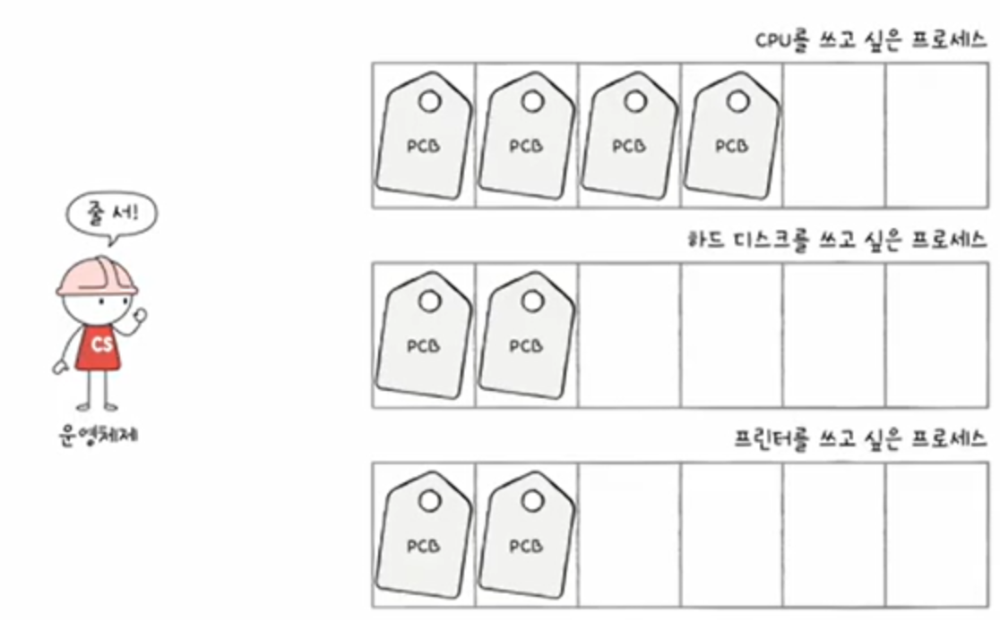
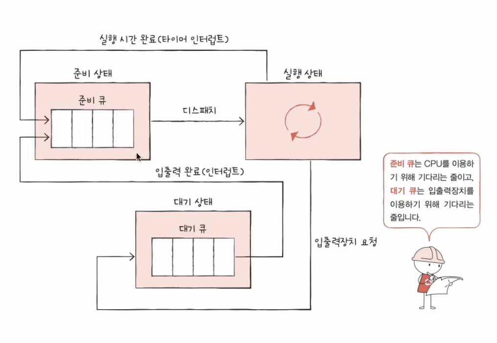
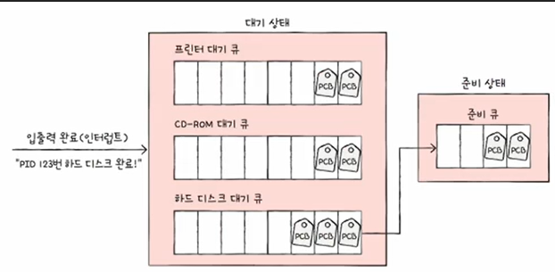

##  CPU 스케줄링(CPU Scheduling)

프로세스들에게 공정하고 합리적으로 CPU 자원을 배분하는 것

### 프로세스 우선순위

- CPU는 우선순위가 높은 프로세스부터 실행시킨다.

- **입출력 집중 프로세스** : 입출력 작업이 많은 프로세스

  > 입출력 집중 프로세스는 실행 상태보다는 입출력을 위한 대기 상태에 많이 머무름

- **CPU 집중 프로세스** : CPU 작업이 많은 프로세스

  > CPU 집중 프로세스는 대기 상태보다 실행 상태에 많이 머무름

- 대기 상태에 많이 머무르는 입출력 집중 프로세스를 먼저 처리해야 작업이 효율적이므로 CPU 집중 프로세스보다 <u>입출력 집중 프로세스의 우선순위가 높다.</u>

  ✅ 참고

  - CPU 버스트(CPU burst) : CPU를 이용하는 작업

  - 입출력 버스트(I/O burst) : 입출력장치를 기다리는 작업

- 각 프로세스의 PCB에 우선순위를 명시

### 스케줄링 큐

- PCB에 프로세스의 우선순위가 명시되어 있지만, 운영체제가 직접 PCB를 보고 우선순위를 결정하는 것은 비효율적

- 스케줄링 큐(scheduling queue) 방식을 통해 작업별로 프로세스들을 줄(큐)을 세워 관리

- **준비 큐(ready queue)** : CPU를 이용하고 싶은 프로세스들이 서는 줄

- **대기 큐(waiting queue)** : 입출력장치를 이용하기 위해 대기 상태에 접어든 프로세스들이 서는 줄

#### 준비 큐(ready queue)

운영체제는 PCB들이 큐에 삽입된 순서대로 프로세스를 실행하되, 그중 우선순위가 높은 프로세스를 먼저 실행

#### 대기 큐(waiting queue)

입출력 장치별로 대기 큐에 삽입되어 입출력 작업을 완료하고, 작업이 완료된 PCB는 준비 큐로 이동

### 선점형과 비선점형 스케줄링

- 어느 프로세스가 지금 당장 CPU를 사용해야 할 상황에서의 처리 방식

- 현재는 대부분 선점형 스케줄링 방식을 사용

#### 선점형 스케줄링(preemptive scheduling)

- 어느 하나의 프로세스가 자원 사용을 독점할 수 없는 스케줄링 방식

- 운영체제가 프로세스로부터 자원을 강제로 빼앗아 다른 프로세스에 할당할 수 있는 스케줄링 방식

- 타이머 인터럽트 발생 시, 운영체제가 다음 차례의 프로세스에게 CPU의 자원을 할당하는 방식은 선점형 스케줄링의 일종

- 장점 : 프로세스의 자원 독점을 막고 효율적인 자원 배분이 가능

- 단점 : 문맥 교맥 과정에서 오버헤드가 발생될 수 있음 

#### 비선점형 스케줄링(non-preemptive scheduling)

- 하나의 프로세스가 자원 사용을 독점할 수 있는 스케줄링 방식

- 프로세스가 *스스로* 대기 상태에 접어들거나, 종료되기 전까진 다른 프로세스의 사용이 불가

- 장점 : 오버헤드의 발생 가능성이 낮음

- 단점 : 하나의 프로세스가 실행 중이면 무작정 기다려야 함
