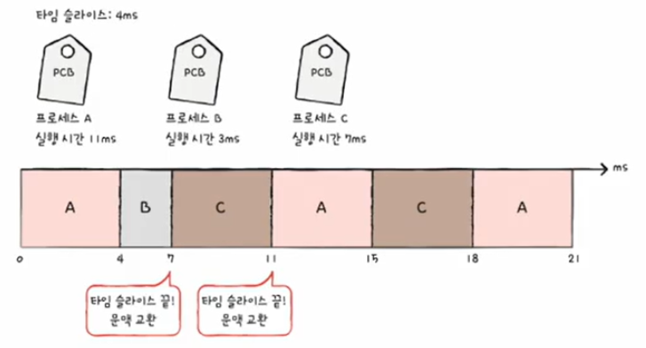
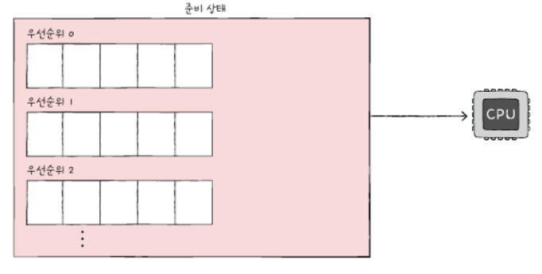
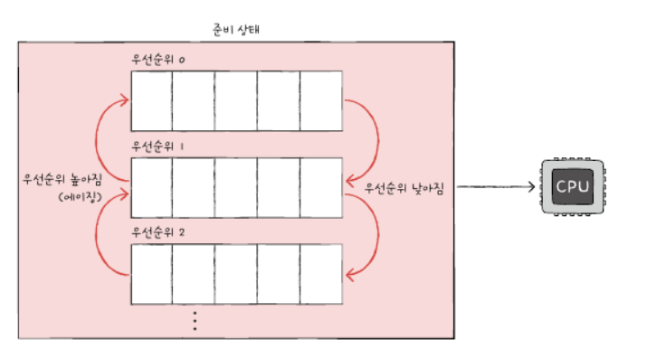

## CPU 스케줄링 알고리즘

### 선입 선처리 스케줄링

- **FCFS 스케줄링**(First Come First Served Scheduling)이라고도 부름

- 준비 큐에 삽입된 *순서대로* 프로세스를 처리하는 비선점형 스케줄링 방식

- 우선순위가 없어, 짧은 CPU 버스트[^1]를 갖는 프로세스도 무작정 기다려야 해서 효위 효과가 발생

    > 효위 효과(convoy effect) : CPU 버스트 시간이 긴 프로세스가 준비 큐 앞에 위치하게 되면 그 뒤에 있는 짧은 CPU버스트를 가지는 프로세스들도 해당 프로세스의 끝을 기다려야 하는 현상

[^1]: CPU 버스트(CPU burst) : CPU를 이용하는 작업

### 최단 작업 우선 스케줄링

- **SJF 스케줄링**(Shortest Job First Scheduling)이라고도 부름

- 준비 큐에 삽입된 프로세스 중 **CPU 버스트 시간이 짧은 순서**로 프로세스를 처리하는 비선점형 스케줄링 방식

### 라운드 로빈 스케줄링

- 선입 선처리 스케줄링에 타임 슬라이스의 개념이 더해진 스케줄링 방식

    > 타임 슬라이스 : 각 프로세스가 CPU를 사용할 수 있는 정해진 시간

- **타임 슬라이스만큼**의 시간 동안 돌아가며 CPU를 이용하는 선점형 스케줄링 방식    

- 타임 슬라이스가 끝나면 문맥 교환 후, 큐의 마지막에 다시 삽입

### 최소 잔여 시간 우선 스케줄링

- **SRT 스케줄링**(Shortest Remaining Time Scheduling)이라고도 부름

- 최단 작업 우선 스케줄링 + 라운드 로빈 스케줄링

- 정해진 타임 슬라이스만큼 CPU를 사용하되, CPU를 사용할 다음 프로세스는 남아있는 작업 시간이 가장 적은 프로세스가 선택

### 우선순위 스케줄링

- 프로세스들에 우선순위를 부여하고, 높은 우선순위를 가진 프로세스부터 실행

- 우선순위가 같은 프로세스는 선입 선처리로 스케줄링 됨

- 우선순위가 낮은 프로세스는 계속해서 실행이 연기되는 **기아**starvation현상이 발생

**에이징**aging기법 : 기아현상을 방지하기 위해 오랫동안 대기한 프로세스의 우선순위를 점차 높이는 방식

### 다단계 큐 스케줄링

- 우선순위별로 준비 큐를 여러 개 사용하는 스케줄링 방식

- 우선순위가 높은 큐에 있는 프로세스를 먼저 처리하고, 우선순위가 높은 프로세스가 비어 있으면 그다음 우선순위 큐에 있는 프로세스를 실행

- 큐마다 다른 스케줄링 알고리즘 및 타임 슬라이스를 지정할 수 있음

- 기아현상이 발생할 수 있음

### 다단계 피드백 큐 스케줄링

- 다단계 큐 스케줄링의 발전된 형태로, 프로세스들이 큐 사이를 이동

- 가장 일반적인 CPU 스케줄링 알고리즘

- 작동 방식

  1. 새로 준비상태에 진입한 프로세스는 가장 우선순위가 높은 큐에 삽입

  2. 타임 슬라이스동안 실행되며, 작업이 끝나지 않았다면 다음 우선순위 큐에 삽입

  3. CPU 버스트가 긴 프로세스 일수록 점차적으로 우선순위가 낮아짐

  4. 낮은 우선순위 큐에서 너무 오래 기다리고 있는 프로세스가 있다면 에이징 기법으로 우선순위를 높임

  5. 즉, CPU 이용 시간이 길면 낮은 우선순위 큐로 이동시키고, 어떤 프로세스가 낮은 우선순위 큐에서 너무 오래 기다린다면 높은 우선순위 큐로 이동시킬 수 있는 알고리즘

