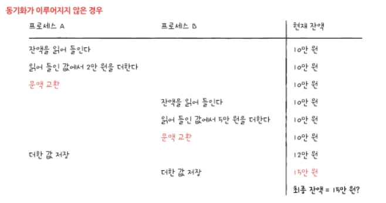
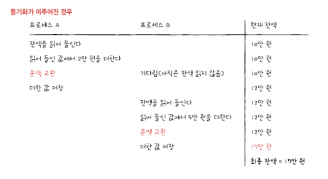

<hr>

# 동기화

공동의 목적을 가진 프로세스들이 동시에 실행되었을 때, 실행 순서와 자원의 일관성을 보장 받기 위해서는 동기화가 되어야 한다.

## 상호 배제를 위한 동기화

- **상호 배제**<sup>mutual exclusion</sup> : 공유가 불가능한 자원의 동시 사용을 피하기 위해 사용하는 알고리즘

- **상호 배제를 위한 동기화** : 동시에 접근해서는 안 되는 자원에 동시에 접근하지 못하게 하는 것

### 예시 1. 저축 문제

현재 계좌에 10만원이 있음. 프로세스 A는 2만원을 저축, 프로세스 B는 5만원을 저축하는 프로세스

- 프로세스 A의 실행 과정

    1. 계좌의 잔액을 읽음
    2. 읽어 들인 잔액에 2만원을 더함
    3. 더한 값을 저장

- 프로세스 B의 실행 과정

    1. 계좌의 잔액을 읽음
    2. 읽어 들인 잔액에 5만원을 더함
    3. 더한 값을 저장





### 예시 2. 생산자와 소비자 문제

- 생산자는 버퍼에 물건을 넣은 후, 물건의 총합에 해당하는 변수를 1 감소

- 소비자는 버퍼에 물건을 넣은 후, 물건의 총합에 해당하는 변수를 1 감소

```python
총합 = 10

생산자() {
    버퍼에 데이터 삽입
    '총합' 변수 1 증가
}

소비자() {
    버퍼에 데이터 빼내기
    '총합' 변수 1 감소
}
```

- 생산자 프로세스와 소비자 프로세스를 동시에 100,000번 실행한다고 가정

- 예상되는 값은 기존 값인 '총합 10'이지만 동기화가 되지 않으면 전혀 이상한 값이 나옴

- 생산자가 소비자의 값이 끝나기 전에 총합을 수정했기 때문에 발생하는 문제

## 공유 자원과 임계 구역

- **공유 자원** : 예시의 잔액, 총합과 같은 공유되는 자원으로 전역 변수, 파일, 입출력장치, 보조기억장치 등

- **임계 구역**<sup>critical section</sup> : 공유 자원에 접근하는 코드 중 동시에 실행하면 문제가 발생하는 코드 영역

- 두 개 이상의 프로세스가 임계 구역에 진입하고자 하면 둘 중 하나는 대기해야 함

- *레이스 컨디션*<sup>race condition</sup> : 잘못된 실행으로 인해 여러 프로세스가 동시 다발적으로 임계 구역의 코드를 실행하여 문제가 발생하는 경우

- 레이스 컨디션이 발생하는 이유

    1. 고급 언어는 실행 과정에서 저급 언어로 변환되어 실행된다.

    2. 여러 줄의 저급 언어로 변환된 고급 언어 한 줄을 실행하는 과정에서 문맥 교환이 일어날 수 있음

## 임계 구역 문제 해결을 위한 세 가지 방법

- 상호 배제를 위한 동기화는 두 개 이상의 프로세스가 임계 구역에 동시에 접근하지 못하도록 관리하는 것을 의미

1. **상호 배제**<sup>mutual exclusion</sup> : 한 프로세스가 임계 구역에 진입했다면 다른 프로세스는 임계 구역에 들어올 수 없다

2. **진행**<sup>progress</sup> : 임계 구역에 어떤 프로세스도 진입하지 않았다면 임계 구역에 진입하고자 하는 프로세스는 들어갈 수 있어야 한다

3. **유한 대기**<sup>bounded waiting</sup> : 한 프로세스가 임계 구역에 진입하고 싶다면 그 프로세스는 언젠가는 임계 구역에 들어올 수 있어야 한다(임계 구역에 들어오기 위해 무한정 대기해서는 안 된다)