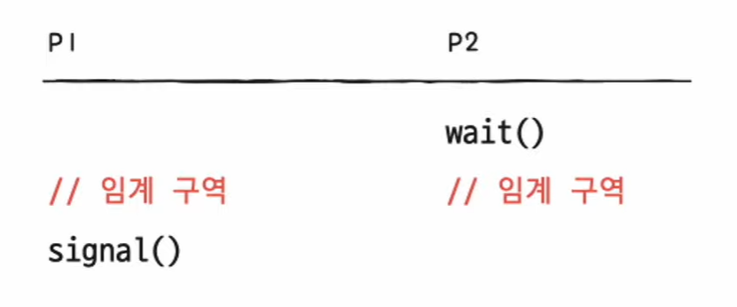

<hr>

# 동기화 기법

## 뮤텍스 락

- **뮤텍스 락**<sup>Mutex lock; MUTual EXclusion lock </sup> : 임계구역에 프로세스가 들어와 있으면 다른 프로세스가 진입하지 못하게 임계구역을 자물쇠로 잠그는 함수(코드)  

- 뮤텍스 락은 하나의 공유 자원에 접근하는 프로세스를 상정한 방식


- 함수의 형태는 하나의 전역 변수와 두 개의 함수로 구현  

    - 자물쇠 역할 : 프로세스들이 공유하는 전역 변수 *lock*

    - 임계 구역을 잠그는 역할 : *acquire 함수*

    - 임계 구역의 잠금을 해제하는 역할 : *release 함수*

```cpp
acquire() {
    while (lock == true)   /* 만약 임계 구역이 잠겨 있다면 */
        ;                  /* 임계 구역이 잠겨 있는지 반복적으로 확인 */
    lock = true;           /* 만약 임계 구역이 잠겨 있지 않으면 임계 구역 잠금 */
}

release() {
    lock = false;          /* 임계 구역 작업이 끝났으니 잠금 해제 */
}
```

- acquire 함수를 보면 임계 구역이 잠겨 있는 경우 반복적으로 lock을 확인하는 것을 볼 수 있음. 이를, *바쁜 대기*<sup>busy wait</sup>라고 함


## 세마포

- **세마포**<sup>semaphore</sup>는 공유 자원이 여러 개 있는 상황에서도 적용이 가능한 동기화 도구로 *임계 구역이 여러 개*

- 함수의 형태는 하나의 전역 변수와 두 개의 함수로 구현  

    - 임계 구역에 진입할 수 있는 프로세스의 개수(사용 가능한 공유 자원의 개수)를 나타내는 전역 변수 *S*

    - 임계 구역에 들어가도 좋은지, 기다려야 할지를 알려주는 *wait 함수*

    - 임계 구역 앞에서 기다리는 프로세스에 '이제 가도 좋다'고 신호를 주는 *signal 함수*

```cpp
wait() {
    while(S <= 0)  /* 만일 임계 구역에 진입할 수 있는 프로세스의 개수가 0 이하라면 */
    ;              /* 사용할 수 있는 자원이 있는지 반복적으로 확인하고, */
    S--;           /* 임계 구역에 진입할 수 있는 프로세스 개수가 하나 이상이면 S를 1 감소시키고 임계 구역에 진입 */
}

signal() {
    S++;           /* 임계 구역에서의 작업을 마친 뒤 S를 1 증가시킨다.*/
}
```

- 위의 방식 역시 바쁜 대기가 발생하므로 개선된 방식을 사용

```cpp
wait() {
    S--;                               /* S를 1 감소시킨 뒤 */
    if (S < 0) {                       /* 만일 공유 자원(S)이 0 보다 작다면 */
        add this procsss to Queue;     /* 본인의 PCB를 대기 큐에 넣고 */
        sleep();                       /* 대기 상태로 전환 */
    }
}

signal() {
    S++;                               /* 작업이 끝나면 S를 1 증가시킨 뒤 */
    if (S <= 0) {                      
        remove a process p from Queue; /* 현재 대기 큐에 있는 프로세스 p를 제거한 후 */
        wakeup(p);                     /* 프로세스 p를 대기 상태에서 준비 상태로 만든다 */
    }
}
```

- 세마포 방식으로 프로세스들의 **실행 순서**를 제어하기 위해서는 공유 자원(S)을 0으로 만들고

- 먼저 실행할 프로세스(p1)는 임계 구역 뒤에 signal() 함수를 붙이고

- 뒤에 실행할 프로세스(p2)는 임계 구역 앞에 wait() 함수를 붙이면 된다



- p1이 먼저 실행되면 임계 구역 앞에 wait()가 없으니 바로 임계 구역에 진입하여 p1이 먼저 실행됨

- p2가 먼저 실행되면 임계 구역 앞에 wait()가 있으니 S를 -1로 만들고 대기하므로 p1이 먼저 실행됨

## 모니터

- 세마포는 매번 임계 구역에 wait()와 signal()을 명시해야해서 실수로 누락하거나 순서를 반대로 하는 경우가 발생

- **모니터**<sup>>monitor</sup>는 <u>공유 자원과 공유 자원에 접근하기 위한 인터페이스(통로)를 묶어서 관리</u>하므로 세마포에 비해 사용자가 사용하기 훨씬 편리한 도구

- 기본 동작 방식

    1. 모니터 안에는 <u>항상 하나의 프로세스만 들어오도록</u> 상호 배제를 위한 동기화를 제공

    2. 모니터를 통해 공유 자원에 접근하고자 하는 프로세스를 큐에 삽입

    3. 큐에 삽입된 순서대로 하나씩 공유자원을 이용


- **조건 변수**<sup>condition variable</sup> : 프로세스나 스레드의 실행 순서를 제어하기 위해 사용되는 특별한 변수

- 조건 변수가 포함된 동작 방식

    1. 프로세스(p1)가 모니터에 진입 했을 때, 조건에 걸리면(먼저 실행되면 안되는 프로세스라면) x.wait()를 호출하여 p1을 조건 변수 큐에 삽입

    2. 프로세스(p1)이 조건 변수 큐에 삽입 되었으므로 모니터는 비어있게 되어 프로세스들이 진입 가능하게 됨

    3. 프로세스(p2; p1 보다 먼저 실행 되었어야 할 프로세스)가 모니터에 진입하면 공유자원을 사용

    4. 프로세스(p2)의 작업이 끝나면 x.signal()을 호출하고, 모니터를 빠져나옴
    
        > 작업이 끝나지 않은 상태에서도 x.signal()을 호출하고 자신이 조건 변수 큐에 삽입된 뒤 p1을 실행하게 할 수 있음

    5. x.signal() 호출을 통해 프로세스(p1)는 조건 변수 큐에서 빠져나와 모니터에 진입. 공유자원을 사용 


