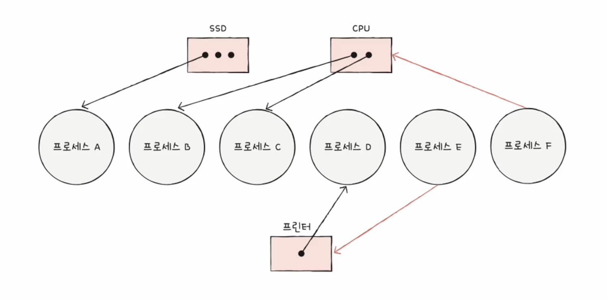
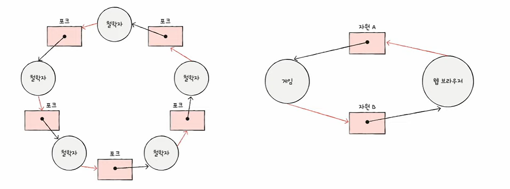

<hr>

# 교착 상태

운영체제 또는 소프트웨어의 잘못된 자원 관리로 인하여 둘 이상의 프로세스 또는 스레드들이 아무것도 진행하지 않는 상태로 서로 영원히 대기하는 상황

## 뮤텍스 락에서의 교착 상태 예시

1. 프로세스 A는 임계 구역 진입 전 lock1을 잠그고(lock1 = true;), lock2가 false 되길 기다림 

2. 프로세스 B는 임계 구역 진입 전 lock2을 잠그고(lock2 = true;), lock1이 false 되길 기다림 

    ```cpp
    // 프로세스 A
    lock1 = true;
    while (lock2 == true)
    ;
    lock1 = false;

    // 프로세스 B
    lock2 = true;
    while (lock1 == true)
    ;
    lock2 = false;
    ``` 

3. 서로 임계 구역을 점유하면서 다른 임계 구역을 기다리게 되므로 교착 상태가 발생

## 자원 할당 그래프

자원 할당 그래프<sup>Resource Allocation Graph, RAG</sup>란 *프로세스*와 *자원*의 관계를 시각적으로 표현한 그래프로 주로 **교착 상태(데드락)**를 분석하거나 감지하는 데 사용

### 자원 할당 그래프의 규칙

1. 프로세스는 원으로, 자원의 종류는 사각형으로 표현된다.

2. 사용할 수 있는 자원의 개수는 자원 사각형 내에 점으로 표현된다.

3. 프로세스가 어떤 자원을 할당받아 사용 중이라면 자원에서 프로세스를 향해 화살표를 표시한다.

4. 프로세스가 어떤 자원을 기다리고 있다면 프로세스에서 자원으로 화살표를 표시한다.

### 자원 할당 그래프 예시

<p id="img_center">
  
</p>

1. 프로세스A : SSD 자원을 사용 중
2. 프로세스B : CPU 자원을 사용 중
3. 프로세스C : CPU 자원을 사용 중
4. 프로세스D : 프린터 자원을 사용 중 
5. 프로세스E : 프린터 자원을 사용하기 위해 대기 중
6. 프로세스F : CPU 자원을 사용하기 위해 대기 중

## 교착 상태 발생 조건

교착 상태가 발생할 조건은 네 가지(*상호 배제*, *점유와 대기*, *비선점*, *원형 대기*)로 네 가지의 조건이 <u>모두</u> 만족해야 교착 상태가 발생할 가능성이 생긴다.

### 상호 배제

상호 배제란, 자원을 동시에 사용할 수 없도록 하는 방식

### 점유와 대기

점유와 대기<sup>hold and wait</sup> : 자원을 할당받은 상태에서 다른 자원을 할당받기를 기다리는 상태

### 비선점

비선점이란, 프로세스가 작업이 끝날 때 까지 하나의 자원을 독점하는 것으로 다른 프로세스가 자원을 강제로 빼앗을 수 없음 

### 원형 대기

자원 할당 그래프가 원의 형태를 이루는 것으로, 서로 자신의 자원을 독점하면서 상대방의 자원을 기다리는 형태

<p id="img_center">
  
</p>

### 결론
<u>자원을 동시에 사용할 수 없고</u>(*상호 배제*), <u>자원을 빼앗을 수도 없는대</u>(*비선점*), <u>자원을 할당 받은 상태</u>(*점유*)에서 <u>서로가 서로</u>(*원형대기*)의 <u>자원을 할당받기를 기다리는 상태</u>(*대기*)