<hr>

# 페이징을 통한 가상 메모리 관리

가상 메모리<sup>virtual memory</sup>란 실행하고자 하는 프로그램을 일부만 메모리에 적재하여 실제 물리 메모리 크기보다 더 큰 프로세스를 실행할 수 있게 하는 기술

가상 메모리 관리 기법에는 *페이징*과 *세그멘테이션*이 있지만, 현재 대부분의 운영체제는 **페이지 기법**을 사용함

## 페이징이란

**페이징**<sup>paging</sup>은 *메모리의 물리 주소 공간*을 **프레임** 단위로 자르고, *프로세스의 논리 주소 공간*을 **페이지** 단위로 자른 뒤 페이지를 프레임에 할당하는 가상 메모리 관리 기법

<p id="img_center">
  
</p>

- 프로세스를 잘라서 메모리에 **불연속적으로 할당**하므로 외부 단편화가 발생하지 않음

- 페이지 단위로 **스와핑**을 하기 때문에 프로세스 전체를 물리 메모리에 적재할 필요가 없어, **실제 물리 메모리 크기보다 더 큰 프로세스를 실행할 수 있음**

- 페이징 시스템에서의 스왑 아웃은 *페이지 아웃*<sup>page out</sup>, 스왑 인은 *페이지 인*<sup>page in</sup>이라고도 부름

<p id="img_center">
  
</p>

## 페이지 테이블

페이지 테이블<sup>page table</sup>: 프로세스의 페이지 정보를 저장하고 있는 테이블로 페이지 번호를 이용해 페이지가 적재된 프레임을 찾을 수 있음 

- 프로세스의 페이지가 메모리의 프레임에 불연속적으로 배치되므로

- 페이지가 어느 프레임에 있는지 CPU가 알 수 있도록

- 페이지 테이블에 *페이지 번호*와 *프레임 번호*를 저장

<p id="img_center">
  
</p>

- CPU는 페이지 테이블을 보고 원하는 페이지를 실행 시키면

- 해당 페이지 번호와 대응된 프레임 번호의 메모리를 실행

<p id="img_center">
  
</p>

프로세스가 (실제 메모리 내의 주소인) 물리 주소에 불연속적으로 배치되더라도 (CPU가 바라보는 주소인) 논리 주소에는 연속적으로 배치되도록 하는 효과

### 내부 단편화

- 페이징은 외부 단편화 문제를 해결할 수 있지만, **내부 단편화**(internal fragmentation)을 야기할 수 있음

- 프로세스를 일정한 크기의 페이지로 나눌 때 페이지 내에 빈공간

- 예: 프로세스의 크기가 `108KB`이고, 페이지의 크기가 `10KB`이면 총 `110KB`의 메모리가 소요되고, 하나의 페이지에는 `2KB`의 내부 단편화가 발생  

- 페이지의 크기를 너무 크게하면 내부 단편화의 크기가 커지고, 너무 작게하면 페이지 테이블의 크기가 커지므로 적절한 크기로 조정하는 것이 중요

- 페이지의 크기를 알 수 있는 리눅스 명령어: `getconf PAGESIZE`

```bash
getconf PAGESIZE

>> 4096
```

### 페이지 테이블 접근 방식

- 프로세스마다 각각의 페이지 테이블이 존재

- 프로세스들의 페이지 테이블 정보들은 각 프로세스의 PCB에 기록되어 있음

- CPU 내의 *페이지 테이블 베이스 레지스터*(**PTBR**: Page Table Base Register)는 각 프로세스의 페이지 테이블이 적재된 주소를 가리키고 있음

- 프로세스 실행 시, CPU는 다음과 같은 순서로 페이지가 적재된 프레임을 알 수 있음

  1. 프로세스 A가 실행될 때, PTBR은 프로세스 A의 페이지 테이블이 적재된 주소를 가리킴

  2. **CPU는** PTBR을 통해 프로세스 A의 페이지 테이블이 적재된 주소의 **메모리에 접근함**

  3. CPU는 페이지 테이블을 보고, 프로세스 A의 페이지가 적재된 프레임을 알 수 있음

<p id="img_center">
  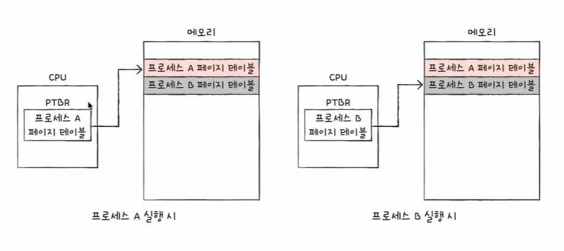
</p>

- 하지만, 방금과 같은 방법에서는 CPU가 메모리에 두 번 접근하므로 접근 시간이 두 배가 되는 문제가 있음

  > 페이지 테이블을 보기위해 한 번, 프레임에 접근하기 위해 한 번 

- 이와 같은 문제를 해결하기 위해 CPU 곁에(일반적으로는 MMU 내에) **TLB**<sup>Translation Lookaside Buffer</sup>라는 *페이지 테이블의 캐시 메모리*를 둠

- TLB는 페이지 테이블의 일부 내용을 CPU 곁에 저장함으로써, 접근 시간을 줄여주는 캐시 메모리

- 참조 지역성에 근거해 주로 최근에 사용된 페이지 위주로 저장

- *TLB 히트(hit)* : TLB 내에 접근하고자 하는 페이지 테이블의 정보가 있을 때를 뜻함. 정보가 있으므로 메모리에 접근할 필요가 없음 

- *TLB 미스(miss)* : TLB 내에 접근하고자 하는 페이지 테이블의 정보가 없을 때를 뜻함. 정보가 없으므로 페이지 테이블이 적재된 메모리에 접근해야 함

<p id="img_center">
  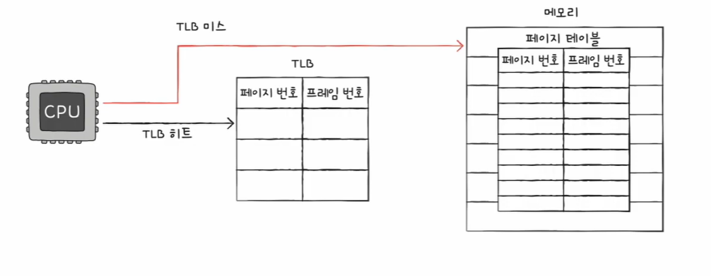
</p>

## 페이지에서의 주소 변환

페이지와 프레임은 일정 단위로 쪼개졌기 때문에 내부에 여러 주소를 포괄하고 있음

그렇기 때문에 특정 주소에 접근하기 위해서는 아래와 같은 두 가지 정보가 필요

1. 어떤 페이지 혹은 프레임에 접근할지

2. 접근하려는 주소가 그 페이지 혹은 프레임으로부터 얼마나 떨어져 있는지

그렇기에 페이징 시스템에서는 모든 *논리 주소*가 기본적으로 **페이지 번호**<sup>page number</sup>와 **변위**<sup>offset</sup>로 이루어져 있음

> 변위 : 접근하려는 주소가 프레임의 시작 번지로부터 얼마큼 떨어져 있는지를 알기 위한 정보

<p id="img_center">
  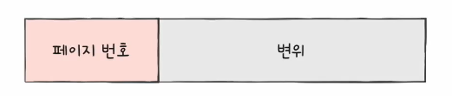
</p>

논리 주소 <페이지 번호, 변위>는 페이지 테이블을 통해 물리 주소 <프레임 번호, 변위>로 변환 됨

예: 아래 그림과 같은 상황에서 CPU가 페이지 5번, 변위 2라는 논리 주소에 접근 한다고 가정 한다면 변환되는 물리 주소는 어디일까?

<p id="img_center">
  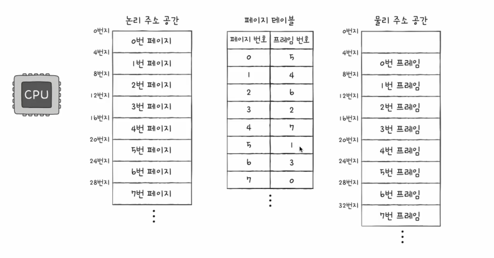
</p>

1. 논리 주소는 <5, 2>로 페이지 테이블을 보고 1번 프레임에 접근

2. 1번 프레임의 시작 번지는 8번지 이므로, 시작 번지로부터 2만큼 떨어진 10번지로 변환 됨

3. 즉, CPU는 물리 주소 공간의 <u>10번지</u>에 접근하게 됨

## 페이지 테이블 엔트리

페이지 테이블 엔트리(PTE: Page Table Entry) : 페이지 테이블을 이루는 각각의 행

페이지 테이블 엔트리에 담기는 정보로는 '페이지 번호'와 '프레임 번호' 이외에도 *유효 비트*, *보호 비트*, *참조 비트*, *수정 비트* 등이 있음

### 유효 비트(valid bit)

- 해당 페이지가 메모리에 적재되어 있는지 여부를 알려주는 비트

- 스와핑으로 인해, 모든 페이지가 메모리에 적재되어 있지 않고, 보조기억장치의 스왑 영역에 위치할 수 있음

- 이 때, 메모리에 적재되어 있다면 유효 비트는 1, 스왑 영역에 있다면 유효 비트는 0이 됨

<p id="img_center">
  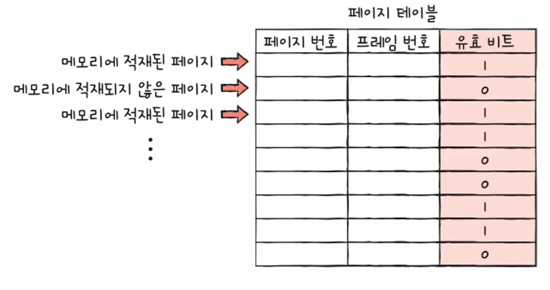
</p>

- CPU가 유효 비트가 0인 페이지에 접근하려 한다면 **페이지 폴트**<sup>page fault</sup>라는 예외가 발생

- CPU의 페이지 폴트 처리 과정

  1. CPU는 기존 작업 내역을 <b>백업</b>
  2. 페이지 폴트 처리 루틴을 실행
  3. 페이지 처리 루틴은 원하는 <b>페이지를 메모리로 가져온 뒤 유효 비트를 1로 변경</b>
  4. CPU가 해당 <b>페이지에 접근</b>

### 보호 비트(protection bit)

- 페이지 보호 기능을 위해 존재하는 비트

- 읽기(**R**ead), 쓰기(**W**rite), 실행(e**X**ecute) 등 페이지에 접근 권한을 제한하여 페이지를 보호

<p id="img_center">
  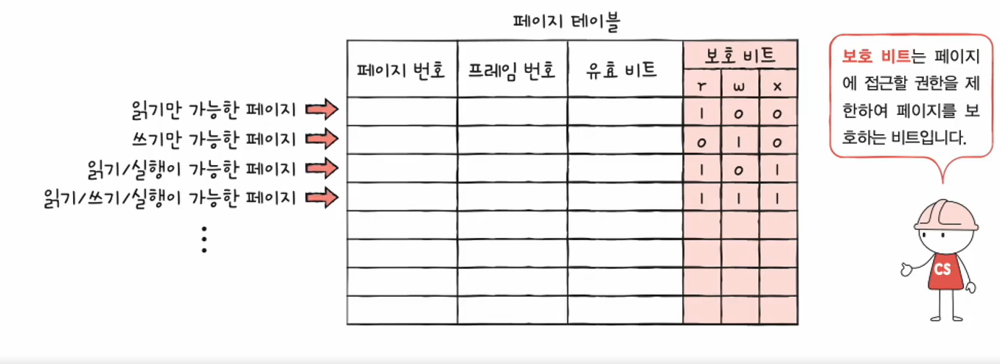
</p>

### 참조 비트(reference bit)

- CPU가 페이지에 접근한 적이 있는지 여부를 나타내는 비트

- 메모리 적재 이후 CPU가 읽거나 쓴 페이지는 1이 되고, 한 번도 읽거나 쓴 적이 없는 페이지는 0이 됨

<p id="img_center">
  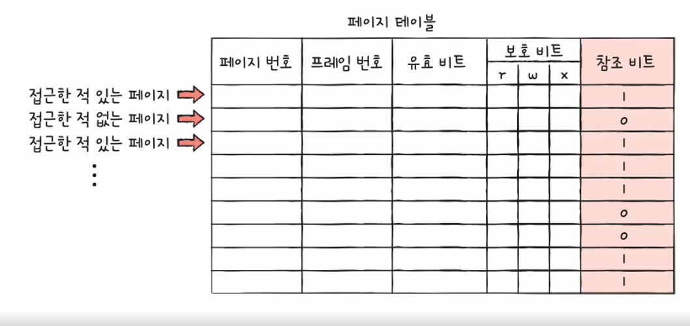
</p>

### 수정 비트(modified bit)

- **더티 비트**<sup>dirty bit</sup>라고도 부르며, 해당 페이지에 데이터를 쓴 적이 있는지 없는지의 수정 여부를 알려줌

- 변경된 적이 있으면 1, 없으면 0

<p id="img_center">
  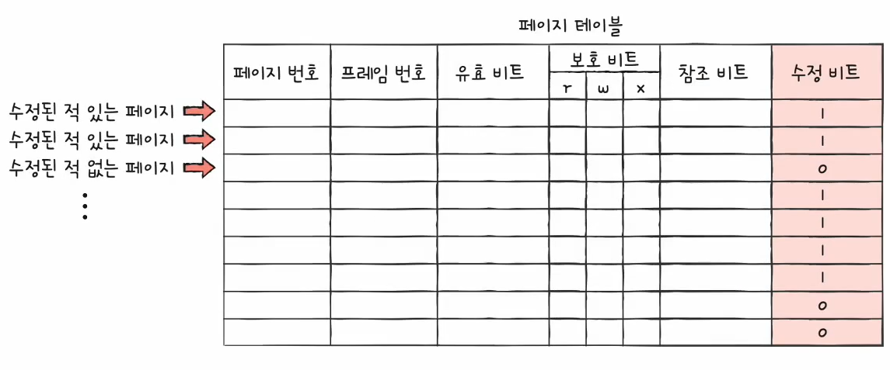
</p>

- 메모리에 적재 되었으나, 수정된 적이 없다면 보조기억장치와 같은 값을 갖기 때문에 그대로 덮어쓰면 됨

- 수정된 페이지만 스왑 아웃될 경우 변경된 값을 보조기억장치에 기록

## 페이징의 이점 - 쓰기 시 복사

- 프로세스 생성 시, 부모 프로세스는 fork를 통해 자신의 복사본을 자식 프로세스로 생성해냄(👉 [프로세스 생성기법](https://ehdgur5123.github.io/posts/OS-03/#%ED%94%84%EB%A1%9C%EC%84%B8%EC%8A%A4-%EC%83%9D%EC%84%B1-%EA%B8%B0%EB%B2%95))

- 일반적인 경우, 부모 프로세스와 자식 프로세스는 전혀 다른 메모리 공간에 생성되므로 프로세스 생성 시간이 늦어지며, 불필요한 메모리 낭비를 야기

<p id="img_center">
  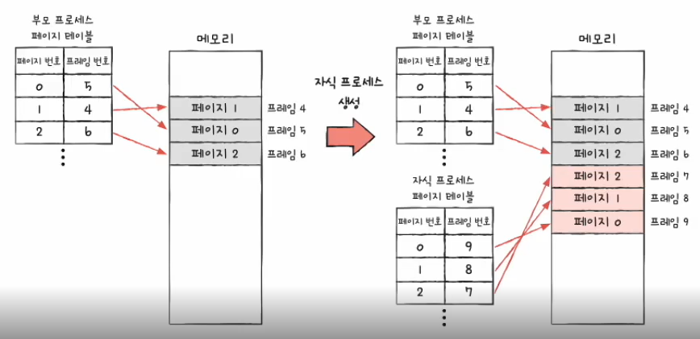
</p>

- 반면 페이징의 쓰기 시 복사에서는 동일한 프레임을 가리킴

<p id="img_center">
  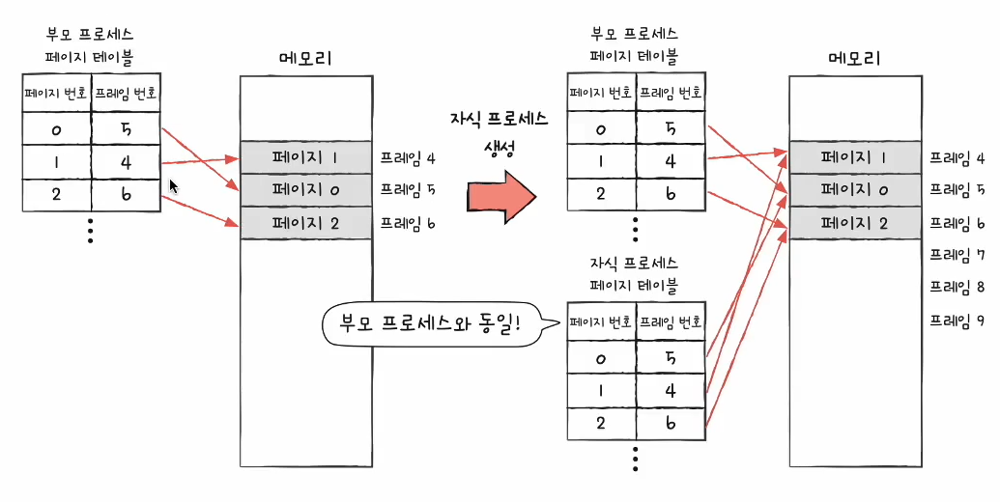
</p>

- 부모 프로세스 혹은 자식 프로세스가 페이지에 쓰기 작업을 하면 해당 페이지만 별도의 공간으로 복제되어 고유한 페이지가 할당된 프레임을 가리킴

<p id="img_center">
  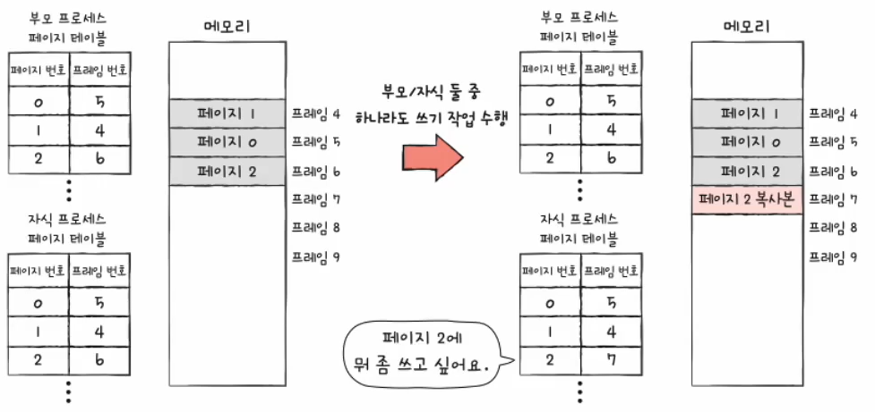
</p>

## 계층적 페이징

- 페이지 테이블의 크기는 생각보다 작지 않음

- 모든 페이지 테이블 엔트리를 메모리에 적재하는 것은 메모리 낭비

- 계층적 페이징<sup>hierarchical paging</sup>을 통해 이를 해결(다단계 페이지 테이블이라고도 부름)

- 페이지 테이블을 여러 개의 페이지로 자르고, 'Outer 페이지 테이블'에 쪼개진 페이지들을 가리키는 방식

<p id="img_center">
  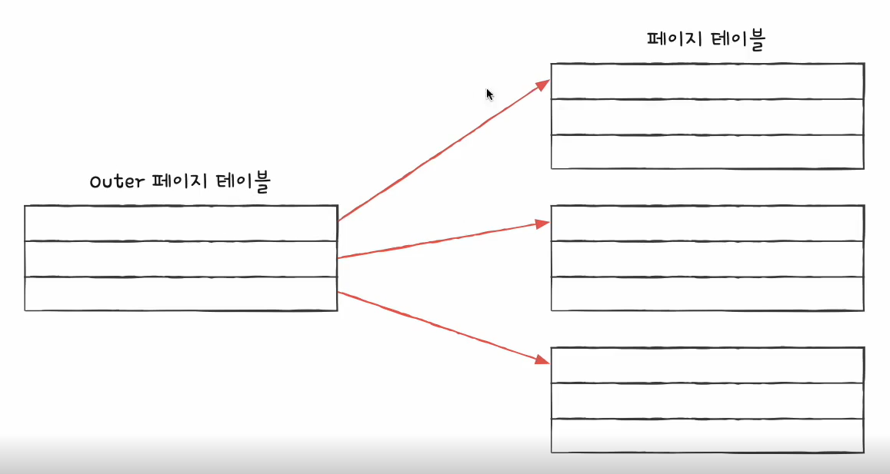
</p>

- 'Outer 페이지 테이블'

