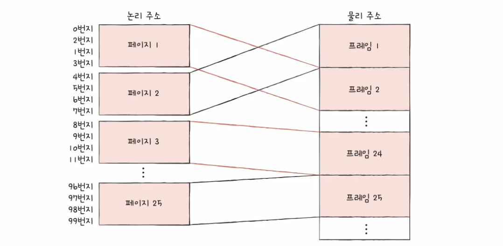
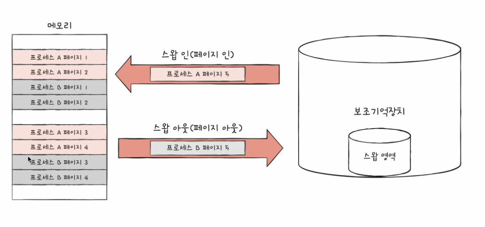
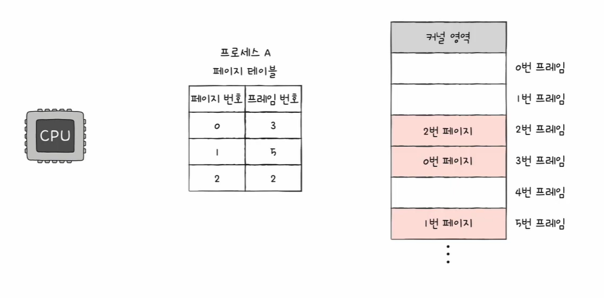
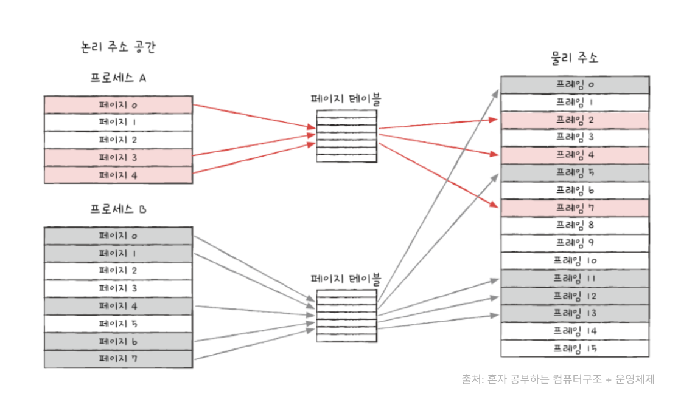

<hr>

# 페이징을 통한 가상 메모리 관리

가상 메모리<sup>virtual memory</sup>란 실행하고자 하는 프로그램을 일부만 메모리에 적재하여 실제 물리 메모리 크기보다 더 큰 프로세스를 실행할 수 있게 하는 기술

가상 메모리 관리 기법에는 *페이징*과 *세그멘테이션*이 있지만, 현재 대부분의 운영체제는 **페이지 기법**을 사용함

## 페이징이란

**페이징**<sup>paging</sup>은 *메모리의 물리 주소 공간*을 **프레임** 단위로 자르고, *프로세스의 논리 주소 공간*을 **페이지** 단위로 자른 뒤 페이지를 프레임에 할당하는 가상 메모리 관리 기법

<p id="img_center">
  
</p>

- 프로세스를 잘라서 메모리에 **불연속적으로 할당**하므로 외부 단편화가 발생하지 않음

- 페이지 단위로 **스와핑**을 하기 때문에 프로세스 전체를 물리 메모리에 적재할 필요가 없어, **실제 물리 메모리 크기보다 더 큰 프로세스를 실행할 수 있음**

- 페이징 시스템에서의 스왑 아웃은 *페이지 아웃*<sup>page out</sup>, 스왑 인은 *페이지 인*<sup>page in</sup>이라고도 부름

<p id="img_center">
  
</p>

## 페이지 테이블

페이지 테이블<sup>page table</sup>: 프로세스의 페이지 정보를 저장하고 있는 테이블로 페이지 번호를 이용해 페이지가 적재된 프레임을 찾을 수 있음 

- 프로세스의 페이지가 메모리의 프레임에 불연속적으로 배치되므로

- 페이지가 어느 프레임에 있는지 CPU가 알 수 있도록

- 페이지 테이블에 *페이지 번호*와 *프레임 번호*를 저장

<p id="img_center">
  
</p>

- CPU는 페이지 테이블을 보고 원하는 페이지를 실행 시키면

- 해당 페이지 번호와 대응된 프레임 번호의 메모리를 실행

<p id="img_center">
  
</p>

프로세스가 (실제 메모리 내의 주소인) 물리 주소에 불연속적으로 배치되더라도 (CPU가 바라보는 주소인) 논리 주소에는 연속적으로 배치되도록 하는 효과

### 내부 단편화

- 페이징은 외부 단편화 문제를 해결할 수 있지만, **내부 단편화**(internal fragmentation)을 야기할 수 있음

- 프로세스를 일정한 크기의 페이지로 나눌 때 페이지 내에 빈공간

- 예: 프로세스의 크기가 `108KB`이고, 페이지의 크기가 `10KB`이면 총 `110KB`의 메모리가 소요되고, 하나의 페이지에는 `2KB`의 내부 단편화가 발생  

- 페이지의 크기를 너무 크게하면 내부 단편화의 크기가 커지고, 너무 작게하면 페이지 테이블의 크기가 커지므로 적절한 크기로 조정하는 것이 중요

- 페이지의 크기를 알 수 있는 리눅스 명령어: `getconf PAGESIZE`

```bash
getconf PAGESIZE

>> 4096
```

### 페이지 테이블 접근 방식

