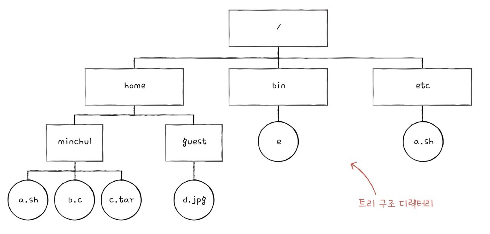
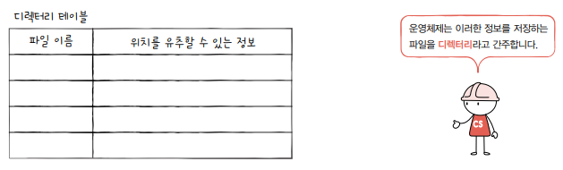

## 파일과 디렉터리

* 파일 : 보조기억장치에 저장된 관련 정보의 집합
* 파일의 속성(=메타데이터)
  * 파일 유형 : 운영체제가 인식하는 파일의 종류(cpp, exe 등 확장자)
  *  크기, 보호, 소유자, 위치 등
* 디렉터리
  * 루트(/) 디렉터리 : 최상위 디렉터리
  * 트리 구조 디렉터리
 

* **절대경로** : 루트(/) 디렉터리에서 자기 자신까지 이르는 고유한 경로
* **상대경로** : 현재 내가 위치한 디렉터리에서 대상 파일까지의 경로
  
* 디렉터리 엔트리(행)
  * 디렉터리도 파일의 한 종류
  * 파일이 보조기억장치 내 어디에 담겨 있는지 위치를 유추할 수 있는 정보를 테이블 형태로 저장

## 파일 시스템

* 운영체제의 핵심 서비스 프로그램
* 파일과 디렉터리를 보조기억장치에 정리하여 저장하고 접근할 수 있도록 해주는 프로그램

* 파티셔닝 : 보조기억장치의 파티션을 나누는 작업
* 포매팅 : 포맷하는 작업
  * 파일 시스템을 설정하고, 새로운 데이터를 쓸 준비를 하는 작업
  * 저장 장치를 완전히 삭제하는 것이 아님
  

   