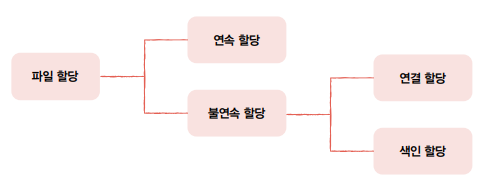

## 파일과 디렉터리

* 파일 : 보조기억장치에 저장된 관련 정보의 집합
* 파일의 속성(=메타데이터)
  * 파일 유형 : 운영체제가 인식하는 파일의 종류(cpp, exe 등 확장자)
  *  크기, 보호, 소유자, 위치 등
* 디렉터리
  * 루트(/) 디렉터리 : 최상위 디렉터리
  * 트리 구조 디렉터리

  

<!-- -->

* **절대경로** : 루트(/) 디렉터리에서 자기 자신까지 이르는 고유한 경로
* **상대경로** : 현재 내가 위치한 디렉터리에서 대상 파일까지의 경로
  
* 디렉터리 엔트리(행)
  * 디렉터리도 파일의 한 종류
  * 파일이 보조기억장치 내 어디에 담겨 있는지 위치를 유추할 수 있는 정보를 테이블 형태로 저장

 

## 파일 시스템

* 운영체제의 핵심 서비스 프로그램
* 파일과 디렉터리를 보조기억장치에 정리하여 저장하고 접근할 수 있도록 해주는 프로그램

* 파티셔닝 : 보조기억장치의 파티션을 나누는 작업
* 포매팅 : 포맷하는 작업
  * 파일 시스템을 설정하고, 새로운 데이터를 쓸 준비를 하는 작업
  * 저장 장치를 완전히 삭제하는 것이 아님

### 파일 할당 방법

  * 하드 디스크의 가장 작은 저장 단위는 섹터
  * 운영체제는 하나 이상의 섹터를 블록이라는 단위로 묶어서 **블록 단위로 파일과 디렉터리를 관리**
  * 파일 할당  

#### 연속 할당

* 보조기억장치 내 연속적인 블록에 파일을 할당하는 방식
* 첫 번째 블록의 주소와 블록의 길이만 알면 파일에 접근이 가능
* 디렉터리 엔트리에 첫 번째 블록의 주소와 블록의 길이를 명시
* **외부 단편화** 문제로 현재는 쓰이지 않는 방식
* 외부 단편화
  * 여유 공간이 여러 조각으로 나뉘는 현상
  * 파일을 연속적으로 할당하였기 때문에 파일을 삭제하면 삭제된 블록의 공백이 발생

#### 불연속 할당

##### 연결 할당
 
* 각 블록에 다음 블록의 주소를 저장하여 다음 블록이 어디에 있는지 알 수 있게 할당하는 방식
* 다음 블록의 위치를 알 수 있어 아무 블록에나 할당이 가능(외부 단편화 문제 해결)

* 단점
  * 반드시 첫 번째 블록부터 하나씩 차례대로 읽어야 한다.
    * 파일 내 임의의 위치에 접근하려면 첫 번째 블록부터 읽어야 하므로 임의 접근 속도가 매우 느림
  * 하드웨어 고장이나 오류 발생 시 해당 블록 이후 블록은 접근할 수 없음
* 현재까지 많이 사용되는 **FAT 파일 시스템**은 연결 할당을 변형한 형태

##### 색인 할당

* 파일의 모든 블록 주소를 **색인 블록**이라는 하나의 블록에 모아 관리하는 방식

* 색인 블록 주소만 알면 파일에 접근이 가능
* 디렉터리 엔트리에는 파일의 이름과 색인 블록 주소를 명시
* 파일 내 임의의 위치에 접근하려면 색인 블록 주소의 i번째 항목에 접근하면 되므로 임의 접근 속도가 빠름
* **유닉스 파일 시스템**의 기반이 되는 할당 방식

   