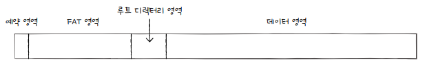
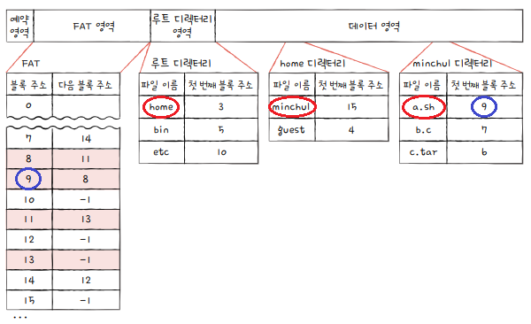
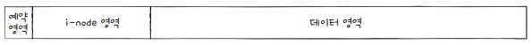
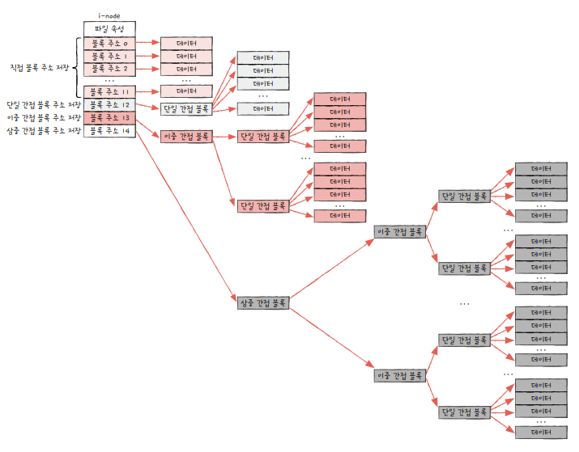
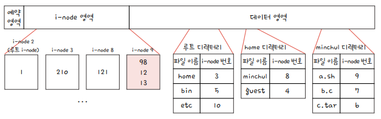

## FAT 파일 시스템  

* FAT(File Allocation Table): **파일 할당 테이블**  

* [연결할당]의 단점을 보완한 파일시스템  

* 이동할 다음 블록의 주소들을 한데 모아 **테이블 형태로 관리**하는 방식  

* USB 메모리, SD 카드와 같은 저용량 저장 장치에 많이 사용되고 있음  

* FAT12, FAT16, FAT32 등이 있으며, 뒤의 숫자는 블록을 표현하는 비트 수

* FAT 파일 시스템의 파티션

    

* FAT 파일 시스템에서 /home/minchul/a.sh 파일을 읽는 과정(예시)

  * a.sh 파일이 있는 블록은 9, 8, 11, 13번 블록

    

[연결할당]: ../OS-15/

 

## 유닉스 파일 시스템

* 색인할당[^1] 기반의 파일 관리 시스템 

* 유닉스 파일 시스템에서는 색인 블록을 **i-node(index-node)**라고 부름

* 'i-node'에는 파일 속성 정보와 15개의 블록 주소가 저장됨

* 'i-node'들은 파티션 내 'i-node 영역'에 모여 있음

    

 

### 'i-node'의 파일 지정 방식

* 'i-node'에는 15개의 블록 주소 밖에 저장할 수 없어 큰 파일의 경우 특별한 파일 지정 방식을 사용해야 함

* 다음 작업은 파일의 크기에 따라 순차적으로 진행(1번 초과 시 2번, 2번 초과 시 3번 \.\.\.)

1. 12개의 블록 주소에는 **직접 블록 주소**를 저장
    > 직접 블록(direct block) : 파일 데이터가 저장된 블록

2. 13번째 블록 주소에는 **단일 간접 블록 주소**를 저장 
    > 단일 간접 블록(single indirect block) : 파일 데이터를 저장한 블록 주소가 저장된 블록

3. 14번째 블록 주소에는 **이중 간접 블록 주소**를 저장
    > 이중 간접 블록(double indirect block) : 단일 간접 블록들의 주소가 저장된 블록

4. 15번째 블록 주소에는 **삼중 간접 블록 주소**를 저장
    > 삼중 간접 블록(triple indirect block) : 이중 간접 블록들의 주소가 저장된 블록 

    

 

### 유닉스 파일 시스템에서 파일을 읽는 과정

* 파일 경로 : /home/minchul/a.sh  

* 유닉스 파일 시스템은 루트 디렉터리의 i-node를 항상 기억하고 있음  

* 파일 시스템은 파일에 접근하기 위해 루트 디렉터리를 먼저 찾음  

1. i-node 2번에 1번 블록이 저장    

    > 1번 블록에는 루트 디렉터리의 정보가 저장

    > 루트 디렉터리에서 home 디렉터리는 i-node 3번

2. i-node 3번에 210번 블록이 저장  

    > 210번 블록에는 home 디렉터리의 정보가 저장

    > home 디렉터리에서 minchul 디렉터리는 i-node 8번

3. i-node 8번에 121번 블록이 저장  

    > 121번 블록에는 minchul 디렉터리의 정보가 저장

    > minchul 디렉터리에서 a.sh 파일은 i-node 9번

4. i-node 9번에는 98번, 12번, 13번 블록이 저장  

5. a.sh 파일의 정보는 98번, 12번, 13번 블록에 저장되어 있음

    

 

## 이외 파일 시스템

* 리눅스의 ext 파일 시스템  

* 윈도우의 NTFS(NT 파일 시스템)  

* 파일 시스템 참조 링크 : [혼공단 강태공 GitHub](https://github.com/kangtegong/self-learning-cs/blob/main/file_system/file_system.md)  

[^1]: 색인할당 : 파일의 모든 블록 주소를 색인 블록이라는 하나의 블록에 모아 관리하는 방식
