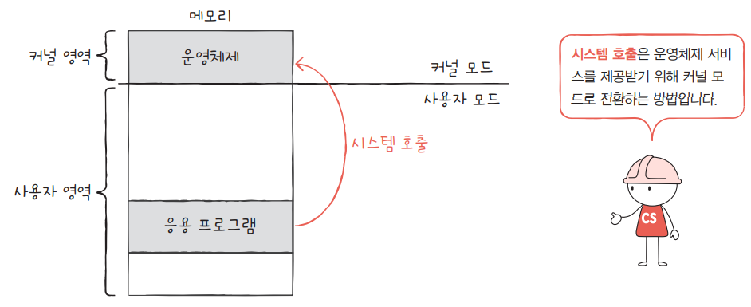

<!—-

## 09-1 운영체제를 알아야 하는 이유

* 운영체제의 종류 : 윈도우, macOS, 리눅스 등
  
* **운영체제(Operating System)** 는 실행할 프로그램에 필요한 자원을 할당하고, 프로그램이 올바르게 실행되도록 돕는 특별한 프로그램(운영체제도 프로그램 중 하나) 

* 운영체제는 매우 특별한 프로그램으로, 메모리 내 **커널 영역**이라는 공간에 따로 적재되어 실행된다.

* 커널 영역을 제외한 나머지 영역을 **사용자 영역**이라고 하며, 운영체제 이외의 응용 프로그램들이 실행된다.

* 메모리 주소가 겹치지 않도록 적당한 공간에 프로그램들을 적재해 주는 것도 운영체제이다.

* 실행할 프로그램을 메모리에 적재하고, 더 이상 실행되지 않는 프로그램을 메모리에서 삭제하며 지속적으로 **메모리 자원을 관리**한다.

* 운영체제는 여러 프로그램들이 동시에 실행될 수 있도록 최대한 공정하게 **여러 프로그램에 CPU 자원을 할당**함.

* 응용 프로그램은 결국 하드웨어가 실행하고, 그 하드웨어를 조작하는 프로그램이 운영체제이다.

* **응용 프로그램(application software)** 은 사용자가 특정 목적을 위해 사용하는 일반적인 프로그램을 의미(인터넷 브라우저, 메모장, 게임 등과 같은 모든 프로그램)

## 09-2 운영체제의 큰 그림

* 운영체제는 사용자를 위한 프로그램이 아니다.
* 사용자가 실행하는 **프로그램을 위한 프로그램**이다. 
* 운영체제의 핵심 서비스를 담당하는 부분을 커널이라고 한다.
  
### 커널(Kernel)  

* 운영체제의 핵심 서비스를 담당하는 부분
    * 프로세스 관리
    * 자원 접근 및 할당
    * 파일 시스템 관리
      
* 사용자 인터페이스 : 사용자가 컴퓨터와 상호작용할 수 있는 통로
    * 운영체제가 제공하는 서비스지만 **커널에 포함되지 않음**
    * 그래픽 유저 인터페이스(GUI) : 바탕화면과 같은 그래픽 기반 인터페이스
    * 커맨드 라인 인터페이스(CLI) : 명령어 기반 인터페이스(bash, shell 등)  

### 이중 모드와 시스템 호출

* 운영체제는 사용자가 실행하는 **응용 프로그램이 하드웨어 자원에 직접 접근하는 것을 방지**하여 자원을 보호한다
  
* 응용 프로그램이 하드웨어 자원에 접근하기 위해서는 운영체제를 거쳐야 한다.
    * 응용 프로그램은 하드웨어에 접근하기 위해 운영체제의 코드를 실행
    * 운영체제는 응용 프로그램이 요청한 운영체제의 코드를 보고 하드웨어 자원에 접근
    * 응용 프로그램이 하드웨어에 직접 접근한다면, 응용 프로그램이 조금만 실수해도 컴퓨터 전체에 큰 악영향을 끼칠 수 있으므로 일종의 문지기 역할이다.

#### 이중 모드(dual mode)

* 이중 모드란 CPU가 명령어를 실행하는 모드를 **사용자 모드**와 **커널 모드**로 구분하는 방식

* **사용자 모드(user mode)** : 운영체제 서비스를 제공받을 수 없는 실행 모드
    * 커널 영역의 코드를 실행할 수 없는 모드
    * 일반적인 응용 프로그램은 기본적으로 사용자 모드임
    * 사용자 모드로 실행 중인 CPU는 하드웨어 자원에 접근하는 명령어를 실행할 수 없음
 
* **커널 모드(kernel mode)** : 운영체제 서비스를 제공받을 수 있는 실행 모드
    * 커널 영역의 코드를 실행할 수 있는 모드
    * CPU가 커널 모드로 명령어를 실행하면 하드웨어 자원에 접근하는 명령어를 실행할 수 있음
    * 운영체제는 커널 모드로 실행되므로 하드웨어 자원에 접근이 가능
 
* CPU가 사용자 모드로 실행 중인지, 커널 모드로 실행 중인지는 플래그 레지스터 속 슈퍼바이저 플래그를 보면 할 수 있다(*참조. 04장 106페이지*)   

#### 시스템 호출(system call)

* 사용자 모드로 실행되는 프로그램이 자원에 접근하기 위해서는 운영체제에 요청을 보내 커널 모드로 전환되어야 한다.
* 이러한 운영체제 서비스를 제공받기 위해 운영체제에 요청을 보내는 것을 시스템 호출(=시스템 콜)이라고 한다.
* 시스템 호출은 **소프트웨어 인터럽트**의 일종이다.
* 시스템 호출 작동 순서
    * 시스템 호출을 발생시키는 명령어가 실행되면  
    * CPU는 지금까지의 작업을 백업하고
    * 커널 영역 내에 시스템 호출을 수행하는 코드(인터럽트 서비스 루틴)를 실행한 뒤
    * 다시 기존에 실행하던 응용 프로그램으로 복귀하여 실행을 계속 진행
* 시스템 호출 작동 예
    * 한 응용 프로그램이 하드 디스크에 데이터를 저장한다고 가정
    * 하드 디스크에 데이터를 저장하는 시스템 호출을 발생시켜 커널 모드로 전환(**시스템 호출**)
    * 운영체제 내의 '하드 디스크에 데이터를 저장하는 코드'를 실행함으로써 하드 디스크에 접근(**운영체제 코드 실행**)
    * 하드 디스크에 접근이 끝났다면 다시 사용자 모드로 복귀(**시스템 호출 복귀**)  

* 시스템 호출은 응용 프로그램 실행 과정에서 매우 빈번하게 발생함(데이터 저장, 프린터 출력 등)

### 운영체제의 핵심 서비스

#### 프로세스 관리
  
#### 자원 접근 및 할당

#### 파일 시스템 관리

## 요약정리

—->

* 운영체제(Operating System)
  * 컴퓨터 하드웨어를 제어하기 위한 소프트웨어

* 커널(kernel)  
  * 운영체제의 핵심서비스를 담당하는 프로그램
 
* 메모리 영역
  * 사용자 영역 : 일반적인 응용 프로그램들이 실행되는 영역 
  * 커널 영역 : 운영체제가 실행되는 영역 
 
* CPU 명령 모드
  * 이중 모드   
    * 사용자 모드 : 하드웨어를 제어할 수 없는 모드
    * 커널 모드 : 하드웨어를 제어할 수 있는 모드 
  * 하이퍼바이저 모드
    * 가상머신(VM ware 등) 환경에서 하드웨어에 접근하기 위한 모드

* 시스템 호출(=시스템 콜)
  * 사용자 모드에서 하드웨어를 제어하기 위해 커널 모드로 전환하는 방법

