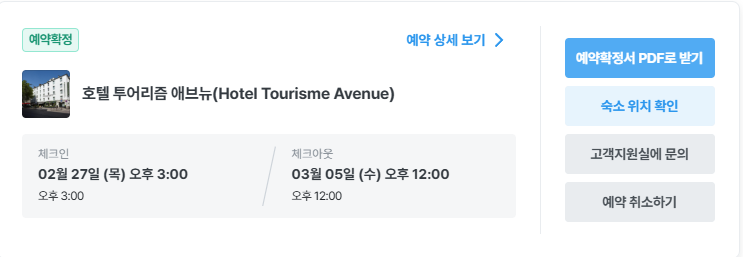

# 여행 일자

|출발|도착|출발일|출발시각|도착시각|비행시간|
|:--:|:--:|:----:|:------:|:-----:|:------:|
|인천공항|샤를 드골 공항|2월 27일(목요일)|10:35|17:00|14시간25분|
|샤를 드골 공항|인천공항|3월 05일(수요일)|19:00|15:00 + 1|12시간|

# 여행 계획

<iframe src="https://www.google.com/maps/d/embed?mid=13aOFudG8rTgFJNeP9uID5oEbDLs63rI&ehbc=2E312F" width="640" height="480"></iframe>

- **M** : 뮤지엄패스 사용가능
- **R** : 예약필수

## 1일차(2월27일 목요일)

1. 인천공항 10:35 출발
2. 파리 샤를 드골 공항 17:00 도착 
3. 택시타고 숙소이동(*현재 숙소 미지정*)
4. 저녁식사
5. 에펠탑 야경 구경<small>(08:45AM ~ 00:45PM, 연중무휴, 올라가는건 별도 구매)</small>

## 2일차(2월28일 금요일)

1. 에투알 개선문<small>(**M**, 10:00AM ~ 22:30PM, 연중무휴)</small>
2. 샹젤리제 거리<small>(그냥 일반 거리)</small>
3. 콩코르드 광장<small>(그냥 일반 거리)</small>
4. 오르세 미술관<small>(**M**, 09:30AM ~ 18:00PM, 월요일 휴무)</small>
5. 샤요 궁(Palais de Chaillot)<small>(그냥 일반 거리)</small>
6. 파리지앵 디너크루즈<small>20:15까지 체크인할 것</small>

## 3일차(3월1일 토요일)

1. 루브르 박물관<small>(**M**, **R**, 09:00AM ~ 18:00PM, 화요일 휴무)</small>
2. 세인트(생트)샤펠(Sainte-Chapelle)<small>(**M**, **R**, 09:00AM ~ 17:00PM, 연중무휴)</small>
3. 노트르담 대성당<small>(무료입장, 07:45AM ~ 19:00PM, 연중무휴)</small>
4. 조르주 퐁피두 센터<small>(**M**, 11:00AM ~ 21:00PM, 화요일 휴무)</small>

## 4일차(3월2일 일요일)

1. 베르사유 궁전<small>(**M**, **R**, 09:00AM ~ 17:30PM, 월요일 휴무)</small>
2. 팡테옹<small>(**M**, 10:00AM ~ 18:30PM, 연중무휴)</small>
3. 뤽상부르 공원<small>(일반 거리, 공원 개장 07:30AM ~ 16:30PM)</small>

## 5일차(3월3일 월요일)

1. 오랑주리 미술관<small>(**M**, **R**, 09:00AM ~ 18:00PM, 화요일 휴무)</small>
2. 사크레쾨르 대성당<small>(무료입장, 06:30AM ~ 22:30PM, 연중무휴, 돔이나 지하 크립트를 방문하려면 별도의 입장료 필요(뮤지엄패스 불가))</small>
3. 몽마르트르 묘지<small>(무료입장, 08:00AM ~ 17:30PM, 연중무휴)</small>
4. 사랑해 벽<small>(그냥 일반 거리)</small>

## 6일차(3월4일 화요일)

1. 마이리얼트립을 통해 몽생미셸 옹플뢰르 야경 투어 신청([👉 몽생미셸 옹플뢰르 야경 투어](https://experiences.myrealtrip.com/products/3417849?mylink_id=195727&utm_source=mktpartner))

2. 만나는 장소 : 지하철 2호선 Ternes 역 1번 출구 앞입니다 - 구글지도 1 Place des Ternes 75017 Paris, 현재 CCF 은행(구 HSBC은행) 앞 

3. 2월~3월: 오전 08:20 시작 / 새벽 12시 30분 개선문 종료 

4. 수도원 내부 입장료는 성인 인당 20유로로 당일 가이드에게 현장 결제(잔돈 없으니 딱맞게 지참할 것(40유로))

## 7일차(3월5일 수요일)

1. 샤를 드골 공항 19:00 출발
2. 인천공항 3월 6일 15:00 도착

# 결제 및 예약

## 1. 결제 목록

|품목               |단가            |수량             |합계            |결제여부        |
|:-----------------:|:--------------:|:---------------:|:--------------:|:--------------:| 
|비행기(왕복)       | 1,376,700원    | 2               | 2,753,400원    |○               | 
|숙소               |                | 6박             |                |X               | 
|뮤지엄패스(4일권)  |                | 2               |                |X               | 
|몽생미셸 투어신청  |                | 2               |                |X               | 
|몽생미셸 입장권    | 20유로         | 2               | 40유로         |X 현장결제 | 
|파리지앵 디너크루즈(Privilege)  | 275,000원         | 2               | 550,000원       |X | 

## 2. 관광지 예약 유무

|관광지              |일정                |예약유무 |예약시간  |
|:-----------------:|:-------------------:|:------:|:-------:|
|루브르 박물관       | 2025년 03월 01일(토) | ○      |09:00AM  |
|오랑주리 미술관     | 2025년 03월 03일(월) | X      | 오전9시?        |         
|베르사유 궁전       | 2025년 03월 02일(일) | X      | 오전9시?        |          
|세인트(생트)샤펠    | 2025년 03월 01일(토) | X      | 오후3시? |         
|노트르담 대성당     | 2025년 03월 01일(토) | X      | 오후5시? |     

- 루브르 박물관
  - [👉 루브르 박물관 예약하기](https://www.ticketlouvre.fr/louvre/b2c/index.cfm/home)
  - [👉 예약방법 설명 블로그](https://blog.naver.com/gaseul_rylee/223698128855)

- 오랑주리 미술관
  - [👉 오랑주리 미술관 예약하기](https://www.musee-orangerie.fr/fr)
  - [👉 예약방법 설명 블로그](https://blog.naver.com/storyclass/223467321016)
  - 예약하려니까 2025년 1월 28일부터 3월 2일까지 유지보수로 휴관한다고 되어있음. 2월 이후 예약 수시 확인 필요(재수없으면 못갈수도)
  
- 베르사유 궁전
  - [👉 베르사유 궁전 예약하기](https://en.chateauversailles.fr/)
  - [👉 예약방법 설명 블로그](https://blog.naver.com/nayon_/223620378670)
  - 베르사유 정원은 4월~10월 운영(못감)

- 세인트(생트)샤펠
  - [👉 세인트(생트)샤펠 예약하기](https://www.sainte-chapelle.fr/en)
  - [👉 예약방법 설명 블로그](https://blog.naver.com/storyclass/223467738074)

- 노트르담 대성당(필수는 아님)
  - [👉 노트르담 대성당 예약하기](https://www.notredamedeparis.fr/)
  - [👉 예약방법 설명 블로그](https://blog.naver.com/bb893/223699378182)
  - 입장 이틀전부터 예약 가능

## 3. 파리지앵 크루즈(Privilege)

- **탑승시간**: 20시 15분에 탑승 체크인이 종료되며, 20시 30분에 크루즈가 출발합니다. 탑승 30분 전까지는 선착장에 도착하여 탑승 준비를 해주시기 바랍니다.(2시간 30분 코스)

- **만나는장소**: 에펠탑 앞에 위치한 이에나 다리(Pont d'lena)의 바토 파리지앵 선착장 Pier 5 or 7(주소 : Bateaux Parisiens, Port de la Bourdonnais 75007 Paris)

- **예약하기**: [👉 파리지앵 크루즈 예약 사이트(마이리얼트립)](https://experiences.myrealtrip.com/products/3511473)

- 파리지앵 공식 홈페이지: [👉 파리지앵 공홈](https://www.bateauxparisiens.com/en/meal-cruise.html)

- **상품 설명**: 서비스 옵션에는 에뚜알 서비스, 데꾸르베르테 서비스, 프리빌레주 서비스, 프리미어 서비스가 있으며, 옵션마다 자리 배정 및 음식 식사 시 제공되는 서비스의 종류가 다름

- 창가 자리에 와인이 제공되는 **프리빌레주 서비스**로 예약 예정(마이리얼 트립에 현재 2인에 550,000원)

- 음식 맛은 기대하지 말 것. 메뉴는 테이블에서 QR코드를 찍으면 한국어도 제공됨

- [👉참조 블로그](https://blog.naver.com/adayoff_/223460471087)

- **주의 사항**: 현장에서 실물 티켓으로 교환하여 탑승해야 하므로, 여유롭게 도착하여 준비할 것

# 참조 블로그&유튜브

## 1. 추가 여행 코스

1. [👉 파리 여행코스 완벽 총정리!(유튜브)](https://www.youtube.com/watch?v=QetTbhRcEME)
2. [👉 파리 여행코스 완벽 총정리!(블로그)](https://cafe.naver.com/momsolleh/428641)
3. 추천 코스 지도맵

<iframe src="https://www.google.com/maps/d/embed?mid=1qjjKFoZqpb8WG_XozTyXCtt2csc0Csi3&ehbc=2E312F" width="640" height="480"></iframe>

## 2. 맛집 추천 리스트

1. [👉 파리 맛집 추천(유튜브)](https://www.youtube.com/watch?v=YELHCwHDfFs)
2. [👉 파리 맛집 추천(블로그)](https://cafe.naver.com/momsolleh/502826)
3. 맛집 추천 지도맵

<iframe src="https://www.google.com/maps/d/embed?mid=1uKUw3ZPSfbXEFUcsVSety0_k3sKPvbE&ehbc=2E312F" width="640" height="480"></iframe>

## 3. 구글 지도맵 만들기 강의

[👉구글 지도맵 만들기(유투브)](https://www.youtube.com/watch?v=jfJIxq25-YQ)

# 기타 사항

## 1. 준비물

1. **여권**
2. **작은 우산**. 유럽은 비가 많이옴
3. 유럽은 샴푸랑 바디워시가 겸용임. 필요하면 **샴푸** 챙길 것
4. 요즘은 세계적으로 호텔에 **치약**, **칫솔**이 없음. 챙길 것 
5. **보조배터리** 
6. **휴대폰 스트립**. 도둑 많음
7. 유럽은 AV 220V를 사용해서 어댑터는 안챙겨도 됨
8. **파리 esim**[👉 파리 esim 구매하기](https://smartstore.naver.com/airportusim/products/6611447067?NaPm=ct%3dm5go93z6%7cci%3dERdf567492%2dc9c5%2d11ef%2d9eea%2df0b2b90047cc%7ctr%3dpla%7chk%3dc90b6657fcab1f789f700755870f4617277df7cf%7cnacn%3d8filC4A0OJtSA)

## 2. 유용한 팁

1. 신용카드는 비자카드나 마스터카드가 웬만한 가맹점에서 다 사용되서 좋음(트래블 월렛 카드 추천)

2. 택시어플 우버(Uber)랑 볼트(Bolt) 어플 설치하기. 볼트(Bolt)는 전화번호 인증이 필요하니 국내에서 가입하기

# 정리 중

## 1. 관광지 주요 휴무일

일정에 따라 변동될 수 있음

  

## 숙소

- 체크인 2월27일, 체크아웃 3월05일로 총 6박 일정

- 숙소를 예약하면, 숙소비와는 별도로 체크아웃할 때, **현지세**를 지불해야 함.(1인당 1박에 약 8.4유로로 6박 2인 총 **15만원** 정도 예상)

- 현지세는 대부분의 호텔에 부과되며, 호텔에서 현금 또는 카드로 지불하는 방식으로 처리됩니다. 예약 시 명시된 숙박 요금 외에 추가 비용을 고려하는 것이 좋습니다.

- 퀸제리 호텔 [👉 퀸제리 호텔 예약하기(마이리얼트립)](https://accommodation.myrealtrip.com/union/products/1491216?checkIn=2025-02-27&checkOut=2025-03-05&adultCount=2&childCount=0&isDomestic=false&providerRoomId=&childAges=)

  - 조식제외, 환불 불가: 1,650,284원
  - 조식제외, 취소 가능: 1,832,927원
  - 조식포함, 환불 불가: 2,013,829원
  - 조식포함, 취소 가능: 2,196,473원
  - 현지세는 총 €101.4로 체크아웃 시 별도 지급

<small>작성일(25년 01월 11일) 기준 마이리얼트립 예약 시 금액</small>

  

## 파리 뮤지엄 패스

파리 시내와 근교에 있는 50개 이상의 주요 명소를 티켓 한 장으로 방문할 수 있는 티켓

티켓이 있더라도, 베르사유 궁전, 루브르 박물관, 오랑주리 미술관 등은 **사전에 별도로 예약**을 진행해야 입장이 가능

다음 링크를 통해 **파리 뮤지엄 패스**에 관한 구매 방법 및 방문 가능한 장소 등 다양한 정보를 알 수 있다.

[👉 (파리 현지 수령)파리뮤지엄패스 구매하기(마이리얼트립)](https://www.myrealtrip.com/offers/125356)

[👉 (공항수령)파리뮤지엄패스 구매하기(마이리얼트립)](https://www.myrealtrip.com/offers/164921)

뮤지엄패스 4일권(2인) : 약 305,900원(€ 207.21)

루브르 박물관 & 오르셰 미술관 등 가이드 투어 신청하기

[👉 마이리얼트립](https://www.myrealtrip.com/)

뮤지엄 패스 현지 수령처: [👉 지도보기](https://www.google.com/maps/place/48%C2%B051'50.8%22N+2%C2%B019'55.6%22E/@48.8640733,2.3321467,17.75z/data=!4m4!3m3!8m2!3d48.8640979!4d2.3321144?entry=ttu&g_ep=EgoyMDI0MTIxMS4wIKXMDSoASAFQAw%3D%3D)

