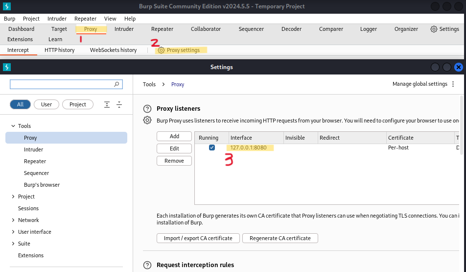

# burpsuite 프록시 설정

**프록시(Proxy)**는 `Burp Suite`의 가장 기본적인 기능 중 하나로, **클라이언트와 서버 간의 HTTP/HTTPS 트래픽을 가로채고 분석 및 수정**할 수 있습니다.

**프록시(Proxy)**를 사용하기 위해서는 **웹 브라우저**의 `Proxy Access`를 `burpsuite`가 사용하는 **프록시 서버**(`127.0.0.1:8080`)로 변경해 주어야 합니다.

이번 글에서는 `burpsuite`를 사용하기 위한 **프록시(Proxy) 설정 방법**을 알아보겠습니다.

<small>
**프록시(Proxy)**는 "대리"의 의미로, 인터넷과 관련해서 쓰이는 경우, 특히 내부 네트워크에서 인터넷 접속을 할 때에, 빠른 액세스나 안전한 통신등을 확보하기 위한 **중계서버**를 "프록시 서버"라고 일컫는다. 클라이언트와 Web서버의 중간에 위치하고 있어, 대신 통신을 받아 주는 것이 프록시 서버입니다. 
</small>

## 1. Proxy listeners 설정(burpsuite)

`burpsuite` 접속하여 아래의 이미지와 같이, `Proxy settings`에 `Proxy listeners`의 `Interface`가 `127.0.0.1:8080`으로 설정되어 있어야 합니다.

  

## 2. Proxy Access 설정(Firefox)

`Proxy listeners`에서 설정된 **프록시 서버**(`127.0.0.1:8080`)를 일치시켜 주기 위해, 웹 브라우저(**Firefox**)에 접속합니다.

Firefox 웹 브라우저의 오른쪽 상단 <b>三</b> 버튼을 누르면 나타나는 `Settings` 메뉴를 클릭합니다.

`Settings` 메뉴의 `Network Settings`에서 `Settings...` 버튼을 클릭하면, 아래의 이미지와 같은 화면이 나타납니다.

아래의 이미지와 같이, Proxy Access를 `127.0.0.1:8080`로 설정합니다.

  

<small>**주의**: 프록시 서버 설정 후에, `burpsuite`을 켜지 않으면, 웹 브라우저에 접속이 되지 않습니다. `burpsuite`을 사용하지 않는다면 Proxy Access를 **No proxy**로 변경해주세요.</small>

## 3. CA Certificate 받기

위와 같은 설정이 끝나면, `HTTP`는 정상적으로 접속되나, `HTTPS`는 접속이 되지 않을 것입니다.

`HTTPS`에 접속하기 위해서는 `http://burp`에 접속하여 인증서(Certificate)를 다운 받아야 합니다.

`http://burp`에 접속하여 `CA Certificate` 버튼을 클릭하면 `cacert.der`라는 파일을 다운로드 받을 수 있습니다.

다운로드한 파일을 다음 영상과 같이 **인증서(Certificate)**를 **등록(Import)** 시켜줍니다.

<video controls width="250">
  <source
    src="../../assets/images/Security/7-04.mp4"
    type="video/mp4"
  />
</video>

