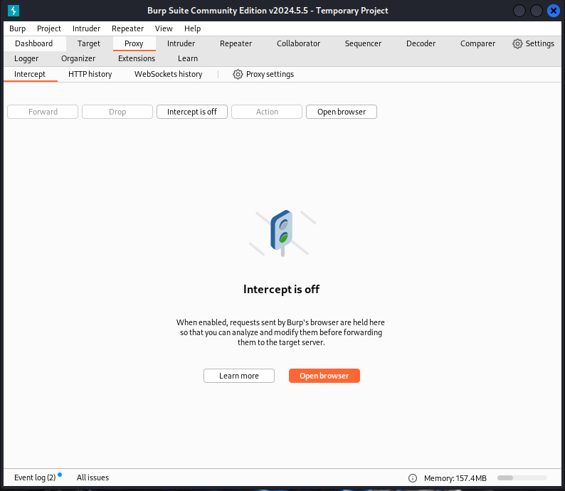
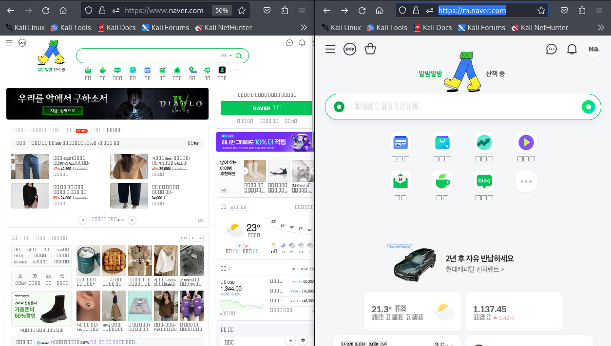

# Burpsuite 인터셉트

**Burp Suite**의 **Intercept** 기능은 **웹 애플리케이션과 클라이언트(주로 웹 브라우저) 간의 HTTP/HTTPS 요청과 응답을 가로채고 수정할 수 있는 도구**입니다. 보안 분석가나 윤리적 해커는 이 기능을 사용해 웹 애플리케이션이 주고받는 데이터를 실시간으로 모니터링하고, 요청이나 응답을 수정하여 애플리케이션의 보안 취약점을 탐색할 수 있습니다.

# Intercept의 작동 방식

1. **인터셉트 설정**: Intercept를 활성화하면 브라우저에서 서버로 보내는 모든 요청이 Burp Suite에 의해 가로채집니다. 이때 사용자는 요청을 서버에 전달하기 전에 수정하거나, 검토한 뒤 그대로 서버로 전달할 수 있습니다.

2. **요청/응답 수정**: Intercept 기능을 통해 가로챈 요청이나 응답은 Burp Suite의 편집 화면에서 수정할 수 있습니다. 파라미터, 헤더, 쿠키, URL 등을 변경하여 서버가 예상하지 못한 방식으로 동작하게 할 수 있으며, 이를 통해 애플리케이션의 반응을 테스트합니다.

3. **요청 흐름 제어**: 사용자가 수정한 후 `Forward` 버튼을 클릭하면 요청이 서버로 전송되며, `Drop` 버튼을 클릭하면 요청이 취소됩니다. Forward와 Drop 기능을 통해 클라이언트와 서버 간의 통신 흐름을 제어할 수 있습니다.

4. **응답 가로채기**: Intercept 기능은 요청뿐만 아니라 서버에서 클라이언트로 돌아오는 응답도 가로챌 수 있습니다. 이를 통해 서버의 응답 내용을 수정해 클라이언트에 전달할 수 있습니다.

# Intercept 주요 활용 분야

1. **매개변수 조작**: Intercept를 통해 HTTP 요청의 파라미터 값을 실시간으로 조작할 수 있습니다. 예를 들어, 가격 정보가 포함된 파라미터를 수정해 서버의 응답이 어떻게 변하는지 테스트할 수 있습니다. 이로 인해 가격 변동이나 접근 권한 우회 등의 보안 취약점이 있는지 확인할 수 있습니다.

2. **인증 및 세션 토큰 분석**: 로그인 요청의 세션 토큰이나 쿠키 값을 가로채고 수정해 세션 고정(Session Fixation)이나 세션 하이재킹(Session Hijacking)과 같은 공격 가능성을 분석할 수 있습니다. 예를 들어, Intercept를 통해 다른 사용자로 가장할 수 있는지 테스트할 수 있습니다.

3. **브루트포스 및 반복 요청**: 특정 파라미터에 대해 여러 값을 대입해 반복적으로 요청을 보내야 할 때, Intercept와 Burp Suite의 다른 기능을 조합해 유효한 인증 정보를 찾거나 특정 응답을 유도할 수 있습니다.

4. **클라이언트 측 데이터 조작**: 클라이언트에서 서버로 전송되는 데이터를 가로채고, HTML이나 JavaScript의 필드 값을 조작하여 서버가 어떻게 반응하는지 확인할 수 있습니다. 예를 들어, 로그인 화면에서 숨겨진 입력 필드의 값을 수정하여 서버의 응답이 변하는지 테스트할 수 있습니다.

5. **취약점 탐지 및 테스트**: SQL 인젝션, XSS 등과 같은 입력 기반 취약점을 탐지하는 데 유용합니다. 가로챈 요청에서 파라미터 값에 악성 페이로드를 삽입해 서버의 응답을 확인함으로써 취약점을 찾을 수 있습니다.

# Burpsuite Intercept 사용 예제

프록시 설정 완료 후, `burpsuite`의 `Proxy` 탭에 접속하면 다음과 같은 화면을 볼 수 있습니다.

  

`Intercept is off` 버튼을 클릭하면 해당 버튼이 `Intercept is on`으로 변경됩니다.

`Intercept is on` 상태에서 웹브라우저로 이용할 사이트에 요청을 보내면, 요청을 가로채고 요청한 내용을 보거나, 수정할 수 있습니다. 

## 1. User-Agent 변경

네이버를 접속해보면, PC와 스마트폰에서 출력되는 화면의 구성이 다를 것입니다. PC에서 인터셉트를 통해 PC `User-Agent`를 스마트폰 `User-Agent`로 변경하여 **요청(request)**을 보내면, 네이버는 스마트폰에 해당하는 화면을 **응답(responde)**할 것 입니다.

- `Intercept is on` 상태에서 웹브라우저를 통해 네이버(https://www.naver.com/)에 접속합니다.

- `burpsuite`이 정보를 <b>Intercept</b>하여, 웹 브라우저는 네이버에 접속이 되지 않지만, `burpsuite`에는 아래 이미지와 같은 화면이 나타날 것 입니다.

  

- 내용을 보면, 나의 `User-Agent`는 `Mozilla/5.0 (X11; Linux x86_64; rv:109.0) Gecko/20100101 Firefox/115.0` 입니다. 해당 내용으로 접속하면, 일반적인 PC용 네이버 화면이 출력될 것입니다.

- `User-Agent`를 **iPhone** `User-Agent`인 <small><u>Mozilla/5.0 (iPhone; CPU iPhone OS 17_2 like Mac OS X) AppleWebKit/605.1.15 (KHTML, like Gecko) CriOS/120.0.6099.119 Mobile/15E148 Safari/604.</u></small>로 변경합니다.

- `User-Agent`의 종류는 다음 깃허브를 참조하세요.(👉 [pzb/user-agents.txt](https://gist.github.com/pzb/b4b6f57144aea7827ae4))

  

